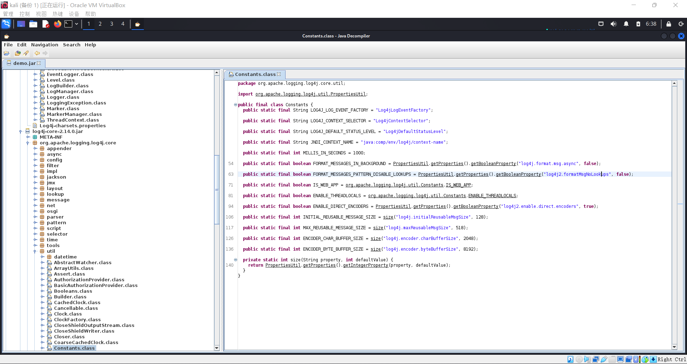

# 个人实践心得体会

## 遇到的问题
- 1.在使用dnslog的时候出现了在主机和攻击者主机上都可以打开dnslog的网址，但靶机上打不开的情况。首先考虑是虚拟机网络问题，但是在确认能顺利在靶机上打开百度网址后排除该问题。然后意识到可能是挂的vpn有关（攻击者挂上了但是靶机没有挂上）然后我就直接重启了靶机后再进行实验就没有问题了

- 2.在下载DMZ场景的时候总是卡在最后一点下载不下来，在跟同学交流后有的说是网络问题（但是我在寝室和教室都下载不下来）。然后又有同学告诉我下载DMZ场景需要挂vpn然后我就关掉虚拟机去打开vpn后重新进行了下载就发现没问题
当然这里我们也可以选择通过自己搭建场景的方法（但是如果要自己去下载镜像的过程也可能会出现某一个需要挂vpn才能下载的问题）

- 3.在攻击者主机上，通过DNSlog获取域名来攻击的时候，出现了需要将post请求改为get请求
  这是因为我们根据反编译结果发现，缺陷函数用到的是get请求方法，所以该 环境不能支持post,所以我们得换成发送get请求
  然后涉及到反编译的部分（后面还有一部分也涉及到了这部分内容），可以去看lihan3238（ldy）同学的实验报告中有详细说到

## 个人实践心得体会

本次小学期网络安全的实验，主要内容为搭建环境（单靶标和多靶标）进行漏洞攻防演练。我在本次实验中首先是去观看老师的b站课程，然后跟着b站的课程一步一步的去做实验。
期间也遇到了不少问题，由于是小组作业，所以我的做法就是自己先尝试解决，在解决不了的情况下问同组的同学，如果我们小组都未能解决该问题，就会先停下实验进度来把问题解决掉再继续进行实验。（如果短时间无法解决则先放弃）本次实验让我收获良多，期间了解到了不少本专业相关的内容（像JNDI注入），也了解到了如何去发现并验证漏洞的存在性、可用性并对漏洞进行修复的知识
当然实验中我也遇到了一些让我印象深刻的点：
  - 在修复漏洞的过程中，借助网上的搜索，我得知log4j在2.14版本之前的版本中才具有这个漏洞。而这个漏洞是攻击者可以借用JNDI注入来让使用log4j这样一个开源项目的用户（涉及范围相当大），访问给出的网址并执行远端代码从而去控制用户的主机。但是在查阅老师带我们找到的源代码中，我们可以找到控制log4j2在格式化日志消息的时候是否允许去执行查找（lookups）操作的代码
  所以要去防御攻击者通过该漏洞来进行攻击，我们可以去设置log4j2.formatMsgNoLookups=True的操作来让 Log4j 2 在格式化日志消息时不要执行查找（lookups）
  
  根据上网查询，我找到可以通过调整JVM参数 -Dlog4j2.formatMsgNoLookups=true的方法来实现。因此首先我在虚拟机上下载了default-jdk工具
  ```
  sudo apt install default-jdk    
  ```
  然后将demo.jar包找到并执行
  ```
  java -Dlog4j2.formatMsgNoLookups=true -jar demo.jar
  ```
  然后重新打包demo.jar并开始验证
  但是很显然我的做法是并不能获取成功的，随后我就仍在这上面进行钻研但是最后还是无法让Log4j 2 在格式化日志消息时不要执行查找（lookups）于是我就将思路告诉了同组的同学，后续他们也对此继续进行了研究但是由于各种原因依然没能通过这种方法进行实验