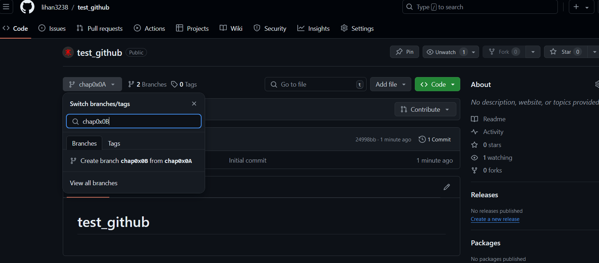
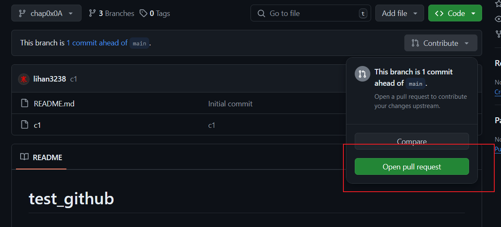
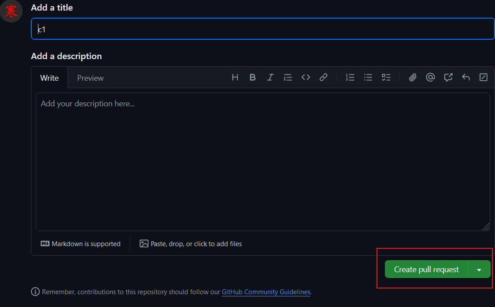
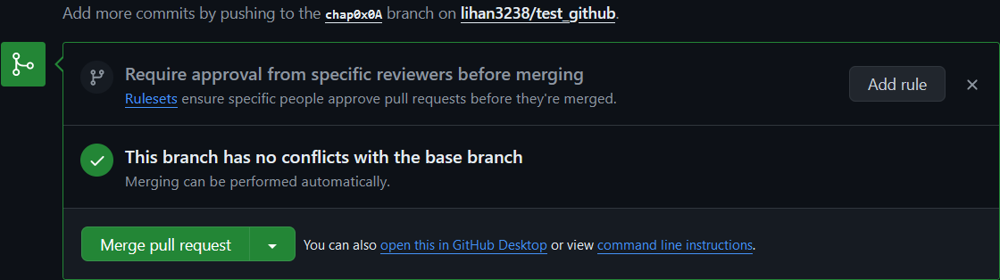
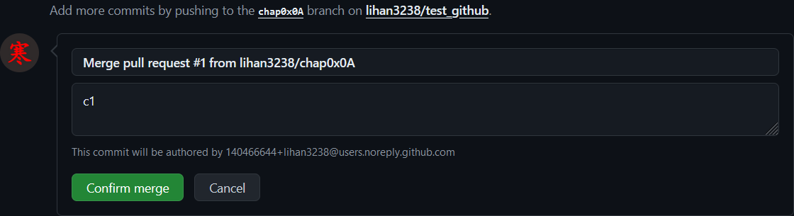
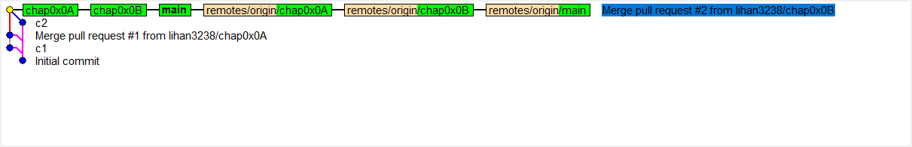

# GitHub小组合作说明文档

## 小组合作开发说明

本次实践项目由小组成员利用 GitHub 进行合作开发，具体选用了 GitHub 的 `Branch` 功能进行协同开发，开发流程与分工主要由 `lihan3238` 设计与管理，`DaleChu` 协同设计与管理，其他小组成员参与。

## 基于 GitHub Branch 的合作开发设计

### 代码仓库地址

- [项目工作仓库](https://github.com/lihan3238/Network-Security-Comprehensive-Practice)
- [项目主仓库]( https://git.cuc.edu.cn/ccs/2024-summer-cp/Network-Security-Comprehensive-Practice)

### 分支说明

- `master` 分支：主分支，用于发布稳定版本；
- `lihan3238` 分支：`lihan3238` 的开发分支；
- `DaleChu` 分支：`DaleChu` 的开发分支；
- `Dracuspicy` 分支：`Dracuspicy` 的开发分支；
- `doubleJ` 分支：`doubleJ` 的开发分支；

### 合作开发流程

1. 在 GitHub 上创建 [项目工作仓库](https://github.com/lihan3238/Network-Security-Comprehensive-Practice), 并将小组成员加入仓库协作；

2. 小组成员创建自己的开发分支，分别为 `lihan3238`、`DaleChu`、`Dracuspicy`、`doubleJ`，在自己的开发分支上进行开发；

3. 在自己的分支上完成开发后，将自己的分支通过 `Pull Reaquest` 合并到 `master` 分支；

4. 完成合并后，使用 `git rebase main` 命令将 `master` 分支的最新代码合并到自己的分支；

5. 不断重复 3、4 步骤，直到项目开发完成。

### 开发示例

- 角色：`小组成员A`、`小组成员B`、`小组成员C(仓库管理员)`、`小组成员D(仓库管理员)`

- 开发流程：

1. c0: `小组成员C(仓库管理员)` 在 GitHub 上创建 `项目主仓库` 的 `main` 分支；
2. c0: `小组成员A`、`小组成员B`、`小组成员C(仓库管理员)`、`小组成员D(仓库管理员)` 分别创建自己的开发分支，并 `git clone` 在线仓库到本地，使用 `git checkout [个人分支]` 切换到自己的开发分支；



3. c1: `小组成员A` 在自己本地的开发分支 `chap0x0A` 上完成开发，并 `git push ` 更新到远程仓库的 `chap0x0A` ,之后在 GitHub 上发起 `Pull Request` ；
4. c2: `小组成员B` 在自己本地的开发分支 `chap0x0B` 上完成开发，并 `git push` 更新到远程仓库的 `chap0x0B` ,之后在 GitHub 上发起 `Pull Request` ；





5. c3: `小组成员C(仓库管理员)` 在 GitHub 上审核 `小组成员A`、`小组成员B` 的 `Pull Request` ，并将其合并到 `main` 分支；





6. c3: `小组成员A`、`小组成员B` 使用 `git checkout main` 切换到 `main` 分支，并使用 `git pull` 拉取最新代码，之后使用 `git checkout [个人分支]` 切换到自己的开发分支，使用 `git rebase main` 命令将 `main` 分支的最新代码合并到自己的开发分支，并 `git push` 更新到远程仓库； 

- 分支示意图：



## 注意事项

- [项目主仓库]( https://git.cuc.edu.cn/ccs/2024-summer-cp/Network-Security-Comprehensive-Practice) 由 `lihan3238` 维护，开发人员请拉取 [项目工作仓库](https://github.com/lihan3238/Network-Security-Comprehensive-Practice) 到本地进行开发；
- 请在自己的个人开发分支上开发，**请勿** 直接在 `main` 分支及他人开发分支上进行开发；
- 开发过程中如果对其他人提交的内容进行了修改，请及时通知相关开发人员，并在 `Pull Request` 时说明；
- 请在 `Pull Request` 时填写详细的 `Pull Request` 说明，方便他人审核；
- 请在 `Pull Request` 合并通过后，切换到 `main` 分支 `git pull` 拉取更新到本，之后 **切换到自己的分支下** 及时使用 `git rebase main` 命令将 `main` 分支的最新代码合并到自己的开发分支，并 `git push` 到远程仓库；
- `git commit message` 参考 

## 问题

### 1. 切换到 `main` 分支进行 `git pull` 更新操作时报错

```bash
error: cannot lock ref 'refs/remotes/origin/Dalechu': is at 4c00ca1858ea4faddfe0955357e4b9204d75604b but expected be1497b8165e857bc659162466e822dc3de8ae08
 ! be1497b..6e4fb37  Dalechu    -> origin/Dalechu  (unable to update local ref)
   5d4fd1c..40f53b8  doubleJ    -> origin/doubleJ
```

- 原因：远程仓库的 `Dalechu` 分支与本地仓库的 `Dalechu` 分支不一致；具体原因不明。
- 解决：删除本地仓库的 `Dalechu` 分支，重新 `git pull` 拉取远程仓库的 `Dalechu` 分支。

```bash
git update-ref -d refs/remotes/origin/Dalechu
git fetch origin
```

### 2. [项目工作仓库(GitHub)](https://github.com/lihan3238/Network-Security-Comprehensive-Practice) 与 [项目主仓库(gitlab)]( https://git.cuc.edu.cn/ccs/2024-summer-cp/Network-Security-Comprehensive-Practice) 同步问题

- 原因：小组一开始在 [项目工作仓库(GitHub)](https://github.com/lihan3238/Network-Security-Comprehensive-Practice) 上进行开发，后得知需要在 [项目主仓库(Gitlab)]( https://git.cuc.edu.cn/ccs/2024-summer-cp/Network-Security-Comprehensive-Practice) 上进行开发，遂决定将 [项目工作仓库(GitHub)](https://github.com/lihan3238/Network-Security-Comprehensive-Practice) 利用 Gitlab 自带的 `Import Project` 功能导入到 [项目主仓库(Gitlab)]( https://git.cuc.edu.cn/ccs/2024-summer-cp/Network-Security-Comprehensive-Practice) 中。但是导入后发现 [项目工作仓库(GitHub)](https://github.com/lihan3238/Network-Security-Comprehensive-Practice) 上的后续更新并不能自动同步到 [项目主仓库(Gitlab)]( https://git.cuc.edu.cn/ccs/2024-summer-cp/Network-Security-Comprehensive-Practice) 中。
- 解决：在得到老师的指导，进一步学习了 Git 的 `本地仓库` 和 `远程仓库`的关系后，理解了 **本地仓库和远程仓库之间的关系通过一组远程引用（remote references）来管理。远程引用是一组指向远程仓库中提交对象的指针（例如分支和标签）。可以为一个本地仓库绑定多个远程仓库。** 
于是由 `lihan3238` 将自己的本地仓库同时绑定了两个远程仓库，每次将 [项目工作仓库(GitHub)](https://github.com/lihan3238/Network-Security-Comprehensive-Practice) 的更新拉取到本地仓库，并将更新推送到 [项目主仓库(Gitlab)]( https://git.cuc.edu.cn/ccs/2024-summer-cp/Network-Security-Comprehensive-Practice) 中。

```bash

# 绑定远程仓库-1
git remote add cuc https://git.cuc.edu.cn/ccs/2024-summer-cp/Network-Security-Comprehensive-Practice.git

## 此时使用 git remote -v 查看绑定情况
## cuc     https://git.cuc.edu.cn/ccs/2024-summer-cp/Network-Security-Comprehensive-Practice.git (fetch)
## cuc     https://git.cuc.edu.cn/ccs/2024-summer-cp/Network-Security-Comprehensive-Practice.git (push)
## origin  https://github.com/lihan3238/Network-Security-Comprehensive-Practice.git (fetch)
## origin  https://github.com/lihan3238/Network-Security-Comprehensive-Practice.git (push)

## 每次使用 git pull origin main 拉取工作仓库的更新，git push cuc main 推送到主仓库

# 绑定远程仓库-2
git remote set-url --add origin https://git.cuc.edu.cn/ccs/2024-summer-cp/Network-Security-Comprehensive-Practice.git

## 此时使用 git remote -v 查看绑定情况
## origin  https://github.com/lihan3238/Network-Security-Comprehensive-Practice.git (fetch)
## origin  https://github.com/lihan3238/Network-Security-Comprehensive-Practice.git (push)
## origin  https://git.cuc.edu.cn/ccs/2024-summer-cp/Network-Security-Comprehensive-Practice.git (push)
## 注意到 origin 的 push 地址有两个，分别是 github 和 gitlab 的地址，这样每次 git push origin main 时，会将更新推送到两个远程仓库，但是 pull 时只会从工作仓库拉取

```

